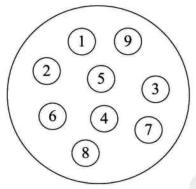
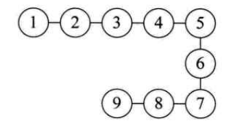
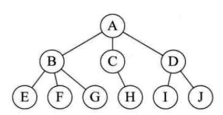
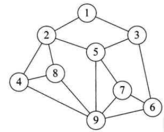
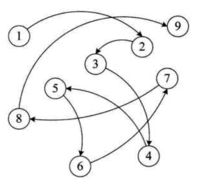
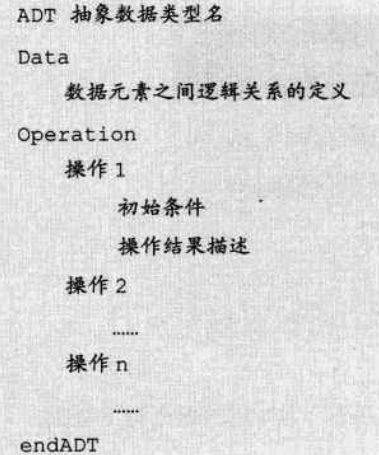

[TOC]

# 数据结构基本术语

## 一、数据

**定义：是描述客观事物的符号，是计算机中可以操作的对象，是能被计算机识别，并输入给计算机处理的符号集合。**

数据不仅仅包括整形，实整形等数值类型，还包括字符、声音、图像、视频等非数值类型。

## 二、数据元素

**定义：是组成数据的、有一定意义的基本单位，在计算机中通常作为整体处理。也被称为记录。**

比如：在人类中，人就是 数据元素 。畜类的话，则牛、马、狗、羊等动物都是禽类的数据元素。

## 三、数据项

**定义：一个数据元素可以由若干个数据项组成，数据项是数据不可分割的最小单位**

比如人这样的数据元素，可以有眼、耳、手、脚这些数据项，也可以有姓名、电话、年龄、地址等数据项。

## 四、数据对象

**定义：是性质相同的数据元素的集合，是数据的子集。**

比如人类这样的数据，可以有白人、黑人、黄种人、这样的数据对象，也可以有健全人、残疾人这样的数据对象。

## 五、数据结构

**定义：是相互之间存在一种或多种特定关系的数据元素的集合。**

不同数据元素之间不是独立的，而是存在特定的关系，我们将这些关系称为结构。

## 总结图：

# 逻辑结构和物理结构

逻辑结构是面向问题的，物理结构就是面向计算机的，其基本目标就是将据及其逻辑关系存储到计算机内存中。

## 一、逻辑结构

**定义：是指数据对象中数据元素之间的相互关系。**

逻辑结构分为四种：

#### 1.集合结构

除了同属于一个集合外，它们没有其他关系

#### 2.线性结构

数据元素之间是一对一的关系

#### 3.树形结构

树形结构中的数据元素之间存在一种一对多的层次关系

#### 4.图形结构

图形结构的数据元素是多对多的关系

* 将每一个数据元素看作一个节点
* 元素之间的逻辑关系用节点之间的连线表示，如果这个关系是有方向的，则用带箭头的连线表示。

## 二、物理结构

**定义：数据的逻辑结构在计算机中的存储形式。**

逻辑结构分为两种：

#### 1.顺序存储结构

把元素存放在地址连续的存储单元中，其数据的逻辑关系和物理关系是一致的。

#### 2.链式存储结构

把数据元素存储在任意的存储单元里，这组存储单元可以是连续的，也可以是不连续的。数据元素的存储关系并不能反映其逻辑关系。

# 抽象数据结构类型

* 数据类型：指一组性质相同的值的集合及定义在此集合上的一些操作的总称。
* 抽象：抽取出事物具有的普遍性的本质。

* 抽象数据类型(ADT)：指一个数学模型及定义在该模型上的一组操作。（像类一样）

标准格式：

