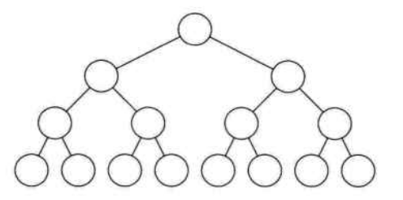

# 树

### 二叉树的性质

**性质1**：二叉树第i层上的结点数目最多为 2^(i-1) (i≥1)。
**性质2**：深度为k的二叉树至多有**(2^k)-1**个结点(k≥1)。
**性质3**：包含n个结点的二叉树的高度至少为**log2 (n+1)**。
**性质4**：在任意一棵二叉树中，若终端结点的个数为**n0**，度为2的结点数为**n2**，则**n0=n2+1**。