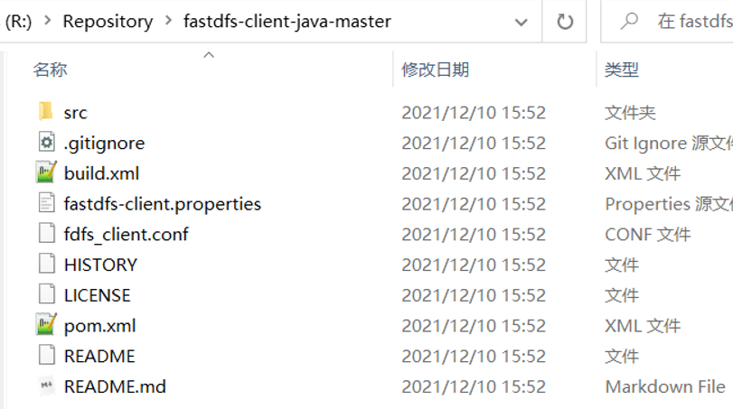

资源下载地址：https://github.com/geekerstar/geek-chat/tree/master/resource


我将这些压缩包放在了/opt/fastdfs目录下

# 安装：

### 一、libfastcommon-1.0.7.zip

安装zip解压工具，安装gcc，安装libevent

```
yum -y install unzip zip
yum -y install gcc-c++
yum -y install libevent
```

```xml
unzip  libfastcommon-1.0.7.zip
cd libfastcommon-1.0.7/
./make.sh
./make.sh install
cd /usr/lib64/
ll libfast*		//显示如下图
cp libfastcommon.so /usr/lib
```


### 二、FastDFS

```
tar -xzvf FastDFS_v5.05.tar.gz
cd FastDFS
yum install perl -y		//安装perl类库
./make.sh
./make.sh install
cd /usr/bin
ll fdfs*	//显示如下图（1）
cd /etc/fdfs
ll		//显示如下图（2）
cd /opt/fastdfs/FastDFS/conf	//进入FastDFS目录下的conf目录下(内容如图（3）)
cp * /etc/fdfs/			//将conf目录下的所有文件拷贝到/etc/fdfs目录下
cd /etc/fdfs/
ll
vim tracker.conf	//如图（4）
```

图（1）

图（2）

图（3）


图（4）


```bash
cd /
mkdir /fastdfs/tracker -p	//-p递归创建
cd /fastdfs
mkdir storage
mkdir client
cd /usr/bin
ll fdfs*
fdfs_trackerd /etc/fdfs/tracker.conf	//启动tracker
cd /etc/fdfs/
vim storage.conf（建议把8888改成80）
```


storage.conf说了如果这个路径store_path0不存在，会依照base_path,为了不出意外，建议配置一下这个路径


```
cd /usr/bin
fdfs_storaged /etc/fdfs/storage.conf	//启动storage
ps aux |grep storage     (查看storage运行状况，会显示两条）
ps aux |grep tracker     (查看tracker运行状况，会显示两条）
```


### 三、测试

```
cd /etc/fdfs/
vim client.conf
```


```
cd /usr/bin
fdfs_test /etc/fdfs/client.conf upload /home/test.jpg	//上传图片测试/home/test.jpg：自己的图片位置
```

说明：group_name=geek, remote_filename=M00/00/00/CtM3ClxelyeAU50EAAPlcXCVEEA734.jpg

云服务器中安全组**放行22122、23000端口**，本地服务器的话关闭防火墙


此时我们在浏览器还打不开图片，需要配置nginx才行，我们继续完成下述操作


### 四、安装fastdfs-nginx-module

```
tar -xzvf fastdfs-nginx-module.tar.gz
cd fastdfs-nginx-module/
cd src/
ll
vim config（把三处local去掉）
```


### 五、安装Nginx

安装Nginx所需的环境

```bash
yum install gcc-c++		//gcc上面已经安装了，这里没必要执行了
yum install pcre pcre-devel
yum install zlib zlib-devel
yum install openssl openssl-devel
```

安装Nginx

```
tar -zxvf nginx-1.14.2.tar.gz -C /usr/local	
cd /usr/local/nginx-1.14.2/
```


```bash
./configure \
--prefix=/usr/local/nginx \
--pid-path=/var/run/nginx/nginx.pid \
--lock-path=/var/lock/nginx.lock \
--error-log-path=/var/log/nginx/error.log \
--http-log-path=/var/log/nginx/access.log \
--with-http_gzip_static_module \
--http-client-body-temp-path=/var/temp/nginx/client \
--http-proxy-temp-path=/var/temp/nginx/proxy \
--http-fastcgi-temp-path=/var/temp/nginx/fastcgi \
--http-uwsgi-temp-path=/var/temp/nginx/uwsgi \
--http-scgi-temp-path=/var/temp/nginx/scgi \
--add-module=/root/fastdfs/fastdfs-nginx-module/src  注意这里改成你fastdfs-nginx-module目录下的src地址
```


```
make
make install
```

修改配置文件

```
cd /fastdfs
mkdir tmp
cd /opt/fastdfs/fastdfs-nginx-module/src
cp mod_fastdfs.conf /etc/fdfs/
cd /etc/fdfs/
vim mod_fastdfs.conf
```


```
cd /usr/local/nginx/conf
vim nginx.conf
```


上图代码

```
server {
        listen       80;
        server_name  39.102.39.40;

        location /geek/M00 {
                root /fastdfs/storage/data/;
                ngx_fastdfs_module;
        }
    }
```

第一行


```
cd ..
cd sbin
mkdir /var/temp/nginx -p
./nginx -t
./nginx
```

此时可以通过ip访问Nginx了，但不能访问图片

```
cd /etc/fdfs
vim mod_fastdfs.conf
```


```
/usr/bin/fdfs_trackerd /etc/fdfs/tracker.conf restart
 
/usr/bin/fdfs_storaged /etc/fdfs/storage.conf restart
```

```bash
cd /usr/local/nginx/sbin/
 
./nginx -s reload
```


安装OK 了


# 使用教程

fastdfs-Java客户端使用

### 1. 引入jar包

由于maven中央仓库没有fastdfs的依赖，所以不能通过maven直接进行加载。需要在fastdfs的github仓库去下载依赖

https://github.com/happyfish100/fastdfs-client-java/tags

下载下来后，解压（下图为解压后的目录结构）



**将jar包弄到本地maven仓库**

```shell
# 方法一(前提：电脑上存在maven环境并且配置了环境变量)
在解压后的fastdfs-client-java-master目录下，执行cmd命令：mvn clean install

# 方法二
把fastdfs-client-java-master工程弄到idea中，使用idea自带的maven进行编译

# 方法三（使用这个依赖-没尝试）
<dependency>
    <groupId>net.oschina.zcx7878</groupId>
    <artifactId>fastdfs-client-java</artifactId>
    <version>1.27.0.0</version>
</dependency>
```

jar包就会出现在本地maven的org包下，如下图（csource）


### 2. 编写配置文件

在resources目录下新建fastdfs.conf配置文件

```bash
tracker_server=139.159.184.216:22122    # tracker Server地址信息
```

### 3. 编写上传下载工具类

3.1测试版

```java
package com.health.fastdfs;

import org.csource.common.MyException;
import org.csource.fastdfs.*;

import java.io.IOException;

public class FastDfsUtil {
    
    
    public static void main(String[] args) {
        //测试
        //upload();
        //download();
        //delete();
    }

    /**
     * 文件上传
     */
    public static void upload(){
        StorageClient sc = null;
        try {
            //1.读取配置文件（用于将所有的tracker_server的地址读取到内存中）
            ClientGlobal.init("fastdfs.conf");

            TrackerClient tc = new TrackerClient();
            TrackerServer ts = tc.getTrackerServer();
            StorageServer ss = tc.getStoreStorage(ts);
            //定义Storage的客户端对象，需要使用这个对象来完成具体的文件上传下载和删除
            sc = new StorageClient(ts,ss);
            /**
             * 文件上传
             * 参数1：文件的绝对路径
             * 参数2：文件的扩展名
             * 参数3：文件的属性（一般不使用）
             * return：string数组（组名、路径名）
             */
            String[] result = sc.upload_file("R:/picture/11.png", "png", null);
            for (String s : result) {
                System.out.println(s);
            }

        } catch (IOException | MyException e) {
            e.printStackTrace();
        } finally {
            if (sc!=null){
                try {
                    sc.close();
                } catch (IOException e) {
                    e.printStackTrace();
                }
            }
        }
    }

    /**
     * 文件下载
     */
    public static void download(){
        StorageClient sc = null;
        try {
            //1.读取配置文件（用于将所有的tracker_server的地址读取到内存中）
            ClientGlobal.init("fastdfs.conf");

            TrackerClient tc = new TrackerClient();
            TrackerServer ts = tc.getTrackerServer();
            StorageServer ss = tc.getStoreStorage(ts);
            //定义Storage的客户端对象，需要使用这个对象来完成具体的文件上传下载和删除
            sc = new StorageClient(ts,ss);
            /**
             * 文件下载
             * 参数1：组名
             * 参数2：文件名
             * 参数3：下载的文件保存到的本地目录以及名称
             * return int（0：成功）
             */
            String group = "geek";
            String remoteFilename = "M00/00/00/wKgA0mKI4GWAeqRqAAblmSSeCic570.png";
            String localFilename = "R:/picture/12.png";
            int flag = sc.download_file(group, remoteFilename, localFilename);
            System.out.println(flag);
        } catch (IOException | MyException e) {
            e.printStackTrace();
        } finally {
            if (sc!=null){
                try {
                    sc.close();
                } catch (IOException e) {
                    e.printStackTrace();
                }
            }
        }
    }

    /**
     * 文件删除
     */
    public static void delete(){
        StorageClient sc = null;
        try {
            //1.读取配置文件（用于将所有的tracker_server的地址读取到内存中）
            ClientGlobal.init("fastdfs.conf");

            TrackerClient tc = new TrackerClient();
            TrackerServer ts = tc.getTrackerServer();
            StorageServer ss = tc.getStoreStorage(ts);
            //定义Storage的客户端对象，需要使用这个对象来完成具体的文件上传下载和删除
            sc = new StorageClient(ts,ss);
            /**
             * 文件删除
             * 参数1：组名
             * 参数2：远程文件名
             * return int（0：删除成功）
             */
            String group = "geek";
            String remoteFilename = "M00/00/00/wKgA0mKI4GWAeqRqAAblmSSeCic570.png";
            int flag = sc.delete_file(group,remoteFilename);
            System.out.println(flag);
        } catch (IOException | MyException e) {
            e.printStackTrace();
        } finally {
            if (sc!=null){
                try {
                    sc.close();
                } catch (IOException e) {
                    e.printStackTrace();
                }
            }
        }
    }

}
```


3.2 实际项目使用版

```java
package com.health.fastdfs;

import org.csource.common.MyException;
import org.csource.fastdfs.*;

import java.io.IOException;

public class FastDfsUtil {

    private String configPath = null;

    public FastDfsUtil(){};

    public FastDfsUtil(String configPath){
        this.configPath = configPath;
    };

    public StorageClient init(){
        StorageClient sc = null;
        try {
            //1.读取配置文件（用于将所有的tracker_server的地址读取到内存中）
            ClientGlobal.init(configPath);
            TrackerClient tc = new TrackerClient();
            TrackerServer ts = tc.getTrackerServer();
            StorageServer ss = tc.getStoreStorage(ts);
            //定义Storage的客户端对象，需要使用这个对象来完成具体的文件上传下载和删除
            sc = new StorageClient(ts,ss);
        } catch (IOException | MyException e) {
            e.printStackTrace();
        }
        return sc;
    }

    public void destroy(StorageClient sc){
        if (sc!=null){
            try {
                sc.close();
            } catch (IOException e) {
                e.printStackTrace();
            }
        }
    }

    /**
     * 文件上传
     */
    public String[] upload(byte[] buffFile,String extName) throws MyException, IOException {
        String[] result;
        StorageClient sc = init();
        /**
         * 文件上传
         * 参数1：文件的绝对路径
         * 参数2：文件的扩展名
         * 参数3：文件的属性（一般不使用）
         * return：string数组（组名、路径名）
         */
        result = sc.upload_file(buffFile,extName,null);
        destroy(sc);
        return result;
    }

    /**
     * 文件下载
     */
    public byte[] download(String group,String remoteFilename) throws MyException, IOException {
        StorageClient sc = init();
        /**
         * 文件下载
         * 参数1：组名
         * 参数2：文件名
         * return int（0：成功）
         */
        byte[] bytes = sc.download_file(group, remoteFilename);
        destroy(sc);
        return bytes;
    }

    /**
     * 文件删除
     */
    public Boolean delete(String group,String remoteFilename) throws MyException, IOException {
        StorageClient sc = init();
        /**
         * 文件删除
         * 参数1：组名
         * 参数2：远程文件名
         * return int（0：删除成功）
         */
        int flag = sc.delete_file(group,remoteFilename);
        destroy(sc);
        return flag == 0;
    }

}
```

