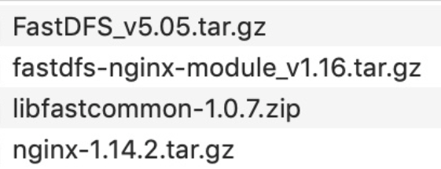
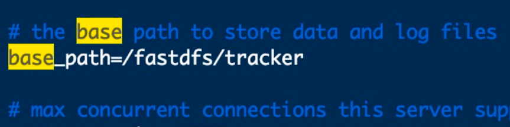
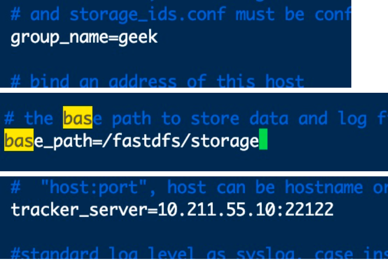
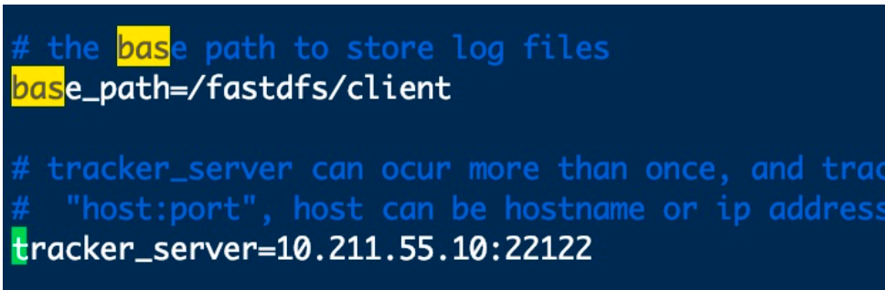
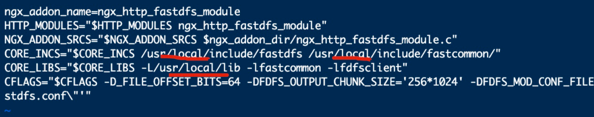
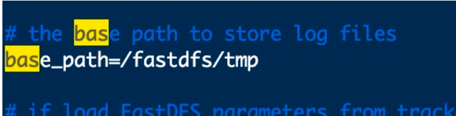
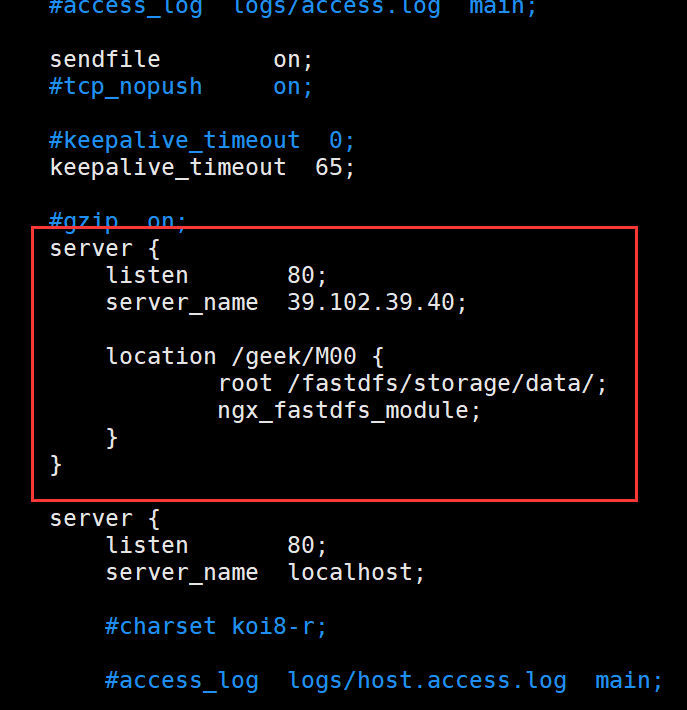
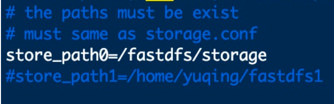

资源下载地址：https://github.com/geekerstar/geek-chat/tree/master/resource



我将这些压缩包放在了/opt/fastdfs目录下

一、libfastcommon-1.0.7.zip

```xml
unzip  libfastcommon-1.0.7.zip
cd libfastcommon-1.0.7/
./make.sh
./make.sh install
cd /usr/lib64/
ll libfast*
cp libfastcommon.so /usr/lib
```

二、FastDFS

```
tar -xzvf FastDFS_v5.05.tar.gz
cd FastDFS
./make.sh
./make.sh install
cd /usr/bin
ll fdfs*
cd /etc/fdfs
ll
cd /home/tar/FastDFS/conf
cp * /etc/fdfs/
cd /etc/fdfs/
ll
vim tracker.conf
```



```
cd /
mkdir /fastdfs/tracker -p
cd /fastdfs
mkdir storage
mkdir client
ll
cd /usr/bin
ll fdfs*
fdfs_trackerd /etc/fdfs/tracker.conf
cd /etc/fdfs/
vim storage.conf（除了下图之外，再把8888改成80）
```



```
cd /usr/bin
fdfs_storaged /etc/fdfs/storage.conf
ps aux |grep storage     (查看storage运行状况）
ps aux |grep tracker     (查看tracker运行状况）
```


## 测试

```
cd /etc/fdfs/
vim client.conf
```



```
cd /usr/bin
fdfs_test /etc/fdfs/client.conf upload /home/test.jpg
```

说明：group_name=geek, remote_filename=M00/00/00/CtM3ClxelyeAU50EAAPlcXCVEEA734.jpg

云服务器中安全组放行22122、23000端口，本地服务器的话关闭防火墙


## 安装Nginx

```
tar -xzvf fastdfs-nginx-module.tar.gz
cd fastdfs-nginx-module/
cd src/
ll
vim config（把三处local去掉）
```



```
cd /home
yum install gcc-c++
yum install pcre pcre-devel
yum install zlib zlib-devel
yum install openssl openssl-devel
tar -zxvf nginx-1.14.2 -C /usr/local
cd /usr/local/nginx-1.14.2/
```

```
./configure\
--prefix=/usr/local/nginx\
--pid-path=/var/run/nginx/nginx.pid\
--lock-path=/var/lock/nginx.lock\
--error-log-path=/var/log/nginx/error.log\
--http-log-path=/var/log/nginx/access.log\
--with-http_gzip_static_module\
--http-client-body-temp-path=/var/temp/nginx/client\
--http-proxy-temp-path=/var/temp/nginx/proxy\
--http-fastcgi-temp-path=/var/temp/nginx/fastcgi\
--http-uwsgi-temp-path=/var/temp/nginx/uwsgi\
--http-scgi-temp-path=/var/temp/nginx/scgi\
--add-module=/opt/fastdfs/fastdfs-nginx-module/src  注意这里改成你服务器上相应地址

make
make install
```

```
cd fastdfs-nginx-module/
cd src
cp mod_fastdfs.conf /etc/fdfs/
cd /etc/fdfs/
vim mod_fastdfs.conf
```



```
cd /fastdfs
mkdir tmp
cd /etc/fdfs/
vim mod_fastdfs.conf
```


```
cd /usr/local/nginx/conf
vim nginx.conf
```



上图代码

```
server {
        listen       80;
        server_name  39.102.39.40;

        location /geek/M00 {
                root /fastdfs/storage/data/;
                ngx_fastdfs_module;
        }
    }
```

第一行


```
cd ..
cd sbin
mkdir /var/temp/nginx -p
./nginx -t
./nginx
```

此时可以通过ip访问Nginx了，但不能访问图片

```
cd /etc/fdfs
vim mod_fastdfs.conf
```



```
/usr/bin/fdfs_trackerd /etc/fdfs/tracker.conf restart
 
/usr/bin/fdfs_storaged /etc/fdfs/storage.conf restart
```

```
cd /usr/local/nginx/sbin/
 
./nginx -s reload
```


OK 了