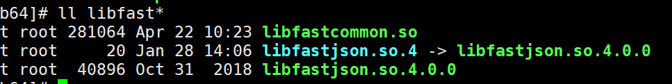
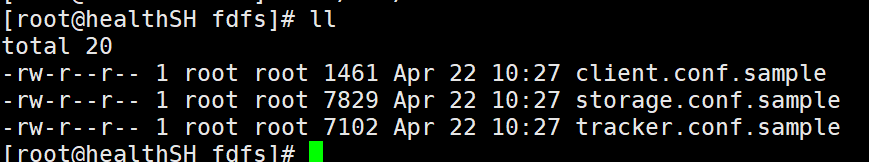
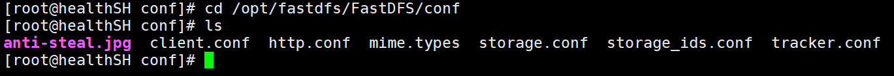
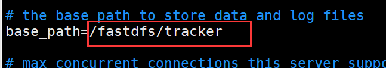
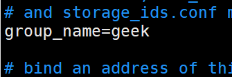
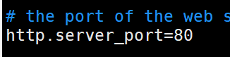
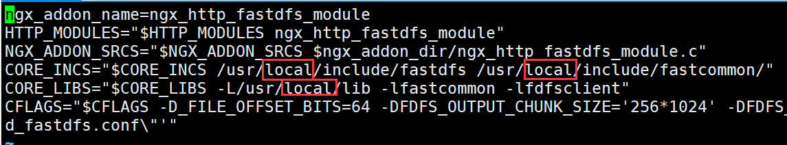
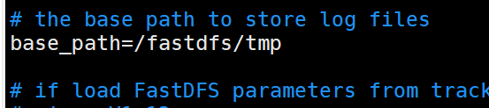

资源下载地址：https://github.com/geekerstar/geek-chat/tree/master/resource


我将这些压缩包放在了/opt/fastdfs目录下

# 安装开始：

### 一、libfastcommon-1.0.7.zip

安装zip解压工具，安装gcc，安装libevent

```
yum -y install unzip zip
yum -y install gcc-c++
yum -y install libevent
```

```xml
unzip  libfastcommon-1.0.7.zip
cd libfastcommon-1.0.7/
./make.sh
./make.sh install
cd /usr/lib64/
ll libfast*		//显示如下图
cp libfastcommon.so /usr/lib
```



### 二、FastDFS

```
tar -xzvf FastDFS_v5.05.tar.gz
cd FastDFS
yum install perl -y		//安装perl类库
./make.sh
./make.sh install
cd /usr/bin
ll fdfs*	//显示如下图（1）
cd /etc/fdfs
ll		//显示如下图（2）
cd /opt/fastdfs/FastDFS/conf	//进入FastDFS目录下的conf目录下(内容如图（3）)
cp * /etc/fdfs/			//将conf目录下的所有文件拷贝到/etc/fdfs目录下
cd /etc/fdfs/
ll
vim tracker.conf	//如图（4）
```

图（1）

图（2）

图（3）


图（4）


```
cd /
mkdir /fastdfs/tracker -p	//-p递归创建
cd /fastdfs
mkdir storage
mkdir client
ll
cd /usr/bin
ll fdfs*
fdfs_trackerd /etc/fdfs/tracker.conf	//启动tracker
cd /etc/fdfs/
vim storage.conf（建议把8888改成80）
```





storage.conf说了如果这个路径store_path0不存在，会依照base_path,为了不出意外，建议配置一下这个路径





```
cd /usr/bin
fdfs_storaged /etc/fdfs/storage.conf	//启动storage
ps aux |grep storage     (查看storage运行状况，会显示两条）
ps aux |grep tracker     (查看tracker运行状况，会显示两条）
```


### 三、测试

```
cd /etc/fdfs/
vim client.conf
```


```
cd /usr/bin
fdfs_test /etc/fdfs/client.conf upload /home/test.jpg	//上传图片测试/home/test.jpg：自己的图片位置
```

说明：group_name=geek, remote_filename=M00/00/00/CtM3ClxelyeAU50EAAPlcXCVEEA734.jpg

云服务器中安全组放行22122、23000端口，本地服务器的话关闭防火墙


### 四、安装fastdfs-nginx-module

```
tar -xzvf fastdfs-nginx-module.tar.gz
cd fastdfs-nginx-module/
cd src/
ll
vim config（把三处local去掉）
```




### 五、安装Nginx

安装Nginx所需的环境

```bash
yum install gcc-c++		//gcc上面已经安装了，这里没必要执行了
yum install pcre pcre-devel
yum install zlib zlib-devel
yum install openssl openssl-devel
```

安装Nginx

```
tar -zxvf nginx-1.14.2.tar.gz -C /usr/local	
cd /usr/local/nginx-1.14.2/
```


```bash
./configure \
--prefix=/usr/local/nginx \
--pid-path=/var/run/nginx/nginx.pid \
--lock-path=/var/lock/nginx.lock \
--error-log-path=/var/log/nginx/error.log \
--http-log-path=/var/log/nginx/access.log \
--with-http_gzip_static_module \
--http-client-body-temp-path=/var/temp/nginx/client \
--http-proxy-temp-path=/var/temp/nginx/proxy \
--http-fastcgi-temp-path=/var/temp/nginx/fastcgi \
--http-uwsgi-temp-path=/var/temp/nginx/uwsgi \
--http-scgi-temp-path=/var/temp/nginx/scgi \
--add-module=/opt/fastdfs/fastdfs-nginx-module/src  注意这里改成你fastdfs-nginx-module目录下的src地址
```


```
make
make install
```

修改配置文件

```
cd /fastdfs
mkdir tmp
cd /opt/fastdfs/fastdfs-nginx-module/src
cp mod_fastdfs.conf /etc/fdfs/
cd /etc/fdfs/
vim mod_fastdfs.conf
```




```
cd /usr/local/nginx/conf
vim nginx.conf
```


上图代码

```
server {
        listen       80;
        server_name  39.102.39.40;

        location /geek/M00 {
                root /fastdfs/storage/data/;
                ngx_fastdfs_module;
        }
    }
```

第一行


```
cd ..
cd sbin
mkdir /var/temp/nginx -p
./nginx -t
./nginx
```

此时可以通过ip访问Nginx了，但不能访问图片

```
cd /etc/fdfs
vim mod_fastdfs.conf
```


```
/usr/bin/fdfs_trackerd /etc/fdfs/tracker.conf restart
 
/usr/bin/fdfs_storaged /etc/fdfs/storage.conf restart
```

```
cd /usr/local/nginx/sbin/
 
./nginx -s reload
```


OK 了