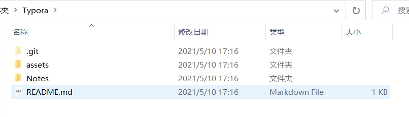
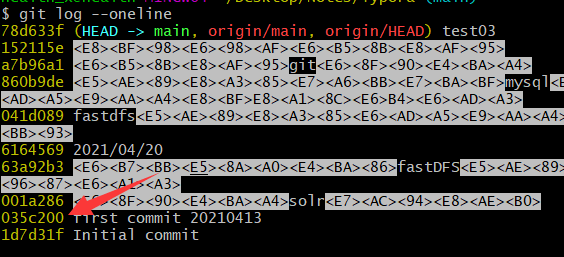

# 一、运行git前的配置

### 1. 配置文件介绍

初次运行git前，需要先配置下自己的Git 工作环境。配置工作只需一次，以后升级时还会沿用现在的配置。而且随时可以用相同的命令修改已有的配置。

使用`git config`命令来配置或读取相应的工作环境变量，这些环境变量，决定了 Git 在各个环节的具体工作方式和行为。这些配置文件可存放在以下三个不同的地方：

- `/etc/gitconfig` 文件：系统中对所有用户都普遍适用的配置。使用 `git config` 时用 `--system` 选项，读写的就是这个文件。【系统级】
- `~/.gitconfig` 文件：用户目录下的配置文件只适用于该用户。使用 `git config` 时用 `--global` 选项，读写的就是这个文件。【用户级】
- 当前项目的 Git 目录中的配置文件（即工作目录中的 `.git/config` 文件）：针对当前项目有效。使用 `git config` 时用 `--local` 或者**空着**，读写的就是这个文件。【仓库级】

优先级 **local > global > system**


### 2. 使用git前的配置（实操）

1. 设置签名：要配置的是个人的用户名和email。每次 Git 提交时都会引用这两条信息，说明是谁提交了更新，所以会随更新内容一起被永久纳入历史记录：

   ```
   git config --global user.name "John Doe"	//用户名可随意设置
   git config --global user.email "johndoe@example.com"	//邮箱可随意设置
   git config --global push.default.simple	//让全局配置生效
   ```

   * 用户名和邮箱仅仅是用来区分开发人员的身份，不一定真实存在

   * 如果要在某个特定的仓库中使用其他名字或者email，只要去掉 --global 选项重新配置即可，新的设定保存在当前仓库的 .git/config 文件里。</font>

2. 查看配置信息：git config --list


# 二、推送和拉取

### 1.1 本地项目首次提交到远程仓库

```
git init	//将当前目录初始化为本地仓库

git add .	//添加到暂存区

git commit -m "日志信息"	//提交到本地库

//给远程仓库取别名，之后就直接用别名origin即可（git remote add 别名 仓库地址）
git remote add origin https://github.com/health-x/Typora.git	

git push -u origin master -f 或者 git push origin master	//将项目推送到远程仓库(master:分支名 -f强制推送)
```

补充：

git pull --rebase origin master	//执行推送出错的话 执行该命令后再执行推送
git pull origin master --allow-unrelated-histories	//强拉失败 执行如下命令

### 1.2 提交修改到远程仓库

git status 查看git是否有修改内容需要提交

```
git add [文件名]	//添加到暂存区
git commit -m "提交注释"	//提交到本地库

//由于首次提交时已经关联了远程仓库，这里直接推送就好了
git push origin master	//将项目推送到远程仓库(master:分支名)
```


### 2.1 拉取远程仓库的项目

```
git clone https://github.com/health-x/Typora.git	//下载下来的文件名为仓库名：Typora(无需init)
```




### 2.2 将远程仓库同步到本地仓库

方法一

```
git pull origin master	//在上一步的基础上执行
```

方法二

```
git pull 仓库地址 分支	//前提是要在一个已经初始化的本地仓库进行
```


### 3其它命令

```
git status		//查看工作区状态
git rm --cached 文件名		//从暂存区删除(git add添加到暂存区)
```


# 三、版本回退

### 1. 查看历史提交记录

```bash
git log：查看历史提交

git log --pretty=oneline：一次提交显示一行

git log --oneline：简洁版显示

git reflog：简介plus版显示
```

查看日志时的操作：

- 空格：向下翻页 

- b：向上翻页

- q：退出


### 2. 版本前进后退

查看日志时会出现前面的这个一串字符，这就是**每个版本的标识(索引)**，后面跟的是提交时自己写的描述（建议用英文，不然会像下面那样乱码）



1. 使用索引值操作 (前进后退都可)

   git reset --hard ede116d：前进或后退到索引为**ede116d**的位置

2. 使用^符号 (只能后退)

   git reset --hard HEAD^^^：添加几个^就会往后退几步

3. 使用~符号 (只能后退)

   git reset --hard HEAD~n：表示后退n步
   
   

### 3. 删除文件找回

前提：删除前，文件存在时的状态提交到了本地库

操作：git reset --hard [指针位置]

+ 删除操作已经提交到本地库：指针位置指向历史记录(git reset --hard eau1bu343)
+ 删除操作尚未提交到本地库：指针位置使用HEAD (git reset --hard HEAD)

git diff 文件名：将文件与暂存区对应的文件进行比较

git diff [本地库中的历史版本] 文件名：将工作区中的文件与本地库历史记录中的该文件比较

不指定文件名时比较的是当前工作区中所有的文件。


# 四、分支操作

### 1. 基本操作

1. 创建分支

   git branch [分支名]

   

2. 查看所有分支（*指向的是当前分支）

   (1).查看本地所有分支

   ​	git branch

   (2).查看远程所有分支

   ​	git branch -r

   (3).查看本地和远程所有分支

   ​	git branch -a

   (4).显示每个本地分支当前指向的版本号和版本描述，以及和其上游分支的相对位置（如果有的话）

   ​	git branch -v

   

3. 切换分支

   git checkout [分支名]

   

4. 合并分支

   git merge [另一个分支的名字]

   - 首先切换到接受修改的分支上：git checkout [分支名]

   + 执行merge命令：git merge [另一个分支的名字]
   + 

5. 删除分支

   git branch -d [分支名]

   

### 2. 分支合并冲突

问题：两个分支都修改了，之后将其合并时会产生冲突

解决：

1. 编辑文件，删除特殊符号
2. 把文件修改到满意的程度，保存退出
3. git add [文件名]
4. git commit -m "日志信息"


#### 别名

```
git remote -v	//查看别名

git remote add [别名] [github仓库地址]	//一般都是origin，但新手一般不知道可以修改（即使用别名）

git push 别名 分支名		//例如 git push origin master
```


#### 通过SSH方式上传代码

1.生成公钥和私钥：ssh -keygen -t rsa -C "github账号邮箱"

会弹出 选择把公私钥放在哪，默认则按enter

然后输入私钥的保护密码：不输入按enter则无

 2.复制公钥，添加到github上

title：随意

key：公钥

弹出窗口是，输入github密码


### git帮助

查看Git 的各式工具使用帮助，三种方法：

```
git help <verb>
git <verb> --help
man git-<verb>
```

例如，要学习 config 命令怎么用，运行：

```
git help config
```


# 五：把一个仓库所有分支克隆到另一个仓库


场景：把A仓库所有分支，克隆到B仓库

```shell
# 把A仓库代码拉到本地，默认只有master分支（保证各分支都是最新代码再操作下一步）
git clone A仓库地址

# 同步远程分支
git branch -r | grep -v '\->' | while read remote; do git branch --track "${remote#origin/}" "$remote"; done

# 将本地所有分支与远程保持同步（此时已经有本地分支了，而且也和远程分支关联了）
git fetch --all
git pull --all

# 提交本地所有分支以及tags到远程（或者修改别名git remote set-url origin B分支地址，然后用别名去push）
git push -u B分支地址 --all
git push -u B分支地址 --tags
```


