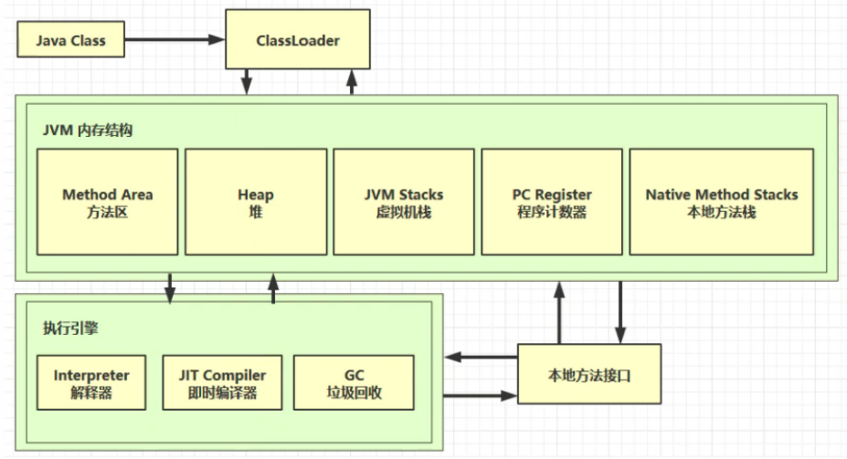

# JVM

## 一、jvm内存结构图

###  1. jdk体系结构：

### 2. Java虚拟机

### 3. jvm内存模型 / 运行时数据区

### 4. Java文件执行过程：

1. .java文件 首先经过 javac编译器 编译为 .class文件（通过：javac 文件名.java 执行该步骤）
2. .class文件 经过 类装载子系统(ClassLoader)  后被装载到jvm内存模型中去执行（通过：java 文件名 执行该步骤）
3. .class文件 首先被装载到方法区，方法区保存文件中得常量、静态变量、类信息等 
4. 经过解释器处理为 机器码 ，CPU拿到机器码进行处理（通过 字节码执行引擎 将.class文件在jvm内存模型中执行起来）

## 二、JVM内存模型分析 / 运行时数据区

内存模型用来存储数据，字节码执行引擎负责执行各种操作。

### 1. 程序计数器

作用：记录线程执行到哪个位置了（记住该线程代码中下一条该执行代码的 jvm 指令的执行地址）

场景：Java程序一般都是多线程执行的，可能当前线程刚执行到第二行，cpu把执行机会给到了别的线程，过个几毫秒cpu再次把执行机会给到该线程时，就能知道执行到哪里了，从而接着执行。

特点：

- 线程私有的，每个线程执行字节码文件时是相互独立的。
- 不会存在内存溢出

工作流程：程序计数器拿到二进制字节码文件后，将其中的 jvm 指令逐行交给解释器（同时保存下一条指令的执行地址），解释器把指令解释为机器码，然后交给cpu处理。

### 2. 虚拟机栈

**虚拟机栈：**每个线程运行时所需要的内存空间，被称为虚拟机栈。

**特点：**

- 先进后出
- 多个线程运行则需要多个虚拟机栈，线程私有，相互独立。
- 每个线程只能有一个活动栈帧。活动栈帧即线程正在执行的那个方法对应的栈帧。

**栈帧：****每个栈中包含多个栈帧**，每个方法运行时需要的内存被称为栈帧（栈帧中包括：参数、局部变量、返回地址等），因为多个方法可能包含名称相同的局部变量，所以应该存在栈帧来分隔开每个方法，使数据互不干扰，每个栈帧只保存自己的数据。

**流程：**调用某个方法时会为该方法分配栈帧空间，然后将该栈帧压入栈内，当该方法执行完成后，会将该栈帧出栈，释放空间。如果在方法执行的中途调用其它方法，则同样为将这个方法分配栈帧空间，入栈，执行，出栈。然后再继续执行前一个方法。

**栈内存分配参数**：在VM options选项中配置，-Xss256k		//1兆就写1m**（默认是1兆）**

**栈内存溢出：**StackOverFlowError

- 一个栈中不断地加入栈帧，而没有出栈，当超出该栈的容量时，会产生栈内存溢出（一般会在递归调用没有设置正确的结束值的时候出现此情况）
- 栈帧过大，超过了栈内存的容量大小，也会出现占内存溢出的情况（很少发生）

### 3. 本地方法栈

c或者c++写的调用底层东西的方法

本地方法栈的作用跟虚拟机栈类似，就是处理的对象不同（存放处理native修饰的方法）

### 4. 堆（Heap）

堆的内存结构：

通过new关键字，创建的对象都会使用堆内存。

**特点：**

- 线程共享的，堆中对象都需要考虑线程安全的问题
- 有垃圾回收机制

**堆内存分配参数**：在VM options选项中配置，-Xmx8m		//1G就写1g

**堆内存溢出：** java.lang.OutOfMemoryError：Java heap space

### 5. 方法区

方法区只是一个概念，**方法区的实现** 在jdk1.8之前称为 **永久代**，到了jdk1.8则成为 **元空间**

方法区在虚拟机启动时被创建，逻辑上是堆的组成部分。

存储：常量 + 静态变量 + 类信息（类名、方法名等等）

**方法区内存分配参数**：在VM options选项中配置

- -XX:MaxMetaspaceSize=8m	//元空间
- -XX:MaxPermSize=8m	//永久代

**方法区内存溢出：** java.lang.OutOfMemoryError：Metaspace(元空间) / PermGen space(永久代)

**特点：**线程共享

jdk1.8以后，永久代的实现被废弃了，改用了**元空间**作为方法区的实现。存储类，类加载器，运行时常量池信息。此时(1.8之后)的方法区的实现已经被移到了本地内存（系统内存）中进行管理了，基本不会发生内存溢出的问题了。串池也被移到了堆中，

**二进制字节码文件**：包含 类的基本信息，常量池，类方法定义，包含了虚拟机指令

**反编译指令**：java -v xxx.class		-v：显示详细信息

**常量池：**就是一张常量表，虚拟机指令根据这张常量表找到要执行的类名、方法名、参数类型、字面量等信息。

**运行时常量池：**常量池是 *.class文件中的，当该类被加载，他的常量池信息就会被放入运行时常量池（存储在内存中），并把里面的符号地址变为真实地址。

## 三、查看字节码文件

进入字节码文件所在的目录，执行javap -c xxx.class 进行反编译

