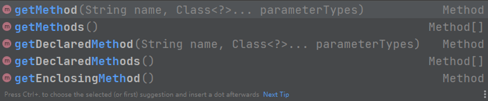
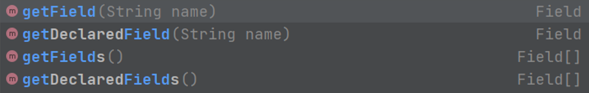
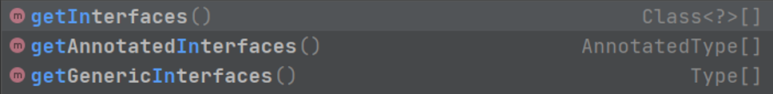
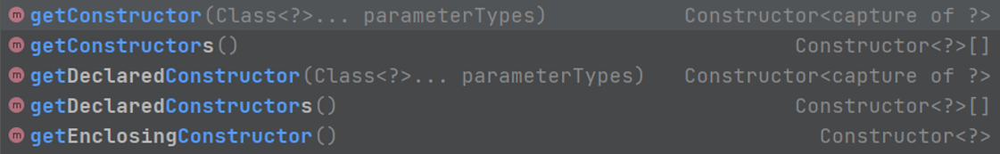
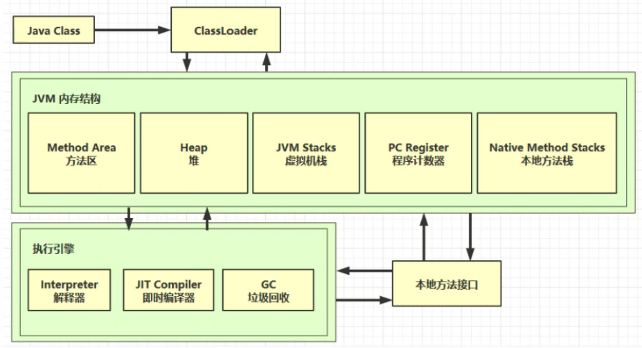

# 一、IO流

## IO流概括和分类

### IO流概括

- IO：输入/输出(Input/Output)

- 流：是一种抽象概念，对数据传输的总称。也就是说数据在设备间传输称为流，流的本质是数据传输。

- IO流就是用来处理设备间数据传输问题的

  ​	常见的应用：文件复制、文件下载、文件上传

### IO流分类

- 按数据流向

  - 输入流：读数据
  - 输出流：写数据

- 按数据类型分

  - 字节流

    ​	字节输入流；字节输出流

  - 字符流

    ​	字符输入流；字符输出流

IO流分类默认按照**数据类型**来分的


如果数据通过Window自带的记事本软件打开，不是乱码，就使用字符流；否则使用字节流。

如果不知道该使用哪种类型的流，就使用字节流。


## 字节流

字节流抽象基类
lnputStream：这个抽象类是表示字节输入流的所有类的超类

OutputStream：这个抽象类是表示字节输出流的所有类的超类

子类名特点：子类名称都是以其父类名作为子类名的后缀

### 字节流写数据

FileOutputStream:文件输出流用于将数据写入File（OutputStream抽象类的子类）
FileOutputStream(String name):创建文件输出流以指定的名称写入文件


```
/*
    FileOutputStream：文件输出流用于将数据写入File
        FileOutputStream(String name)：创建文件输出流以指定的名称写入文件
 */
public class FileOutputStreamDemo {
    public static void main(String[] args) throws IOException {
        /*
        创建字节输出流对象
        做了三件事情
            A:调用系统功能创建了文件
            B:创建了字节输出流对象
            C:让字节输出流对象指向创建好的文件
         */
        FileOutputStream fs = new FileOutputStream("fs.txt");
        
        //void write(int b):将指定的字节写入此文件输出流
        fs.write("Hello".getBytes());
        
        //void close():关闭此输入流并释放与流相关联的任何系统资源。
        fs.close();
    }
}
```


```
写数据的三种方法
    void write(byte[] b)：将 b.length个字节从指定的字节数组写入此文件输出流。
    一次写一个字节数组的数据

    void write(byte[] b, int off, int len)：将 len字节从位于偏移量 off的指定字节数组写入此文件输出流。
    一次写一个字节数组的部分数据

    void write(int b)：将指定的字节写入此文件输出流。
    一次写一个字节的数据
```

##### 字节流写数据时的问题

1. 字节流写数据如何实现换行

   windows:\r\n
   linux:\n
   mac:\r

2. 字节流写数据如何实现追加写入(第二次运行时添加在后面)

   FileOutputStream(File file, boolean append)：创建文件输出流以写入由指定的 File对象表示的文件。
   如果第二个参数是true ，则字节将被写入文件的末尾而不是开头

```
public class FileOutputStreamDemo3 {
    public static void main(String[] args) throws IOException {
        //创建字节输出流对象
        FileOutputStream fos = new FileOutputStream("fos.txt",true);	//实现追加写入

        for (int i = 0; i < 10; i++) {
            fos.write("hello".getBytes());
            fos.write("\r\n".getBytes());   //实现换行
        }
        fos.close();
    }
}
```

##### 字节流写数据加异常处理

```
public class FileOutputStreamDemo4 {
    public static void main(String[] args) {
        FileOutputStream fos = null;
        try {
            fos = new FileOutputStream("fos.txt",true);
            fos.write("hello".getBytes());
        }catch (IOException e){
            e.printStackTrace();
        }finally {
            if (fos!=null) {
                try {
                    fos.close();
                } catch (IOException e) {
                    e.printStackTrace();
                }
            }
        }
    }
}
```


### 字节流读数据

FileInputStream:文件输入流用于从文件系统中的文件获取输入字节。（InputStream抽象类的子类）

FileInputStream(String name) ：通过打开与实际文件的连接来创建一个 FileInputStream ，该文件由文件系统中的路径名  name命名。

```
/*
    需求：把文件中的内容读取出来在控制台输出

    使用字节输入流读取数据步骤
        1：创建字节输入流对象
        2：调用字节输入流对象的读数据方法
        3：释放资源
 */
public class FileInputStreamDemo {
    public static void main(String[] args) throws IOException {
        //创建字节输入流对象
        FileInputStream fis = new FileInputStream("fos.txt");
        
    /*
        //int read (byte[] b):从该输入流读取最多b.length个字节的数据到一个字节数组
        int len = fis.read(b);  //实际读取到的字节的长度，读取到末尾的话就会返回-1
    */
        
        //一次读一个字节
        int bys;
        while((bys=fis.read())!=-1){
            System.out.println(bys);
        }

        //一次读取一个字符数组
        byte[] bytes = new byte[1024];
        int lens;
        while((lens=fis.read(bytes))!=-1){
            System.out.println(new String(bytes,0,lens));
        }
        //释放资源
        fis.close();
    }
}
```


### 字节流练习

1. 复制文本文件

   **需求：**
       把 E:\\Java\\1212.txt 复制到模块目录下的“1212.txt”
       数据源:
           E:\\Java\\1212.txt ---读数据--- InputStream --- FiLeInputStream
       目的地:
           IO流\\1212.txt ---写数据--- OutputStream --- FileOutputStream

   思路:
       1:根据数据源创建字节输八流对象
       2:根据目的地创建字节输出流对象
       3:读写数据，复制文本文件(一次读取一个字节，一次写入一个字节)
       4:释放资源

```
public class CopyTxtDemo {
    public static void main(String[] args) throws IOException {
        FileInputStream fis = new FileInputStream("E:\\Java\\1212.txt");
        FileOutputStream fos = new FileOutputStream("12.txt");

        //一次读取一个字节
        int by;
        while ((by=fis.read())!=-1){
            fos.write(by);
        }

        /*//一次读一个字节数组
        byte[] bytes = new byte[1024];
        int len;
        while ((len=fis.read(bytes))!=-1){
            fos.write(bytes,0,len);
        }*/
        fos.close();
        fis.close();
    }
}
```

2. 复制图片

   需求：
       把“E:\\picture\\java.jpg”复制到模块目录下的“java1.jpg”

   思路:
       1 :根据数据源创建字节输八流对象
       2:根据目的地创建字节输出流对象
       3:读写数据，复制文本文件(一次读取一个字节数组，一次写入一个字节数组)
       4:释放资源

   ```
   public class CopyJpgDemo {
       public static void main(String[] args) throws IOException{
           FileInputStream fis = new FileInputStream("E:\\picture\\java.jpg");
           FileOutputStream fos = new FileOutputStream("java2.jpg");
           byte[] bytes = new byte[1024];
           int len;
           while((len=fis.read(bytes))!=-1){
               fos.write(bytes,0,len);
           }
           fis.close();
           fos.close();
       }
   }
   ```


## 字节缓冲流

字节缓冲流:
BufferOutputStream:该类实现缓冲输出流。通过设置这样的输出流，应用程序可以向底层输出流写入字节，而不必为写入的每个字节导致底层系统的调用
BufferedlnputStream:创建BufferedInputstream将创建一个内部缓冲区数组。当从流中读取或跳过字节时，内部缓冲区将根据需要从所包含的输入流中重新填充，一次很多字节


构造方法:
字节缓冲输出流: BufferedOutputStream(OutputStream out)字节缓冲输入流: BufferedInputStream(InputStream in)
为什么构造方法需要的是字节流，而不是具体的文件或者路径呢?
字节缓冲流仅仅提供缓冲区，而真正的读写数据还得依靠基本的字节流对象进行操作

```
/*
    字节缓冲流:
        BufferOutputStream
        BufferedInputStream
    构造方法:
        字节缓冲输出流: BufferedOutputStream (OutputStream out)
        字节缓冲输入流:BufferedInputStream (inputStream in)

 */
public class BufferStreamDemo {
    public static void main(String[] args) throws IOException {
        /*
        字节缓冲输出流: BufferedOutputStream (OutputStream out)
        //FileOutputStream fos = new FileOutputStream("12.txt");
        //BufferedOutputStream bos = new BufferedOutputStream(fos);

        BufferedOutputStream bos = new BufferedOutputStream(new FileOutputStream("12.txt"));
        //写数据
        bos.write("hello buffered".getBytes());
        bos.write("haha".getBytes());
        bos.close();
        */

        //字节缓冲输入流:BufferedInputStream (inputStream in)
        BufferedInputStream bis = new BufferedInputStream(new FileInputStream("12.txt"));
        /*//一次读取一个字节
        int bys;
        while((bys=bis.read())!=-1){
            System.out.print((char) bys);
        }*/

        //一次读取一个字节数组
        byte[] bytes = new byte[1024];
        int len;
        while ((len=bis.read(bytes))!=-1){
            System.out.println(new String(bytes,0,len));
        }
    }
```


## 四种方法复制视频

```
package com.health.字节流.练习.复制视频;import java.io.*;/*    需求:        把E:\\video\\iu.mp4复制到模块目录下的files文件夹下    思路:        1:根据数据源创建字节输入流对象        2:根据目的地创建字节输出流对象        3:读写数据，复制图片(一次读取一个字节数组，一次写入一个字节数组)        4:释放资源    四种方式实现复制视频，并记录每种方式复制视频的时间        1 :基本字节流一次读写一个字节        2:基本字节流一次读写一个字节数组        3:字节缓冲流—次读写一个字节        4:字节缓冲流一次读写一个字节数组 */public class CopyAviDemo {    public static void main(String[] args) throws IOException {        //记录开始时间        long startTime = System.currentTimeMillis();        //复制视频        method1();        //记录结束时间        long endTime = System.currentTimeMillis();        System.out.println("共耗时："+(endTime-startTime)+"毫秒");    }    //基本字节流，一次读写一个字节    共耗时：121015毫秒    public static void method1() throws IOException {        FileInputStream fis = new FileInputStream("E:\\video\\iu.mp4");        FileOutputStream fos = new FileOutputStream("files\\iu.mp4");        int bys;        while((bys=fis.read())!=-1){            fos.write(bys);        }        fis.close();        fos.close();    }    //基本字节流，一次读写一个字节数组  共耗时：172毫秒    public static void method2() throws IOException {        FileInputStream fis = new FileInputStream("E:\\video\\iu.mp4");        FileOutputStream fos = new FileOutputStream("files\\iu.mp4");        int len;        byte[] bytes = new byte[1024];        while((len=fis.read(bytes))!=-1){            fos.write(bytes,0,len);        }        fis.close();        fos.close();    }    //字节缓冲流域，一次读写一个字节   共耗时：408毫秒    public static void method3() throws IOException {        BufferedInputStream bis = new BufferedInputStream(new FileInputStream("E:\\video\\iu.mp4"));        BufferedOutputStream bos = new BufferedOutputStream(new FileOutputStream("files\\iu.mp4"));        int bys;        while((bys=bis.read())!=-1){            bos.write(bys);        }        bis.close();        bos.close();    }    //字节缓冲流域，一次读写一个字节数组 共耗时：31毫秒    public static void method4() throws IOException {        BufferedInputStream bis = new BufferedInputStream(new FileInputStream("E:\\video\\iu.mp4"));        BufferedOutputStream bos = new BufferedOutputStream(new FileOutputStream("files\\iu.mp4"));        int len;        byte[] bytes = new byte[1024];        while((len=bis.read(bytes))!=-1){            bos.write(bytes,0,len);        }        bis.close();        bos.close();    }}
```


## 编码解码

```
package com.health.编码解码;import java.io.UnsupportedEncodingException;import java.util.Arrays;/*    编码:        byte[ ] getBytes():使用平台的默认字符集将该string编码为一系列字节，将结果存储到新的字节数组中        byte[ ] getBytes(String charsetName)、使用指定的字符集将该String编码为一系列字节，将结果存储到新的字节数组中    解码:        String(byte[ ] bytes):通过使用平台的默认字符集解码指定的字节数组来构造新的String        String(byte[ ] bytes，String charsetName):通过指定的字符集解码指定的字节数组来构造新的 string    注意：编码和解码要使用同一种字符集 */public class StringDemo {    public static void main(String[] args) throws UnsupportedEncodingException {        //定义一个字符串        String s = "中国";        //byte[ ] getBytes():使用平台的默认字符集将该string编码为一系列字节，将结果存储到新的字节数组中        byte[] bys = s.getBytes();    //[-28, -72, -83, -27, -101, -67]        //byte[] bys = s.getBytes("UTF-8");   //[-28, -72, -83, -27, -101, -67]        //byte[] bys = s.getBytes("gbk"); //[-42, -48, -71, -6]        System.out.println(Arrays.toString(bys));        //解码：String(byte[ ] bytes):通过使用平台的默认字符集解码指定的字节数组来构造新的String        String ss = new String(bys);        //String(byte[ ] bytes，String charsetName):通过指定的字符集解码指定的字节数组来构造新的 string        //String ss = new String(bys,"utf-8");        //String ss = new String(bys,"gbk");        System.out.println(ss);    }}
```


## 字符流

字符流抽象基类

- Reader:字符输入流的抽象类
- Writer:字符输出流的抽象类

具体子类：

1. FileReader：字符输入流
2. FileWriter：字符输出流

3. Reader的常用方法
   1. close();
   2. read();
   3. read(char[] arr);
4. Writer的常用方法
   1. close();
   2. flush();
   3. write(int c)：写出一个字符
   4. write(String str):写出一个字符串
   5. write(char[] arr):
   6. wirte(char[] arr, int offset,int len)：len是个数


## 字符缓冲流

使用类似字节缓冲流

- BufferedReader：字符缓冲输入流

- BufferedWriter：字符缓冲输出流


字符缓冲流的特有的方法

- BufferedReader：
  - readLine()：可以从输出流中，一次读取一行文本，返回一个String对象，读取到为文件末尾的时候返回null

- BufferedWriter：
  - newLine():写出一个换行符


## 转换流

1、GBK：国标码，英文占一个字节，中文两个字节

2、UTF-8 万国码表，定义了全球所有语言的符号，英文占一个字节，中文占三个字节


转换流

1、InputStreamReader:是字节流转向字符流的桥梁，可以指定转换时使用的字符集

- InputStreamReader(InputStream is): 将指定的字节流is转为字符流。返回值：获取的是InputStreamReader对象，是Reader子类
- InputStreamReader(InputStream is, String charsetName):将指定字节流转为字符流，并指定读取时采用的编码集

2、OutputStreamWriter:是字节流转向字符流的桥梁，可以指定转换时的字符集

- OutputStreamWriter(OutputStream os) : 将字节流转为字符流，是Writer的子类
- OutputStreamWriter(OutputStream os, String charsetName):将字节流转为字符流，同时写出指定的字符集   


# 二、JDK8新特性

- lambda表达式
- 集合之stream流式操作
- 接口的增强
- 并行数组的排序
- Optional中避免Null检查
- 新的时间和日期 API
- 可重复注解


## 2.1 lambda表达式

### 2.1.1 快速入门

lambda表达式是一个匿名函数，函数就相当于Java中的方法

**当方法的参数是接口的时候，就可以考虑使用Lambda表达式**。lambda表达式就是对接口中的抽象方法的重写

(参数列表) -> { 方法体 }

简单示例：

```java
// 1. 不需要参数,返回值为 5  
() -> 5  
  
// 2. 接收一个参数(数字类型),返回其2倍的值  
x -> 2 * x  
  
// 3. 接受2个参数(数字),并返回他们的差值  
(x, y) -> x – y  
  
// 4. 接收2个int型整数,返回他们的和  
(int x, int y) -> x + y  
  
// 5. 接受一个 string 对象,并在控制台打印,不返回任何值(看起来像是返回void)  
(String s) -> System.out.print(s)
```

### 2.1.2 Lambda省略规则

1. 小括号内参数的**类型可以省略**
2. 如果小括号内有且仅有一个参数，则小括号可以省略
3. 如果大括号内有且仅有一个语句，可以同时省略大括号、return关键字及语句分号（三个必须同时省略）


```java
//匿名内部类（编译后会多生成一个新的类）
new Thread(new Runnable() {
    @Override
    public void run() {
        System.out.println("匿名内部类");
    }
}).start();

//Lambda表达式（编译后会多生成一个方法）
new Thread(()-> System.out.println("Lambda表达式")).start();
```


**总结：**

匿名内部类：在编译后会生成一个名为 类名$1.class 的文件

Lambda：会在程序运行的时候形成一个类，详细步骤如下

1. 在类中新增一个私有的静态方法，Lambda表达式中的代码会被放进这个方法中
2. 还会生成一个匿名内部类，实现接口，重写抽象方法
3. 在接口的重写方法中会调用新生成的方法


### 2.1.3 使用前提

1. 方法的参数或者局部变量类型必须为接口才能使用Lambda
2. 接口中有且仅有一个抽象方法


## 2.2 stream流

常用方法

```java
//foreach 遍历输出（最终方法）
list.stream().forEach(System.out::println);

//coount 统计元素总和（最终方法）
list.stream().count();

//filter 过滤元素
list.stream().filter(it -> it.startsWith("张")).collect(Collectors.toList());

//limit 截取前n个元素
list.stream().limit(3).collect(Collectors.toList());

//skip 跳过前n个元素
list.stream().skip(3).collect(Collectors.toList());

//map 把一组类型的流转换为另外一组类型（对流中的每个元素进行操作）
list.stream().map(it->Integer.parseInt(it)).collect(Collectors.toList());    把list中的元素转换为Integer类型

//sorted 将数据进行排序
list.stream().sort();		根据元素的自然顺序排序
list.stream().sorted((o1, o2) -> o2 - o1)		根据比较器指定的规则排序

//distinct 去除重复数据
    //对于自定义结构，需要重写equals和hashcode方法（直接自动生成即可）
list.stream().distinct().collect(Collectors.toList());

//match 判断元素是否匹配指定的条件，返回布尔值（最终方法）
	//allMatch:全都要匹配
	//anyMatch：有一个匹配即可
	//noneMatch：都不匹配
boolean flag = list.stream().allMatch(it -> it > 8);

//find 
	//findFirst() 找到第一个元素
	//findAny() 返回任意一个元素
Optional<Integer> any = listNum.stream().findAny();
System.out.println(any.get());

//max 和 min  获取最大和最小值。参数为比较规则
Optional<Integer> max = listNum.stream().max(Comparator.naturalOrder());
System.out.println(max.get());

Optional<Integer> min = listNum.stream().min((aa,bb)->aa-bb);
System.out.println(min.get());

//reduce 将数据按照一定的规则归纳为一个数据
	//参数一：默认值	参数二：对数据进行处理的方式
	//执行步骤：第一步，将默认值赋值给x，取出集合第一个元素赋值给y
	//第二步，将上一步的结果赋值给x，去除集合中第二个元素赋值给y
	//第三步，将上一步的结果赋值给x，去除集合中第二个元素赋值给y
	//......
Integer reduce = listNum.stream().reduce(0, (x, y) -> {
    System.out.println("x= " + x + ", y= " + y);
    return x + y;
});
System.out.println(reduce);	//总数的和

Integer reduce1 = listNum.stream().reduce(0, (x, y) -> {	
    return x > y ? x : y;
});
System.out.println(reduce1);	//取最大值

//map 和 reduce


//map ToInt


//concat
```


# 三、反射

- 概念：反射，指在运行状态中，对于任意一个类，都能够知道这个类的所有属性和方法，对任意一个对象，都能调用它的任意一个方法。这种动态获取信息，以及动态调用对象方法的功能，叫做java语言的反射机制。
- 优点：灵活性高。因为反射属于动态编译，即只有到运行时才动态创建 &获取对象实例。
- 缺点：执行效率低。

**示例对象：**

```java
package com.health;

/**
 * @author health
 * @since 2022/1/17
 */
public class Dog {

    protected String name;

    private String dogType;

    public Dog() {
    }

    public Dog(String name, String dogType) {
        this.name = name;
        this.dogType = dogType;
    }
    
    public String getName() {
        return name;
    }

    public void setName(String name) {
        this.name = name;
    }

    public String getDogType() {
        return dogType;
    }

    public void setDogType(String dogType) {
        this.dogType = dogType;
    }

    /**
     * 狗叫
     */
    static void dogBark(){
        System.out.println("旺旺旺！");
    }
}
```

## 3.1 简单获取方法和属性的示例

```java
public static void main(String[] args) throws Exception {
        Class<?> clz = Class.forName("com.health.test.Dog");
    	//声明该对象的实例
        Object dog = clz.newInstance();
        //获得setName方法
        Method setName = clz.getMethod("setName", String.class);
        //执行setName方法
        setName.invoke(dog, "毛毛");
        Method getName = clz.getMethod("getName");
        System.out.println(getName.invoke(dog));
    
        //获得name属性
        Field name = clz.getField("name");
        //输出dog对象的name属性的值
        System.out.println(name.get(dog));
    }
```


## 3.2 获取字节码文件的方式

```java
//通过对象获得字节码文件
Dog dog = new Dog();
Class clz1 = dog.getClass();

//通过类名.class 的方式获取字节码文件
Class clz2 = Dog.class

//通过全类名的方式获取字节码文件
Class clz3 = Class.forName("com.health.Dog");
```

## 3.3 获取方法



```java
Class clz = Class.forName("com.health.Dog");
Object dog = clz.newInstance();

//第一个参数为 方法名，第二个参数为：该方法的各个参数类型
Method method = clz.getMethod("getName",String.class)
    
//执行该方法，第一个参数为实例对象（为该对象执行此方法），第二个参数为该方法接收的参数
method.invoke(dog,"豆豆")
```


## 3.4 获取属性



```java
Class clz = Class.forName("com.health.Dog");
Object dog = clz.newInstance();

//获取字节码文件中的name属性（name需要是public修饰才行，getDeclaredField("")可以获取任意访问权限的属性）
Field name = clz.getField("name");
//获取dog实例中的name属性的值
Object o = name.get(dog);
```


## 3.5 获取实现的接口




## 3.6 获取构造函数，创建实例



```java
Class clz = Class.forName("com.health.Dog");

//获得两个参数的构造方法
Constructor<?> constructor = clz.getConstructor(String.class, String.class);
//创建实例对象
Dog o = (Dog)constructor.newInstance("北大", "金毛");
System.out.println(o.getName()+" ： "+o.getDogType());
```


## 3.7 获取注解

```java
Class clz = Class.forName("com.health.Dog");

Annotation[] annotations = clz.getAnnotations();
for (Annotation annotation : annotations) {
        System.out.println(annotation.getClass().getName());
}
```


## 3.8 Spring中IOC的简单实现原理

1. Spring 在项目启动的时间通过读取xml中配置的bean的路径
2. 然后通过Class.forName 读取class 到类加载器
3. 然后通过反射创建所有的bean实例并保存到容器中，启动容器之后
4. 在项目中可以直接获取bean对象

建议：自己写下用反射获取xml文件中的类对象，并正常使用

## 3.9 总结

在使用Java反射机制时，主要步骤包括：

获取 目标类型的Class对象

通过 Class 对象分别获取Constructor类对象、Method类对象 或者 Field 类对象等等

通过 Constructor类对象、Method类对象 & Field类对象分别获取类的构造函数、方法&属性的具体信息，并进行后续操作。


# 四、JVM



java文件编译为二进制字节码文件后，经过类加载器(ClassLoader) 后才能被加载到jvm中去运行。

## JVM内存结构

方法区、堆、虚拟机栈、程序计数器、本地方法栈


## 1. 程序计数器

作用：记住下一条 jvm 指令的执行地址

特点：

- 线程私有的，每个线程执行字节码文件时是相互独立的。
- 不会存在内存溢出

工作流程：程序计数器拿到二进制字节码文件后，将其中的 jvm 指令逐行交给解释器（同时会把下一条指令的执行地址保存），解释器把指令解释为机器码，然后交给cpu处理。


## 2. 虚拟机栈

**虚拟机栈：**每个线程运行时所需要的内存空间，被称为虚拟机栈。

**特点：**

- <font color="red">先进后出</font>
- 多个线程运行则需要多个虚拟机栈，线程私有，相互独立。
- 每个线程只能有一个活动栈帧。活动栈帧即线程正在执行的那个方法对应的栈帧。

**栈帧：**每个栈中包含多个栈帧，每个方法运行时需要的内存被称为栈帧（栈帧中包括：参数、局部变量、返回地址等）。

**流程：**调用某个方法时会为该方法分配栈帧空间，然后将该栈帧压入栈内，当该方法执行完成后，会将该栈帧出栈，释放空间。如果在方法执行的中途调用其它方法，则同样为将这个方法分配栈帧空间，入栈，执行，出栈。然后再继续执行前一个方法。

**栈内存分配参数**：在VM options选项中配置，-Xss256k		//1兆就写1m

**栈内存溢出：**StackOverFlowError

- 一个栈中不断地加入栈帧，而没有出栈，当超出该栈的容量时，会产生栈内存溢出（一般会在递归调用没有设置正确的结束值的时候出现此情况）
- 栈帧过大，超过了栈内存的容量大小，也会出现占内存溢出的情况（很少发生）


## 3. 本地方法栈


## 4. 堆（Heap）

存放实例对象


## 5. 方法区

存放类
