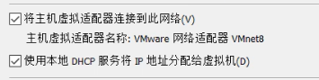

# 压缩打包与备份

gzip：

- 使用 gzip 进行压缩时，在默认的状态下原本的文件会被压缩成为 .gz 的文件名，原始文件就不再存在了
- 使用 gzip 压缩的文件在 Windows 系统中，竟然可以被 WinRAR/7zip 这个软件解压缩呢

```
-c或--create 建立新的备份文件。
-f<备份文件>或--file=<备份文件>  指定备份文件。
-t或--list 列出备份文件的内容。
-x或--extract或--get 从备份文件中还原文件。
-v或--verbose 显示指令执行过程。
-z或--gzip或--ungzip 通过gzip指令处理备份文件。
```

压缩

```
tar -czvf test.tar.gz a.txt b.txt   //压缩a.txt和b.txt文件为test.tar.gz
```

列出压缩文件内容

```
 tar  -tzvf  test.tar.gz 
```

解压

```
tar -xzvf test.tar.gz -C 指定目录
```


# 安装软件

### 安装Tomcat8

把**apache-tomcat-8.5.61.tar.gz**放到/usr/local目录下解压（目录随便选）

tar -zxvf apache-tomcat-8.5.61.tar.gz

cd 切换到tomcat的bin目录下

输入：./shutup.sh打开服务器。在本机浏览器输入localhost:8080可以访问

在windows上不行，此时需要关闭linux的防火墙**或**放行8080端口

放行端口：

- firewall-cmd  --add-port=8080/tcp  --permanent
- firewall-cmd  --reload       重新加载防火墙
- firewall-cmd  --list-all       查看防火墙上的端口

关闭防火墙

- centos：systemctl stop firewalld.service 关闭运行的防火墙
- ubuntu：sudo ufw disable


### 安装jdk

1. 解压tar.gz的安装包到/usr/local下
2. 重命名为jdk
3. 配置环境变量
4. vi /etc/profile
   export JAVA_HOME=/usr/local/jdk 
   export CLASSPATH=$JAVA_HOME/lib
   export PATH=$JAVA_HOME/bin:$PATH
5. source /etc/profile
6. java -version  ==>  成功


### 安装zookeeper

1. 解压zookeeper-3.4.6到/usr/lcoal下，重命名为zookeeper

2. 进入zookeeper目录，添加目录data

3. 修改conf目录下的zooSample.cfg为zoo.cfg

4. 打开zoo.cfg文件修改目录
   dataDir=/usr/local/zookeeper/data

5. 进入bin目录运行服务 ./zkServer.sh  start|restart|stop|status

6. 打开zoo.cfg查看端口号clientPort=2181

7. 开放2181端口

   <font color=red>firewall-cmd  --add-port=2181/tcp  --permanent</font>           持久化的放行某个端口号   --permanent：持久化的开启

   firewall-cmd  --reload       重新加载防火墙

   firewall-cmd  --list-all       查看防火墙上的端口


### 配置Dubbo监控中心

将dubbo-admin-2.6.1.war导入到/usr/local/tomcat/webapps目录下

重命名为dubbo(建议)

删除ROOT目录

启动tomcat

在windows上访问：ip:8080/dubbo-->输入账号root，密码root

上面dubbo的密码在tomcat/webapps/dubbo/WEB-INF下的dubbo.properties中


### yum在线安装mysql

1. 查看CentOS下是否安装了MySQL：yum list installed | grep mysql

2. 删除已安装的mysql：yum -y remove mysql-libs.x86_64

3. 修改CentoS6默认yum库

   1. CentoS 6 停止维护更新日期：2020年11月30日

      CentOS 7 停止维护更新日期：2024年6月

      CentOS 8 停止维护更新日期：2029年5月

      如果需要使用centos6 源，可以使用vault.centos.org作为centos的更新源

   2. 修改配置文件：**vim /etc/yum.repos.d/CentOS-Base.repo**

   3. 删除所有内容

   4. 复制下述内容

      ```
      [centos-office]
      name=centos-office
      failovermethod=priority
      baseurl=https://vault.centos.org/6.9/os/x86_64/
      gpgcheck=1
      gpgkey=https://vault.centos.org/6.9/os/x86_64/RPM-GPG-KEY-CentOS-6
      ```

4. 测试：yum repolist

5. mysqlyum安装及配置（需要网络）

   ```
   # wget http://repo.mysql.com/mysql-community-release-el6-5.noarch.rpm
   # rpm -ivh mysql-community-release-el6-5.noarch.rpm
   # yum repolist all | grep mysql       //查看可用的mysql yum库。
   ```

6. 安装MYSQL数据库服务器：yum install mysql-community-server -y

7. 设置为开机启动

   ```
   # chkconfig --list | grep mysqld
   # chkconfig mysqld on
   ```

8. 启动mysql服务：service mysqld start

   1. 设置密码：Y
   2. 移除匿名用户：Y
   3. 不允许用户远程登录：N
   4. 移除test数据库：[ Y/n ]
   5. Reload privilege tables now? [ Y/n ]  y

9. 登录mysql：mysql -u root -p

10. 给root用户赋予远程连接权限：mysql> GRANT ALL PRIVILEGES ON *.* TO 'root'@'%' IDENTIFIED BY '你设置的密码' WITH GRANT OPTION;

11. 刷新权限：mysql> flush privileges;

12. 退出mysql（exit）重启mysql服务：service mysqld restart

13. 打开防火墙配置文件：vim /etc/sysconfig/iptables

    1. 开放3306端口（添加这行进去）：A INPUT -m state --state NEW -m tcp -p tcp --dport 3306 -j ACCEPT

14. 重启防火墙：service iptables restart

15. 清除防火墙中链中的规则：iptables -F（非必须，防火墙设置完毕后依然连接失败）


\#mysql_secure_installation		//设置或者修改mysql的root密码 （yum安装mysql默认root无密码）


# CentOS7网络配置

最小安装版刚开始没有网络，需要这样设置：

ip a：查看ip地址
（1）vmware->编辑->虚拟网络...->点击 更改设置(赋予权限)，然后下图都勾上



点击DHCP设置-->子网设置为192.168.188.0-->点应用

（2）配置ip：vi /etc/sysconfig/network-scripts/ifcfg-ens33 --> onboot改为yes
（3）重新加载配置文件：source  /etc/sysconfig/network-scripts/ifcfg-ens33

