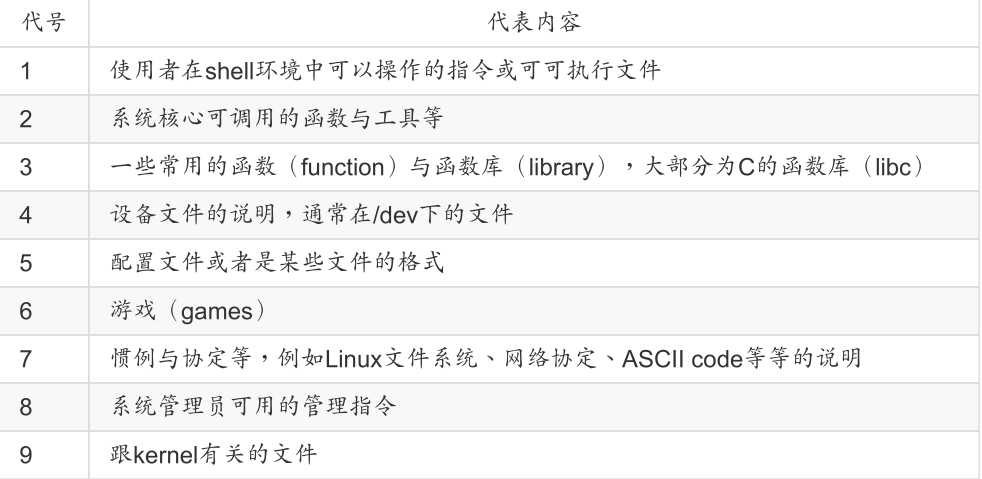

# 基本使用

如果是网络服务的问题时，请到/var/log/这个目录里头去查阅一下 log file（登录文件）

### 基础指令

date：显示日期与时间

- date +%Y/%m/%d	显示当前系统年月日

- date +%H:%M:%S  显示当前系统时间

cal：显示日历

- cal 2020	显示整年日历情况
- cal [month] [year]    显示某年某月的日历

bc：简单计算器

- bc    进入计算器
- quit    退出计算器
- bc默认仅输出整数，如：10/100 结果为0，键入：scale=number就可以保留number位小数了

### 重要的热键

Tab：补全

ctrl+c：将正在运行中的指令中断

ctrl+d：键盘输入结束（End Of File, EOF 或 End Of Input），退出终端

shift+PageUp|PageDn：往前/后翻页

### 线上求助

指令 --help：显示该指令说明

man 指令：进入man page页面，显示系统帮助手册



在文本中输入/word：搜寻关键字

sync：将内存中的数据写入到硬盘，只更新账号使用者的数据（进入到管理员权限可以更新整个系统中的数据）


### 关机

将数据同步写入硬盘中的指令： sync

无论关机还是重启，都非常建议在指令前添加 sync;

常用关机重启指令：sync；sync；sync；poweroff|reboot；


**shutdown [-krhc] [时间] [警告讯息]**

- -k ： 不要真的关机，只是发送警告讯息出去！
  -r ： 在将系统的服务停掉之后就重新开机（常用）
  -h ： 将系统的服务停掉后，立即关机。 （常用）
  -c ： 取消已经在进行的 shutdown 指令内容。

注意：shutdown 后面一定得要加时间参数才行

- 示例：

```
[root@study ~]# shutdown -h now
立刻关机，其中 now 相当于时间为 0 的状态
[root@study ~]# shutdown -h 20:25
系统在今天的 20:25 分会关机，若在21:25才下达此指令，则隔天才关机
[root@study ~]# shutdown -h +10
系统再过十分钟后自动关机
[root@study ~]# shutdown -r now
系统立刻重新开机
[root@study ~]# shutdown -r +30 'The system will reboot'
再过三十分钟系统会重新开机，并显示后面的讯息给所有在线上的使用者
[root@study ~]# shutdown -k now 'This system will reboot'
仅发出警告信件的参数！系统并不会关机啦！吓唬人！
```


**各种关机指令**

- halt：系统停止～屏幕可能会保留系统已经停止的讯息！
- power off：系统关机，所以没有提供额外的电力，屏幕空白！
- reboot：重启
- shutdown -h -now：常用关机指令
- shutdown -h 10    10分钟后自动关机。用shutdown -c命令取消重启
- init：切换不同的执行等级（执行等级共 0~6 七个）
  - init 0：关机
  - init 6：重启


# 文件与目录管理

### 目录相关操作（删除创建）

. 代表此层目录
.. 代表上一层目录

\- 代表前一个工作目录
~ 代表“目前使用者身份”所在的主文件夹
~account 代表 account 这个使用者的主文件夹（account是个帐号名称）


**mkdir [-mp] 目录名称（创建新目录）**

<font color=red>一般不加参数</font>

- -m ：设置文件的权限喔！直接设置，不需要看默认权限 （umask） 的脸色～
- -p ：帮助你直接将所需要的目录（包含上层目录）递回创建起来！
  - 示例1：mkdir -m 711 test2：创建权限为rwx--x--x的目录
  - 示例2：mkdir -p test1/test2/test3/test4：直接把test1····4全部创建


**rmdir [-p] 目录名称 （删除“空”的目录）**

- -p ：连同“上层”“空的”目录也一起删除
  - 示例1：rmdir test  直接删除test空目录（有文件不行）
  - 示例2：rmdir -p test1/test2/test3/test4 删除多个空目录


### 复制删除与移动

**cp（复制文件或目录）**

<font color=red>常用参数：-r</font>

- cp [-adfilprsu] 来源文件（source） 目标文件（destination）

- cp [options] source1 source2 source3 .... directory

```
-a ：相当于 -dr --preserve=all 的意思（复制文件权限和所属）， dr 请参考下列说明；（常用）
-d ：若来源文件为链接文件的属性（link file），则复制链接文件属性而非文件本身；
-f ：为强制（force）的意思，若目标文件已经存在且无法打开，则移除后再尝试一次；
-i ：若目标文件（destination）已经存在时，在覆盖时会先询问动作的进行（常用）
-l ：进行硬式链接（hard link）的链接文件创建，而非复制文件本身；
-p ：连同文件的属性（权限、用户、时间）一起复制过去，而非使用默认属性（备份常用）；
-r ：递回持续复制，可用于目录和文件的复制行为；（常用）
-s ：复制成为符号链接文件 （symbolic link），亦即“捷径”文件；
-u ：destination 比 source 旧才更新 destination，或 destination 不存在的情况下才复制。
--preserve=all ：除了 -p 的权限相关参数外，还加入 SELinux 的属性, links, xattr 等也复制了。
```

- 示例太多太详细：参考鸟哥304页


**rm [-fir] 文件或目录（移除文件或目录）**

<font color=red>常用参数：-r</font>

```
-f ：就是 force 的意思，忽略不存在的文件，不会出现警告讯息；(也常用)
-i ：互动模式，在删除前会询问使用者是否动作（默认已经加上此选项了）
-r ：递回删除,将目录及目录下的文件逐一删除！最常用在目录的删除了！这是非常危险的选项！！！
```

示例：rm -r /tmp/etc   删除目录（会一直提问是否要删除）


**mv （移动文件与目录，或更名）**

<font color=red>一般不带参数</font>

- mv [-fiu] source destination
- mv [options] source1 source2 source3 .... directory

```
-f ：force 强制的意思，如果目标文件已经存在，不会询问而直接覆盖；
-i ：若目标文件 （destination） 已经存在时，就会询问是否覆盖！
-u ：若目标文件已经存在，且 source 比较新，才会更新 （update）
```

- 示例1：mv mvtest mvtest2    将目录名称更名为 mvtest2
- 示例2：mv bashrc1 bashrc2 mvtest2   将两个文件移动到mvtest2中


### 文件查阅

```
cat 由第一行开始显示文件内容
tac 从最后一行开始显示，可以看出 tac 是 cat 的倒着写！
nl 显示的时候，顺道输出行号！
more 一页一页的显示文件内容
less 与 more 类似，但是比 more 更好的是，他可以往前翻页！
head 只看头几行
tail 只看尾巴几行
od 以二进制的方式读取文件内容！
```

### 修改文件时间或创建文件

- modification time （mtime）： 当该文件的“内容数据”变更时，就会更新这个时间！内容数据指的是文件的内容，而不是文件的属性或权限喔！
- status time （ctime）： 当该文件的“状态 （status）”改变时，就会更新这个时间，举例来说，像是权限与属性被更改了，都会更新这个时间啊。
- access time （atime）： 当“该文件的内容被取用”时，就会更新这个读取时间（access）。举例来说，我们使用 cat 去读取 /etc/man_db.conf ， 就会更新该文件的atime 了。

**touch [-acdmt] 文件**

```
-a ：仅修订 access time；
-c ：仅修改文件的时间，若该文件不存在则不创建新文件；
-d ：后面可以接欲修订的日期而不用目前的日期，也可以使用 --date="日期或时间"
-m ：仅修改 mtime ；
-t ：后面可以接欲修订的时间而不用目前的时间，格式为[YYYYMMDDhhmm]
```

在默认的状态下，如果 touch 后面有接文件，则该文件的三个时间 （atime/ctime/mtime） 都会更新为目前的时间。若该文件不存在，则会主动的创建一个新的空的文件喔！例如上面这个例子！

- 示例1：touch -d "2 days ago" bashrc  将bashrc文件日期调整为两天前（ctime不变）
- 示例2：touch -t 201406150202 bashrc  将bashrc 日期改为 2014/06/15 2:02


# 指令与文件的搜寻

### 指令文件名的搜寻

which （寻找“可执行文件”）

```
-a ：将所有由 PATH 目录中可以找到的指令均列出，而不止第一个被找到的指令名称
```

- 示例：which ifconfig   搜寻 ifconfig 这个指令的完整文件名


### 文件文件名的搜寻

whereis （由一些特定的目录中寻找文件文件名）

whereis [-bmsu] 文件或目录名

```
-l :可以列出 whereis 会去查询的几个主要目录而已
-b :只找 binary 格式的文件
-m :只找在说明文档 manual 路径下的文件
-s :只找 source 来源文件
-u :搜寻不在上述三个项目当中的其他特殊文件
```

- 示例：whereis ifconfig   ifconfig 这个文件名


**locate / updatedb**

locate [-ir] keyword

```
-i ：忽略大小写的差异；
-c ：不输出文件名，仅计算找到的文件数量
-l ：仅输出几行的意思，例如输出五行则是 -l 5
-S ：输出 locate 所使用的数据库文件的相关信息，包括该数据库纪录的文件/目录数量等
-r ：后面可接正则表达式的显示方式
```

- 示例：locate -l 5 passwd  找出系统中所有与 passwd 相关的文件名，且只列出 5 个


 **updatedb：更新local数据库**


**find [PATH] [option] [action]**

- 示例1：find /opt -name fileName		查找/opt目录下名字为fileName的文件
- 示例2：find /opt -name '*o.txt'                 查找/opt目录下名字后缀为o.txt的文件

- 太多啦，请参考鸟哥330页


**grep**

grep [-abcd...]  [文件或目录...]

```
-A<显示行数> 或 --after-context=<显示行数> : 除了显示符合范本样式的那一列之外，并显示该行之后的内容。
-B<显示行数> 或 --before-context=<显示行数> : 除了显示符合样式的那一行之外，并显示该行之前的内容。
-c 或 --count : 计算符合样式的列数。
-C<显示行数> 或 --context=<显示行数>或-<显示行数> : 除了显示符合样式的那一行之外，并显示该行之前后的内容。
-d <动作> 或 --directories=<动作> : 当指定要查找的是目录而非文件时，必须使用这项参数
-i 或 --ignore-case : 忽略字符大小写的差别
-l 或 --file-with-matches : 列出文件内容符合指定的样式的文件名称。
-n 显示行号
-L 或 --files-without-match : 列出文件内容不符合指定的样式的文件名称。
-v 或 --invert-match : 显示不包含匹配文本的所有行。
```


- 示例1：grep test *file	在当前目录中，查找后缀有 file 的文件中包含 test 字符串的文件，并打印出该字符串的行。
- 示例2：grep -r tomc /etc/acpi     查找目录/etc/acpi 及其子目录（如果存在子目录）下所有文件中包含字符串"tomc"的文件，并打印出该字符串所在行的内容
- 示例3：grep -v ab&#42;test&#42;          查找文件名中包含 test 的文件中 不包含ab的行

grep --version     显示grep版本号

grep -A 2  "a" test.txt	//匹配test.txt文件中字符 'a' 后面两行（-B是前面两行）


# Bash与变量

### 输入指令时操作光标


|       组合键        |                          功能与示范                          |
| :-----------------: | :----------------------------------------------------------: |
| [ctrl]+u / [ctrl]+k | 分别是从光标处向前删除指令串 （[ctrl]+u） 及向后删除指令串（[ctrl]+k）。 |
| [ctrl]+a / [ctrl]+e | 分别是让光标移动到整个指令串的最前面 （[ctrl]+a） 或最后面 （[ctrl]+e）。 |


### 变量的取用与设置：echo, 变量设置规则, unset

**变量的取用: echo** 

echo $变量名      或者     echo ${变量名}

- 示例：echo $PATH  或者  echo ${PATH}

**变量值的修改**

变量名=新值

- 示例：myname=VBird  将myname 这个变量名称的内容设置为 VBird

**变量的设置规格**

echo 变量名=变量值

- 变量与变量内容以一个等号“=”来链接，如下所示： “myname=VBird”
- 等号两边不能直接接空白字符，如下所示为错误： “myname = VBird”或“myname= VBirdTsai”
- 变量名称只能是英文字母与数字，但是开头字符不能是数字，如下为错误：“2myname=VBird”
- 变量内容若有空白字符可使用双引号“"”或单引号“'”将变量内容结合起来，但
  - 双引号内的特殊字符如 $ 等，可以保有原本的特性，如下所示： “var="lang is $LANG"”则“echo $var”可得“lang is zh_TW.UTF-8”
  - 单引号内的特殊字符则仅为一般字符 （纯文本），如下所示： “var='lang is $LANG'”则“echo $var”可得“lang is $LANG”
- 可用跳脱字符“ \ ”将特殊符号（如 [Enter], $, \, 空白字符, '等）变成一般字符，如：“myname=VBird\ Tsai”
- 通常大写字符为系统默认变量，自行设置变量可以使用小写字符

- 等等......  鸟哥500页

**取消变量的方法为使用 unset **

unset  变量名称

- 例如取消 myname 的设置： “unset myname”


### 环境变量的功能


env（environment）：查看环境变量与常见环境变量说明

- 示例：env   列出目前的 shell 环境下的所有环境变量与其内容

用 set 观察所有变量 （含环境变量与自订变量）


export： 自订变量转成环境变量


### 可执行文件路径： $PATH

将root目录加到环境变量中（PATH 前面加的 $ 表示后面接的是变量）

\# PATH="${PATH}:/root"

****


# 终止程序

Ctrl+c是强制中断程序的执行。

Ctrl+z的是将任务中断,但是此任务并没有结束,他仍然在进程中他只是维持挂起的状态

Ctrl+d 不是发送信号，而是表示一个特殊的二进制值，表示 EOF。

fg命令重新启动前台被中断的任务,

bg命令把被中断的任务放在后台执行.


# 防火墙设置

## Centos下

- systemctl status firewalld.service 查看防火墙状态
- systemctl stop firewalld.service 关闭运行的防火墙
- service iptables restart 重启防火墙
- firewall-cmd  --reload   重新加载防火墙

#### 开放某端口号

##### 方法一：

1. 打开防火墙配置文件：vim /etc/sysconfig/iptables

2. 例如开放3306端口（添加这行进去）：A INPUT -m state --state NEW -m tcp -p tcp --dport 3306 -j ACCEPT

##### 方法二：

1. <font color=red>firewall-cmd  --add-port=2181/tcp  --permanent</font>    持久化的放行某个端口号   --permanent：持久化的开启
2. firewall-cmd  --reload       重新加载防火墙
3. firewall-cmd  --list-all       查看防火墙上的端口

### Ubuntu下

安装防火墙：sudo sudo apt-get install ufw

查看防火墙状态：sudo ufw status	         “Status: inactive”状态：不活跃（并不是没有安装防火墙）

开启防火墙：sudo ufw enable

关闭防火墙：sudo ufw disable

开放8080端口：sudo ufw allow 8080

关闭8080端口：sudo ufw delete allow 8080

重启防火墙：sudo ufw reload

查看22端口信息：sudo netstat -tunlp | grep 22


# 进程

ps命令用于显示当前进程的状态

ps [options] [--help]

```
-A 列出所有的进程
-w 显示加宽可以显示较多的资讯
-au 显示较详细的资讯
-aux 显示所有包含其他使用者的行程
```

kill -9 端口号：杀死进程

