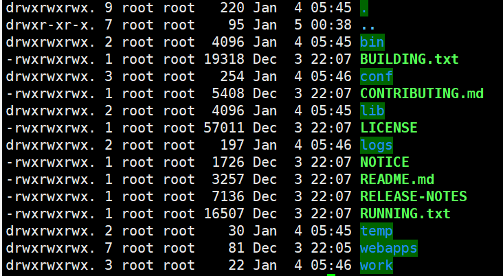

# 用户

### 添加用户

useradd [选项] 用户名

useradd -d 指定目录 用户名

useradd 用户名 -m (-m 相当于会创建对应的用户家目录)

useradd -g 用户组 用户名	：添加用户时直接将其指定到某个组

**补充：passwd 用户名：为该用户指定/修改密码**

### 删除用户

userdel 用户名：删除用户但会保留目录

userdel -r 用户名：删除用户以及用户所在的目录

### 修改用户信息

usermod [选项] 

修改用户名：usermod  -l  新用户名  旧用户名（只修改用户名，别的组什么的都不变）

修改用户登入时的目录：usermod - d  新目录   用户名

​	登陆前面不显示目录，只显示 -bash-3.00$

​	解决办法：cp  /etc/skel/.*   用户目录

修改用户名：usermod -l 新用户  旧用户 

修改用户所在的群组：usermod -g 新组名 用户名

将用户加到某个组（适用于没有组的用户）：gpasswd -d 用户 组

### 查询用户信息

id 用户名：查看用户，组等信息

whoami：查看当前是哪个用户

### 切换用户

su  [-]  用户名（加）

exit/logout/ctrl+d：退出用户

# 组

### 增加组

groupadd 组名

### 删除组

groupdel 组名

### 修改组

usermod -g 新组名  用户名：改变用户所在组

groupmod -n 新组名 旧组名：修改组名

- -g GID：修改组 ID；
- -n 新组名：修改组名；

# 用户组相关文件

用户配置文件： /etc/passwd

组文件：/etc/group

口令配置文件：/etc/shadow

/etc/group文件包含所有组
/etc/shadow和/etc/passwd系统存在的所有用户名

# 文件/目录属性与权限

查看文件/目录所有者：ls  -al  等同于 ll 命令

- **chgrp ：改变文件所属群组 **chgrp [-R]  新群组 文件名

  - -R : 连同次目录下的所有文件、目录都更新成为这个群组之意。常常用在变更某一目录内所有的文件之情况。
  - 示例：chgrp  group1  a.cfg： 将a.cfg文件的群组改为group1 （前提要有这个组）

- **chown ：改变文件拥有者** （两种）

  1. chown [-R] 用户名:群组名称 文件或目录
  2.  chown [-R] 用户名 文件或目录

  - -R : 连同次目录下的所有文件都变更
  - 示例1：将 a.cfg 的拥有者改为hel这个帐号：chown hel  a.cfg
  - 示例2：将a.cfg 的拥有者与群组改回为root：chown root:root  a.cfg

- **chmod ：改变文件的权限**

  - **数字类型改变文件权限**：chmod [-R] xyz 文件或目录
    - xyz : 就是刚刚提到的数字类型的权限属性，为 rwx 属性数值的相加。
    - -R : 连同次目录下的所有文件都会变更
    - 规则：r=4 w=2 x=1   rwx=r+w+x的值，三个为一组
    - 示例：将.bashrc这个文件所有的权限都设置启用：chmod 777 .bashrc
  - **符号类型改变文件权限**：chmod | u g o a | +（加入） -（除去） =（设置） | r w x | 文件或目录 |
    - u=user，g=group，o=other，a=all
    - 示例1：增加bashrc这个文件的每个人均可写入的权限：chmod  a+w  bashrc（改成-号则是减去该权限）
    - 示例2：设置bashrc文件的权限成为-rwxr-xr-x：chmod  u=rwx,go=rx  bashrc

修改文件所有者：chown  用户名 文件名

修改文件所在组：chgrp 组名 文件名

### 文件属性

ls -al

- [ r ]代表可读（read）

- [ w ]代表可写（write）

- [ x ]代表可执行（execute）

第一栏代表这个文件的类型与权限（permission）：

- 当为[ d ]则是目录，例如上表文件名为“.config”的那一行；
  当为[ - ]则是文件，例如上表文件名为“initial-setup-ks.cfg”那一行；
  若是[ l ]则表示为链接文件（link file）；
  若是[ b ]则表示为设备文件里面的可供储存的周边设备（可随机存取设备）；
  若是[ c ]则表示为设备文件里面的序列埠设备，例如键盘、鼠标（一次性读取设
  备）

第二栏表示有多少文件名链接到此节点（i-node）：

第三栏表示这个文件（或目录）的“拥有者帐号”

第四栏表示这个文件的所属群组

第五栏为这个文件的容量大小，默认单位为Bytes；

第六栏为这个文件的创建日期或者是最近的修改日期：

第七栏为这个文件的文件名

### 文件与目录权限

对于**文件**来说

- r （read）：可读取此一文件的实际内容，如读取文本文件的文字内容等；
- w （write）：可以编辑、新增或者是修改该文件的内容（但不含删除该文件）；
- x （eXecute）：该文件具有可以被系统执行的权限。

对**目录**来说

- [ r ]代表可读(read): 可以读取，即：ls 能查看目录内容
- [ w ]代表可写(write): 可以修改，即：目录内创建+删除+重命名目录
- [ x ]代表可执行(execute):可以**进入**该目录当工作目录

**补充知识：**

​	passwd -l -用户名：锁定该用户密码（此时用密码不能登录了）

​	passwd -u 用户名：解锁