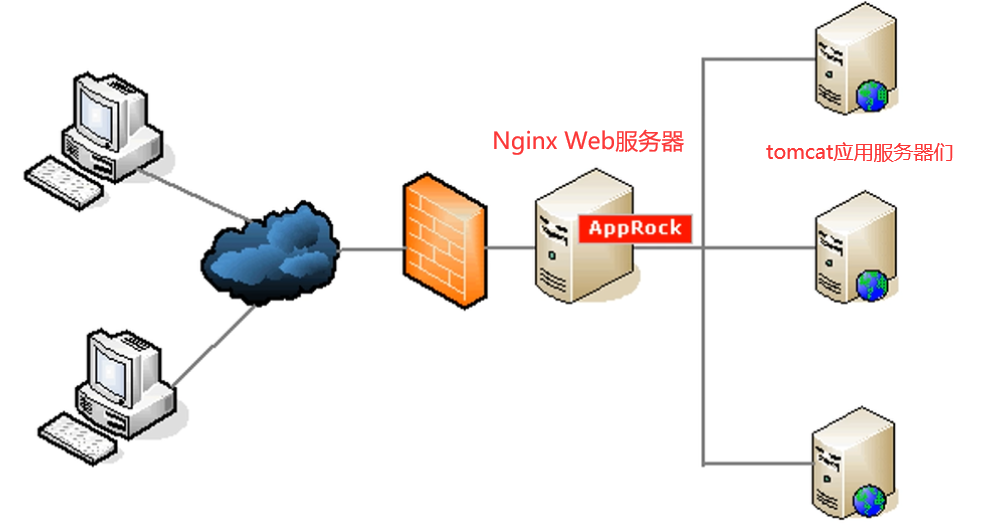
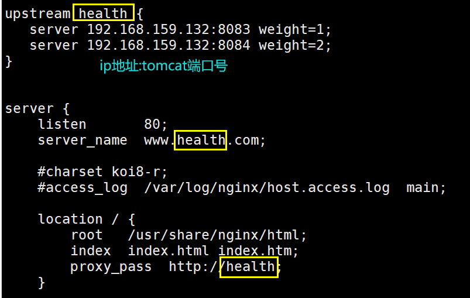
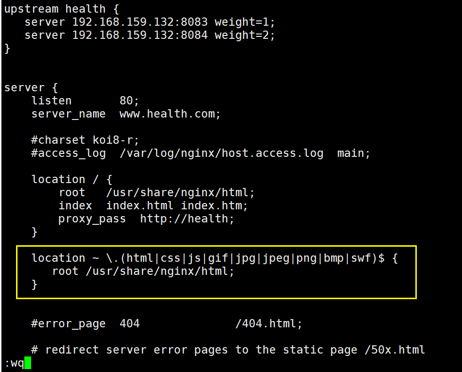

# Nginx的yum安装

1. 在/etc/yum.repos.d/目录下创建一个源配置文件nginx.repo(**需root权限**)

    填写如下内容（CentOS7就把数字6改为7）

   ```
   [nginx]
   name=nginx repo
   baseurl=http://nginx.org/packages/centos/**6**/$basearch/
   gpgcheck=0
   enabled=1
   ```

2. 从源下载Nginx

   - #yum install nginx -y

3. 启动Nginx服务

     - CentOS6
         - service nginx start       #启动Nginx服务 
         - service nginx stop     # 停止Nginx服务
         - service nginx restart   # 重启Nginx服务
   - CentOS7
     - systemctl start nginx.service
     - systemctl stop nginx.service
     - systemctl reload nginx.service
     - systemctl status nginx.service

4. 防火墙放行 80 端口，为了在windows中能访问到

   1. vim /etc/sysconfig/iptables
   2. 添加：-A INPUT -p tcp -m state --state NEW -m tcp --dport 80 -j ACCEPT

5. 重启防火墙  

   - service iptables restart

6. 测试

   - windows浏览器输入 CentOS的ip:80


# Nginx和Tomcat负载均衡


### 一、Nginx负载均衡策略

nginx的upstream目前支持的5种方式的分配

##### 1、轮询（默认）

每个请求按时间顺序逐一分配到不同的后端服务器，如果后端服务器down掉，能自动剔除。 

```
upstream backserver { 
server tomcat1IP; 
server tomcat2IP; 
} 
```

##### 2、指定权重

指定轮询几率，weight和访问比率成正比，用于后端服务器性能不均的情况。

```
upstream backserver { 
server tomcat1IP weight=1; 
server tomcat2IP weight=2; 
} 
```

##### 3、IP绑定  ip_hash     hash：绑定

每个请求按访问ip的hash结果分配，这样每个访客访问固定的一个后端服务器，可以解决session共享的问题。 

解决分布式项目sesssion共享问题的常用方式：**用redis替代session**

```
upstream backserver { 
ip_hash; 
server 192.168.0.14:88; 
server 192.168.0.15:80; 
} 
```


##### 4、fair（需要第三方）

按后端服务器的响应时间来分配请求，响应时间短的优先分配。


##### 5、url_hash:即url绑定（需要第三方）

按访问url的hash结果来分配请求，使每个url定向到同一个后端服务器，后端服务器为缓存时比较有效。 

/user/regist   tomcat1

/user/login   tomcat2


### 二、配置Nginx负载均衡 

Nginx配置文件：/etc/nginx/conf.d/default.conf

1. vim  /etc/nginx/conf.d/default.conf



2. service nginx restart：重启nginx服务器

3. 出现访问异常（报错）的处理方式：执行如下命令:耐心等待

   setsebool -P httpd_can_network_connect 1


4. 最后，修改hosts文件(非必须)：把域名请求映射到本机 

   - Windows:

     ​	Windows--->System32--->drivers--->etc--->hosts

     ​	添加： IP   www.health.com

​           - Linux下

​					vim /etc/hosts

​					添加： IP   www.health.com


### 三、Nginx部署动静分离

##### 1.上传html文件

分别上传demo.jsp分别到

服务器1：/usr/local/tomcat1/webapps/ROOT  	 \

服务器2：/usr/local/tomcat2/webapps/ROOT		\

```
<%@ pageimport="java.util.*,java.text.*" %>
<html>
<head>
    <title> Session Test</title>
</head>
<body >
<%
   Date dNow = new Date( );
   SimpleDateFormat ft = new SimpleDateFormat ("yyyy-MM-dd HH:mm:ss");
   out.print( "<h2 align=\"center\">" + ft.format(dNow) + "</h2>");
%>

</body>
</html>
```


##### 2.上传图片

上传图片demo.jpg和 demo2.jpg到：/usr/share/nginx/html


##### 3.配置Nginx动静分离


vim  /etc/nginx/conf.d/default.conf




##### 4.重启nginx服务器

service nginx restart