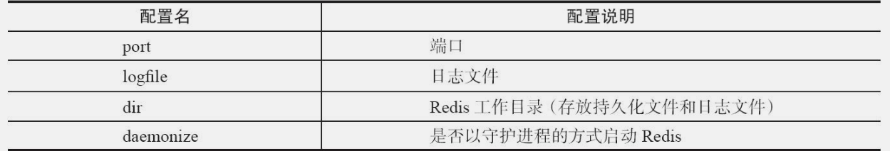

# Redis开发与运维

# redis前序

usr/local/bin：下的可执行文件可以在任意目录启动（所以非常建议安装在/usr/local目录下）

/etc/init.d：Linux开机自启的文件都在这儿

### CentOS下安装redis

1. 导入redis压缩包到/usr/local，解压

2. 将解压后的redis目录更名为redis
3. 安装gcc和gcc类库(tcl)：1. yum install gcc   2. yum install tcl
4. cd /usr/local/redis
5. make
6. cd  /usr/local/redis/src
7. make install           安装成功，输入redis-server测试

### redis后台启动设置

```bash
cd /usr/local/redis		# 在/usr/local/redis下新建etc目录
mkdir etc
mv redis.conf  etc		# 将redis.conf文件移动到etc目录下
vim etc/redis.conf

#修改daemon... 为yes 后台启动，此时可以使用配置文件进行后台启动

redis-server  /usr/local/redis/etc/redis.conf     # 使用配置文件启动
```

### redis开机自启

chkconfig --list    查看所有开机自启项

1. 将redis的启动文件**redis_init_script**复制到linux开机自动加载的目录下/etc/init.d

   ​    将/usr/local/redis/utils下的**redis_init_script**复制到/etc/init.d/下并重命名为redis

   1. cp /usr/local/redis/utils/redis_init_script   /etc/init.d/**<font color=red>redis</font>**（复制文件的同时把启动文件更名为redis）

2. redis启动文件需要加载**/etc/redis/6379.conf**

   1. 在/etc下创建目录redis

   2. 复制redis/etc/下的redis.conf到/etc/redis并改名为6379.conf

       cp  /usr/local/redis/etc/redis.conf   /etc/redis/6379.conf

   3. vim  /etc/redis/6379.conf，修改保护模式yes为no，注释127.0.0.1

3. 添加redis到系统服务 chkconfig --add redis

4. 设置开机自启 chkconfig redis on 

5. 查看所有注册的脚本文件  chkconfig --list

6. 重启Linux


### 修改 6379.conf 为远程连接做准备

vim  /etc/redis/6379.conf，修改保护模式yes为no，注释127.0.0.1


### Redis远程连接配置

防火墙配置，放行6379端口

vim /etc/sysconfig/iptables

添加：-A INPUT -m state --state NEW -m tcp -p tcp --dport 6379-j ACCEPT

重启防火墙：service iptables restart


# 第一章：初始redis

### Redis可执行文件说明


### 启动redis服务

三种方法启动Redis：默认配置、运行配置、配置文件启动。

**1）默认配置**

redis-server（前台运行）

**2）运行启动**

redis-server加上要修改配置名和值（可以是多对），没有设置的配置将使用默认配置：

redis-server --configKey1 configValue1 --configKey2 configValue2

- 示例1：redis-server --port 6380    用6380作为端口启动Redis
- **<font color="red">示例2：redis-server --daemonize yes 后台运行redis（目前常用）</font>**

ps -ef|grep redis：查看redis服务是否被启动

**3）配置文件启动(后台运行)**

修改配置文件：vim /usr/local/redis/redis.conf        将配置daemonize no修改为yes

在任意路径执行：redis-server /opt/redis/redis.conf（使用/opt/redis/redis.conf配置文件启动redis）


<center>Redis的基础配置</center>




### 启动Redis客户端

```shell
# 交互式方式连接上服务后可以交互了）
redis-cli -h {host} -p 	{port} -a {密码}

# 命令方式（可以直接得到命令的返回结果）
redis-cli -h ip {host} -p {port} {command}  -a 密码（连接别的主机的redis）
```

注意：如果没有-h参数，那么默认连接127.0.0.1；如果没有-p，那么默认6379端口

<font color=red>常用：redis-cli，启动的是0号数据库</font>

redis-cli **--**raw        会对中文数据进行UTF-8解码

### 停止Redis服务（shutdown）

```shell
- redis-cli  shutdown  或者 在redis-cli里面输入shutdown
- kill-9 [UID]  强制杀死redis服务。不会做持久化操作，还会造成缓冲区等资源不能被优雅关闭，极端情况会造成AOF和复制丢失数据的情况。
- redis-cli shutdown nosave|save       代表是否在关闭Redis前，生成持久化文件
```


### 设置redis密码

#### 1. 永久修改

修改redis.conf设置密码（/usr/local/redis/etc/redis.conf）

<font color=red>提示</font>：*改了开机自启之后配置文件就变成了 /etc/redis/6379.conf 了，改配置的话 就改它*

\#requirepass foobared。设置密码的方法就是去掉注释的#，把foobared替换成自己的密码即可

登录客户端  redis-cli  -a  密码   -p 6379

#### 2. 临时修改

进入redis客户端

&gt; config set requirepass 密码


有了密码之后登录方式：

redis-cli -h {主机名}  -p {端口号}  -a {密码}

或者不输 -a和密码，enter之后再输入：> auth 密码 


# 第二章：API理解与使用

redis有五种数据类型，它们分别是：string（字符串）、hash（哈希）、list（列表）、set（集合）、zset（有序集合）

## 一、全局命令

```shell
keys * 	# 查看所有的键（遍历所有键，时间复杂度是O（n））
dbsize 	#返回键总和（直接获取Redis内置的键总数变量，时间复杂度是O（1））
exists key	#检查键是否存在（键存在则返回1，不存在则返回0）
del key [key · · · ]	# 直接删除（返回结果为成功删除键的个数）
unlink key	# 根据value选择非阻塞删除（真正删除可能会在后续异步操作）
expire key second		# 键过期（对键添加过期时间，超过过期时间后，会自动删除键）
ttl key	# 返回键的剩余过期时间，三种返回值如下
  大于等于0的整数：键剩余的过期时间。
  -1：键没设置过期时间。
  -2：键不存在
type key	# 键的数据结构类型
object encoding [key]	# 查询内部编码
setex	# 设置key对应的value的过期时间
select 库名	# 切换数据库（如select 15）
flushdb	# 清空当前库
flushall	# 清空所有库
```


## 二、字符串（string）

字符串类型是Redis最基础的数据结构。字符串类型的值实际可以是字符串（简单的字符串、复杂的字符串（例如JSON、XML））、数字（整数、浮点数），甚至是二进制（图片、音频、视频），但是值最大<font color=red>不能超过512MB</font>。


### 1. 设置值 set

1.1 set key value [ex seconds] [px milliseconds] [nx|xx]

```bash
ex seconds	# 为键设置秒级过期时间。
px milliseconds		# 为键设置毫秒级过期时间。
nx		# 键必须不存在，才可以设置成功，用于添加。
xx		# 与nx相反，键必须存在，才可以设置成功，用于更新
```

1.2 除了set选项，Redis还提供了setex和setnx两个命令：

1.2.1 setnx（set if Not exists）：命令在指定的 key 不存在时，为 key 设置指定的值。

​		格式：```setnx key value```

```bash
redis> EXISTS job                # job 不存在
(integer) 0

redis> setnx job "programmer"    # job 设置成功返回1
(integer) 1

redis> setnx job "code-farmer"   # 尝试覆盖 job ，失败返回0
(integer) 0

redis> GET job                   # 没有被覆盖
"programmer"
```

1.2.2 setex：为指定的 key 设置值及其过期时间。如果 key 已经存在， SETEX 命令将会替换旧的值。

```shell
格式：setex key timeout value

setex mykey 60 value

示例：set name 60 张飞
```

（3）批量设置值

```shell
mset key value [key value ...]

示例：mset a 1 b 2 c 3 d 4
```


### 2. 获取值 get

- 单个获取：get key
- 批量获取值：mget key [key ...]
  - 示例：mget a b c d
- 获取范围内的值：getrange key 起始位置  结束位置
- 设置新值同时获取旧值：getset key value

### 3.计数 incr / decr

incr 命令用于对值做自增操作，返回结果分为三种情况：

- 值不是整数，返回错误。
- 值是整数，返回自增后的结果。
- 键不存在，按照值为0自增，返回结果为1。

Redis还提供了incrby（自增指定数字）、decrby（自减指定数字）、incrbyfloat（自增浮点数）：

```bash
decr key
incrby key increment	# 自增自定义步长
decrby key decrement	# 自减自定义步长
incrbyfloat key increment	# 自增自定义步长浮点数
```

### 4.追加值 

append key value：append可以向字符串尾部追加值

### 5.字符串长度

strlen key：返回字符串的字节长度

注意：每个中文占3个字节

### 6.设置并返回原值

getset key value：和set一样会设置值，但是不同的是，它同时会返回键原来的值

### 7.设置指定位置的字符

setrange key offeset value：

- offeset：索引（从零开始计数）
-  value：替换的值

### 8.获取部分字符串

getrange key start end：start和end分别是开始和结束的偏移量，偏移量从0开始计算（左右都取）

<center>字符串类型命令时间复杂度</center>


### 内部编码

字符串类型的内部编码有3种：

- int：8个字节的长整型。
- embstr：小于等于39个字节的字符串。
- raw：大于39个字节的字符串。

Redis会根据当前值的类型和长度决定使用哪种内部编码实现。

使用**object encoding key**查看字符串内部编码


## 三、哈希（hash）

在Redis中，哈希类型是指键值本身又是一个键值对结构，形如value={{field1，value1}，...{fieldN，valueN}}

### 1.设置值hset

```shell
hset key field value

示例：hset stu name tom    # 为stu添加一对field-value，设置成功会返回1，反之会返回0

hsetnx key field value	# 当且仅当域 field 不存在时才添加
```

### 2.获取值hget

```shell
hget key field

示例：hget user1 name    # 获取user1的name域（属性）对应的值
```

### 3.删除field

```shell
hdel key field [field ...]		# hdel会删除一个或多个field，返回结果为成功删除field的个数

示例：hdel user1 name
```

### 4.计算field个数

```shell
hlen key

示例：hlen user1    # 计算user1有多少个field
```

### 5.批量设置或获取field-value

```shell
hmget key field [field ...]
hmset key field value [field value ...]

示例：
hmset user1 name mike age 12 city tianjin    //设置
>OK
hmget user1 name city		//获取
>"mike"
>"tianjin"
```

### 6.判断field是否存在

```shell
hexists key field
```

### 7.获取所有field

```shell
hkeys key
```

### 8.获取所有value

```shell
hvals key
```

### 9.获取所有的field-value

```shell
hgetall key
```

### 10.计算value的字符串长度（需要Redis3.2以上）

```shell
hstrlen key field
```


## 四、列表（list）

特点

1. 列表中的元素是有序的
2. 列表中的元素可以是重复的


lrange 0-1 命令可以从左到右获取列表的所有元素   如：lrange listkey 0 -1

### 1.添加操作

```shell
rpush/lpush key value [value ...]
rpush listkey c b a    # 从右向左插入元素c、b、a

linsert  key  before|after  key2  value	# 向某个元素前或者后插入元素  
linsert  listkey  before  b  java    # 在列表的元素b前插入 java
```

### 2.查找操作

```shell
lrange key start end	# 获取指定范围内的元素列表
	1. 索引下标从左到右分别是0到N-1，但是从右到左分别是-1到-N， 0 -1表示查所有
	2. lrange中的end选项包含了自身
	
lrange listkey 1 3     # 获取列表listkey 的第2到第4个元素


lindex key index	# 获取列表指定索引下标的元素
lindex listkey -1		#查看listkey列表最后一个元素

llen key	# 获取列表长度 
llen listkey		# 查看listkey列表长度
```

### 3.删除

```shell
lpop key		# 从列表左侧弹出一个元素

rpop key		# 从列表右侧弹出

lrem key count value	# 删除指定元素

# lrem命令会从列表中找到等于value的元素进行删除，根据count的不同分为三种情况：
  1. count>0，从左到右，删除最多count个元素。
  2. count<0，从右到左，删除最多count绝对值个元素。
  3. count=0，删除所有
示例：从列表 listkey 左边开始删除4个值为a的元素    lrem  listkey  4  a

ltrim key start end		# 按照索引范围修剪列表
示例：ltrim listkey 1 3    只保留列表listkey索引1到3位置的元素
```

### 4.修改

```shell
lset key index newValue		# 修改指定索引下标的元素

示例：lset listkey 2 python    将列表listkey中的第3个元素设置为python
```


### 5.阻塞弹出操作

blpop命令会按照从左到右的顺序依次检查用户给定的列表，并对最先遇到的非空列表执行左端元素弹出操作。如果给定的所有列表都没有可以执行弹出操作的非空列表，那么它将阻塞执行该命令的客户端并开始等待。直到某个给定列表变为非空，或者等待时间超出给定时限为止。

```bash
# blpop命令包含两个参数（blpop、brpop用法相同）：
- key [key...]：多个列表。
- timeout：阻塞时间（单位：秒）

blpop key [key ...] timeout		# 阻塞式弹出操作 

当blpop命令成功对某个非空列表执行了弹出操作之后，它将向用户返回一个包含两个元素的数组：
- 数组的第一个元素记录了执行弹出操作的列表，即被弹出元素的来源列表
- 数组的第二个元素则是被弹出元素本身。
```

示例：若三个列表都为空则会阻塞给定的三秒时间。


### 6.解除阻塞状态

在客户端被阻塞的过程中有另一个客户端，向导致阻塞的列表推入了新的元素，那么该列表就会变为非空，而被阻塞的客户端也会随着捕捞泡沫命令成功弹出元素而重新回到非阻塞状态。


## 五、集合（set）

集合（set）类型也是用来保存多个的字符串元素

**特点：**

- 集合中不允许有重复元素，

- 并且集合中的元素是无序的，不能通过索引下标获取元素

### 1.集合内操作

```shell
sadd key element [element ...]		# 添加元素

srem key element [element ...]		# 删除元素
	
scard key		# 计算元素个数，scard的时间复杂度为O(1)，它不会遍历集合所有元素，而是直接用Redis内部的变量

sismember key element    # 判断元素是否在集合中 在集合内返回1，反之返回0

srandmember key [count]      # 随机从集合返回指定个数元素 [count]是可选参数，如果不写默认为1

spop key		# 从集合随机弹出元素

smembers key	# 查询所有元素

srandmember key n		# 随机查询n个值 

smove source  destination element		# 移动元素 将集合source中的element元素移动到destination集合中
```

### 2.集合间操作

```shell
# 现在有两个集合，它们分别是 user1 和 user2

sinter key [key ...]		# 求多个集合的交集

suinon key [key ...]		# 求多个集合的并集

sdiff key [key ...]			# 求多个集合的差集

# 将交集、并集、差集的结果保存在另外的列表中
sinterstore  key  [key ...]
suionstore  key  [key ...]
sdiffstore  key  [key ...]
```


## 六、有序集合（zset）

有序集合（zset）中的元素可以排序，但是不能有重复成员

有序集合给每个元素设置一个分数（score）作为排序的依据。（小在前大在后，score可以重复）


### 1.集合内

```shell

# 8.返回指定分数范围的成员# 1.添加元素
zadd key score member [score member ...]
- 示例 zadd stu 200 tom	# 向有序集合stu添加用户tom和他的分数251
- Redis3.2为zadd命令添加了nx、xx、ch、incr四个选项：
  - nx：member必须不存在，才可以设置成功，用于添加。
  - xx：member必须存在，才可以设置成功，用于更新。
  - ch：返回此次操作后，有序集合元素和分数发生变化的个数
  - incr：对score做增加，相当于后面介绍的zincrby。
  
# 2.计算元素个数 zcard的时间复杂度为O（1）
zcard key	

# 3.计算某个成员的分数
zscore key member	

# 4.计算成员的排名
zrank key member    从低到高返回排名
zrevrank key member    从高到低返回排名

# 5.删除成员
zrem key member [member ...]

# 6.增加成员的分数
zincrby key increment member
示例：zincrby stu 9 tom   给tom加九分

# 7.返回指定排名范围的成员
zrange key starIndext endIndex [withscores]   zrange是从低到高返回
zrevrange key starIndext endIndex [withscores]   从高到低返回
- startIndex和endIndex指的是排名
- 如果加上withscores选项，同时会返回成员的分数

# 8.返回指定分数范围的成员
zrangebyscore key min max [withscores] [limit offset count]      从低到高返回，
zrevrangebyscore key max min [withscores] [limit offset count]

withscores选项会同时返回每个成员的分数

[limit offset count]选项可以限制输出的起始位置和个数

# 9.返回指定分数范围成员个数
zcount key min max

# 10.删除指定排名内的升序元素
zremrangebyrank key start end
示例：zremrangebyrank stu 0 2   删除第start到第end名的成员

# 11.删除指定分数范围的成员
zremrangebyscore key min max
```

### 2.集合间的操作

详情见Redis开发与运维第138页


## 七、键管理

### 1.单个键管理

```shell
# 1.键重命名
rename key newkey		# 如果在rename之前，键newKey已经存在，那么它的值将被覆盖
renamenx key newKey		# 如果在renamenx之前，键newKey已经存在，则重命名失败

# 2.随机返回一个键
randomkey

# 3.键过期
ttl/pttl key	# 查看键过期时间ttl精确到秒，pttl精确到毫秒
 - 大于等于0的整数：键剩余的过期时间（ttl是秒，pttl是毫秒）。
 - 1：键没有设置过期时间。
 - 2：键不存在。
 
# 4.设置键的秒级过期时间戳 expireat
- expire key seconds：键在seconds秒后过期。
- expireat key timestamp：键在秒级时间戳timestamp后过期
	注意事项：
    1. 如果expire key的键不存在，返回结果为0
    2. 如果过期时间为负值，键会立即被删除，犹如使用del命令一样
    3. persist命令可以将键的过期时间清除
    4. 字符串类型键，执行set命令会去掉过期时间
    5. Redis不支持二级数据结构（例如哈希、列表）内部元素的过期功能
    6. setex命令作为set+expire的组合，不但是原子执行，同时减少了一次网络通讯的时间
    
# 5.键迁移
move
move key db

dump+restore

dump key
restore key ttl value

整个迁移过程分为两步：

​	1）在源Redis上，dump命令会将键值序列化，格式采用的是RDB格式。
​	2）在目标Redis上，restore命令将上面序列化的值进行复原，其中ttl参数代表过期时间，如果ttl=0代表没有过期时间。

migrate

太多了，看不太懂，暂时略
```

### 2.遍历键

```shell
# 全量遍历键
keys pattern    支持正则表达式的遍历，例如 keys hll* ，匹配以hll开头的键
# 渐进式遍历
scan cursor [match pattern] [count number]
参数介绍：
- cursor是必需参数，实际上cursor是一个游标，<font color=red>第一次遍历从0开始</font>，每次scan遍历完都会返回当前游标的值，直到游标值为0，表示遍历结束。
- match pattern是可选参数，它的作用的是做模式的匹配，这点和keys的模式匹配很像。
- count number是可选参数，它的作用是表明每次要遍历的键个数，默认值是10，此参数可以适当增大
```

### 3.数据库管理

```shell
# 切换数据库

select dbIndex

Redis默认有16个数据库，select 0将切换到第一个数据库，select15选择最后一个数据库

0号数据库和15号数据库之间的数据没有任何关联，甚至可以存在相同的键：


# 清除数据库

flushdb/flushall

flushdb只清除当前数据库，flushall会清除所有数据库
```

# 第三章：小功能大用处

### 一、慢查询分析

系统在命令执行前后计算每条命令的执行时间，当超过预设阀值，就将这条命令的相关信息

1发送命令-->2命令排队-->3命令执行-->4返回结果      慢查询只统计步骤3

slowlog-log-slower-than：预设阀值，单位是微秒（1秒=1000毫秒=1000000微秒），默认值是10000

- slowlog-log-slower-than=0会记录所有的命令
- slowlog-log-slower-than<0对于任何命令都不会进行记录。

slowlog-max-len：表示慢查询日志最多存储多少条，当慢查询日志列表已处于其最大长度时，最早插入的一个命令将从列表中移出

#### 修改配置的方法

```shell
config set命令动态修改：
​	config set slowlog-log-slower-than 20000：预设阀值设置为20000微秒
​	config set slowlog-max-len 1000：设置日志最多存储1000条
​	config rewrite：将配置持久化到本地配置文件

# 1.获取慢查询日志
slowlog get [n]：参数n可以指定条数

# 2.获取慢查询日志列表当前的长度
slowlog len
# 3.慢查询日志重置（清理）

slowlog reset
```


### 二、Redis Shell

#### 1.redis-cli详解

```shell
redis-cli-help		# 查看redis-cli的全部参数

-r（repeat）：选项代表将命令执行多次
	示例：redis-cli -r 3 ping      执行三次ping命令

-i（interval）：每隔几秒执行一次命令 
	示例：redis-cli -r 5 -i 1 ping      每隔1秒执行一次ping命令，一共执行5次
	注意：i 必须和 -r 选项一起使用

-x：从标准输入（stdin）读取数据作为redis-cli的最后一个参数
	示例：echo "world" | redis-cli -x set hello    将字符串world作为set hello的值
```

课本182页


# java与redis

引入依赖

```
<dependency>
    <groupId>redis.clients</groupId>
    <artifactId>jedis</artifactId>
    <version>3.1.0</version>
</dependency>
```


创建连接

```
//单实例连接
@Test
public void jedisDemo01(){
    //一个jedis对象相当于和redis服务器的一个连接
    Jedis jedis = new Jedis("192.168.159.132",6379);
    //没设置密码的话不需要该语句
    jedis.auth("liu0801");
    //测试连接
    System.out.println(jedis.ping());
    String value = jedis.set("stu","tom");
    System.out.println(value);
    jedis.close();
}

//连接池连接
@Test
public void jedisDemo02(){
    //创建jedis连接池
    JedisPool jedisPool = new JedisPool("192.168.159.132", 6379);
    //从连接池取连接
    Jedis jedis1 = jedisPool.getResource();
    //密码验证
    jedis1.auth("liu0801");
    System.out.println(jedis1.ping());
    //存数据
    String value = jedis1.set("stu","lili");
    System.out.println(value);
    //取数据
    String stu = jedis1.get("stu");
    System.out.println(stu);
    
    //关闭连接
    jedis1.close();
    jedisPool.close();
}
```


# springboot整合redis

```shell
1.导依赖
<dependency>
    <groupId>org.springframework.boot</groupId>
    <artifactId>spring-boot-starter-data-redis</artifactId>
</dependency>

2.编写配置文件
spring:
  redis:
    port: 6379
    host: 47.100.81.153
    database: 0     # 数据库索引（默认为0）
    timeout: 1800000    # 连接超时时间（毫秒）
    lettuce:
      pool:
        max-active: 20    # 连接池最大连接数（使用负值表示没有限制）
        max-wait: -1      # 最大阻塞等待时间(负数表示没限制)
        max-idle: 50       # 连接池中的最大空闲连接
        min-idle: 0       # 连接池中的最小空闲连接
        
        
        
3.测试
@RestController
@RequestMapping("/redis")
public class RedisController {

    @Autowired
    private RedisTemplate<String,String> redisTemplate;

    @GetMapping("/get")
    public String getValue() {
        return redisTemplate.boundValueOps("name").get();
    }
}
```


# redis视频学习

# 一、redis发布订阅

```shell
SUBSCRIBE channel1		# 订阅channel1频道（进入等待接受消息状态）

PUBLISH channel1 hello	# 给channel1发送消息（发完消息后，订阅该频道的客户端都能收到消息）
```


# 二、redis事务

Redis事务是一个单独的隔离操作：事务中的所有命令都会序列化、按顺序地执行。事务在执行的过程中，不会被其他客户端发送来的命令请求所打断。Redis事务的主要作用就是串联多个命令防止别的命令插队。

## 1. 具体操作事务命令

```shell
multi		# 开启事务，进行命令组队。键入multi之后输入的命令都会依次进入命令队列中，但不会执行
exec		# 按顺序执行队列的里的命令
discard		# 放弃组队，会取消multi的组队
```

- 组队中如果某个命令出现了报告错误，执行时整个的所有队列都会被取消。
- 如果执行阶段某个命令报出了错误，则只有报错的命令不会被执行，而其他的命令都会执行，不会回滚。

注意：事务只能保证自己完整执行，若两个事务同时修改某个值，则会发送事务冲突，导致数据不是期望的数据了，此时需要使用锁机制。

## 2. 锁 / 监视机制

```shell
# 在执行multi之前，先执行watch key1 [key2],可以监视一个(或多个) key。如果两个事务同时修改某个数据，则后修改的将会执行失败（乐观锁机制）
watch key [key ···]

# 取消 WATCH 命令对所有 key 的监视。
unwatch key [key ···]
```

## 3. Redis事务三特性

```shell
单独的隔离操作 
- 事务中的所有命令都会序列化、按顺序地执行。事务在执行的过程中，不会被其他客户端发送来的命令请求所打断。 

没有隔离级别的概念 
- 队列中的命令没有提交之前都不会实际被执行，因为事务提交前任何指令都不会被实际执行

不保证原子性 
- 事务中如果有一条命令执行失败，其后的命令仍然会被执行，没有回滚
```

# 三、redis持久化

## 1. RDB（Redis DataBase）

**原理介绍：**Redis会单独创建（fork）一个子进程来进行持久化，会先将数据写入到 一个临时文件中，待持久化(写入)过程都结束了，再用这个临时文件替换上次持久化好的文件（dump.rbd）。 整个过程中，主进程是不进行任何IO操作的，这就确保了极高的性能 如果需要进行大规模数据的恢复，且对于数据恢复的完整性不是非常敏感，那RDB方式要比AOF方式更加的高效。**RDB的缺点是最后一次持久化后的数据可能丢失**。

提示：临时文件名、存储位置、出发RDB快照的时机等都可以在redis配置文件（redis.conf）中找得到。

**优势：**

- 适合大规模的数据恢复
- 对数据完整性和一致性要求不高更适合使用
- 节省磁盘空间
- 恢复速度快

**劣势：**

- 需要两别的内存空间（因为过程会生成一个临时文件去替换备份文件）
- 最后一次持久化后的数据可能丢失

**RDB的备份**：将dump.rbd文件保存下来，即为备份。

**RDB恢复**：一般丢失dump.rbd时需要恢复，将备份的dump.rbd文件放到redis对应的目录即可（位置可以在redis.conf中查得到）


## 2. AOP（Append  Only  File）

**原理介绍**：以日志的形式来记录每个写操作（增量保存），将Redis执行过的所有写指令记录下来(读操作不记录)， **只许追加文件但不可以改写文件**，redis启动之初会读取该文件重新构建数据，换言之，redis 重启的话就根据日志文件的内容将写指令从前到后执行一次以完成数据的恢复工作

AOF默认不开启，可在redis.conf中 修改 appendonly no这行，将no改为yes

AOF和RDB同时开启，系统默认取AOF的数据（数据不会存在丢失）

**AOF持久化流程**：

1. 客户端的请求写命令会被append追加到AOF缓冲区内
2. AOF缓冲区根据AOF持久化策略[always,everysec,no]将操作sync同步到磁盘的AOF文件中
3. AOF文件大小超过重写策略或手动重写时，会对AOF文件rewrite重写，压缩AOF文件容量
4. Redis服务重启时，会重新load加载AOF文件中的写操作达到数据恢复的目的

**AOF启动/修复/恢复**

- 正常备份恢复：备份和恢复的操作同RDB一样，都是拷贝备份文件，需要恢复时再拷贝到Redis工作目录下，启动系统即加载
- 异常恢复：若AOF(appendonly.aof)文件损坏，可通过执行 /usr/local/bin/redis-check-aof --fix appendonly.aof 进行恢复，然后重启redis即可
  - 是执行/usr/local/bin/目录下的 redis-check-aof 文件，并添加 --fix参数 添加 appendonly.aof (要修复的文件名)

**AOF同步频率设置**

修改配置文件中 appendfsync 的属性即可：

- appendfsync always：始终同步，每次Redis的写入都会立刻记入日志；性能较差但数据完整性比较好
- appendfsync everysec：每秒同步，每秒记入日志一次，如果宕机，本秒的数据可能丢失。
- appendfsync no：redis不主动进行同步，把同步时机交给操作系统。

**AOF备份优势：**

- 备份机制更稳健，丢失数据概率更低。
- 可读的日志文本，通过操作AOF稳健，可以处理误操作。

**AOF备份劣势：**

- 比起RDB占用更多的磁盘空间。
- 恢复备份速度要慢。
- 每次读写都同步的话，有一定的性能压力。
- 存在个别Bug，造成恢复不能。


# 四、主从复制

介绍：主机数据更新后根据配置和策略， 自动同步到从机的master/slaver机制，Master(主)以写为主，Slave(从)以读为主。只能是一主多从

- 读写分离（主写从读），性能扩展
- 容灾快速回复（一台从服务器挂了，会快速切换到另外一台从服务器）


配置从机：

启动多个redis-server，默认都是主机，使用slaveof [主机ip] [主机端口号]，可以将主机配置为从机


