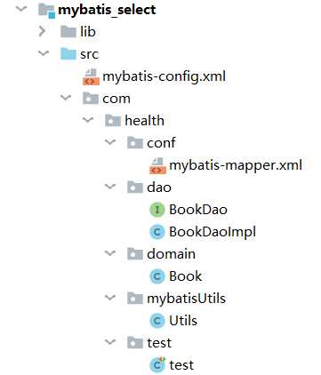

[TOC]

## Mybatis使用步骤

mybatis中文文档：https://mybatis.org/mybatis-3/zh/getting-started.html




### 一、导入jar包

mybatis和mysql驱动包

- log4j-1.2.17.jar
- mysql-connector-java-8.0.19.jar
- mybatis-3.5.2.jar


### 二、编写dao层

BookDao.java

```
public interface BookDao {
    List<Book> findAll();
    Book selectOne();
}
```

BookDaoImpl.java

```
public class BookDaoImpl implements BookDao{
    @Override
    public List<Book> findAll() {
        return null;
    }
    @Override
    public Book selectOne() {
        return null;
    }
}
```


### 三、编写javabean

Book.java

```
public class Book {
    private String name;
    private float price;
    private String author;

    public String getName() {
        return name;
    }

    public void setName(String name) {
        this.name = name;
    }

    public float getPrice() {
        return price;
    }

    public void setPrice(float price) {
        this.price = price;
    }

    public String getAuthor() {
        return author;
    }

    public void setAuthor(String author) {
        this.author = author;
    }

    @Override
    public String toString() {
        return "Book{" +
                "name='" + name + '\'' +
                ", price=" + price +
                ", author='" + author + '\'' +
                '}';
    }
}
```


### 四、编写核心配置文件

mybatis-config.xml

```xml
<?xml version="1.0" encoding="UTF-8" ?>
<!DOCTYPE configuration
        PUBLIC "-//mybatis.org//DTD Config 3.0//EN"
        "http://mybatis.org/dtd/mybatis-3-config.dtd">
<!--mybatis的主配置文件-->
<configuration>
    <environments default="mysqlEnvirment">
        <environment id="mysqlEnvirment">
            <!--事务类型-->
            <transactionManager type="JDBC"/>
            <!--配置数据源（连接池）-->
            <dataSource type="POOLED">
                <!--配置连接数据库的基本信息-->
                <property name="driver" value="com.mysql.cj.jdbc.Driver"/>
                <property name="url" value="jdbc:mysql://localhost:3306/mybatis?serverTimezone=Asia/Shanghai"/>
                <property name="username" value="root"/>
                <property name="password" value="liu0801."/>
            </dataSource>
        </environment>
    </environments>
    <!--指定映射配置文件的位置，映射配置文件指的是每个dao独立的配置文件-->
    <mappers>
        <mapper resource="com/health/conf/mybatis-mapper.xml"/>
    </mappers>
</configuration>
```


### 五、编写Utils类

创建SqlSessionFactory，以及获得SqlSession

包含两个静态方法。

Utils.java

```java
public class mybatisUtils {
	public static SqlSessionFactory getSqlSessionFactory() throws IOException{
		String resource = "mybatis-config.xml";
		InputStream inputStream = Resources.getResourceAsStream(resource);
		SqlSessionFactory sqlSessionFactory = new SqlSessionFactoryBuilder().build(inputStream);
		return sqlSessionFactory;
	}
	
	public static SqlSession getSqlSession() throws IOException {
		return getSqlSessionFactory().openSession();
	}
}
```


### 六、编写sql映射文件---->添加到核心配置文件中

mybatis-mapper.xml

```xml
<?xml version="1.0" encoding="UTF-8" ?>
<!DOCTYPE mapper
        PUBLIC "-//mybatis.org//DTD Mapper 3.0//EN"
        "http://mybatis.org/dtd/mybatis-3-mapper.dtd">
<mapper namespace="com.health.dao.BookDao">
    <select id="findAll" resultType="com.health.domain.Book">
        select * from book;
    </select>
    <select id="selectOne" resultType="com.health.domain.Book">
        select * from book where id = #{id}
    </select>
</mapper>
```


### 七、测试

test.java

```java
public class test {
    @Test
    public void test1() throws IOException {
        SqlSession session = Utils.getSession();
        List<Book> o = session.selectList("com.health.dao.BookDao.findAll");
        Book b2 = session.selectOne("com.health.dao.BookDao.selectOne", 2);
        System.out.println(b2.toString());
        for (Book b:o) {
            System.out.println(b.toString());
        }
        session.close();
    }
}
```


### Mybatis入门步骤（offcn）

1. 添加依赖（使用maven坐标：mybatis、mysql）

2. 构建表，构建数据模型(bean类)

3. 构建mybatis主配置文件（数据源、设计事务管理器、管理sql文件xxxMapper.xml）

4. <font color=red>构建sql文件 xxxMapper.xml</font>
5. 使用mybatis.jar包中的工具类，读取mybatis配置文件


### Mybatis接口代理模式（改进）

1. 添加依赖（使用maven坐标：mybatis、mysql）
2. 构建表，构建数据模型(bean类)
3. 声明dao接口，编写相应方法
4. 构建mybatis主配置文件（数据源、设计事务管理器、管理sql文件xxxMapper.xml）
5. <font color=red>构建sql文件 xxxMapper.xml，命名空间写dao路径，id写方法的名</font>
6. 使用mybatis.jar包中的工具类，读取mybatis配置文件


# 知识点：

1. 多表联合查询
2. 嵌套查询
3. 多参数处理
4. PageHelper分页插件
5. 动态sql

