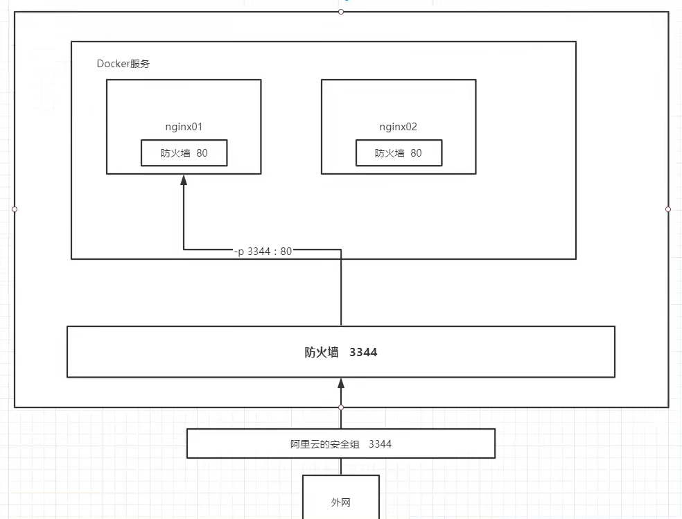

# 一、帮助命令

```shell
docker version		#查看docker的版本信息
docker info			#查看docker的系统信息，包括镜像和容器的数量
docker 命令 --help	#帮助命令(可查看可选的参数)
```

docker帮助文档地址:https://docs.docker.com/engine/reference/commandline/docker/

# 二、镜像命令

#### 1. docker images 	//查看所有本地镜像

```shell
[root@healthSH ~]# docker images
REPOSITORY    TAG       IMAGE ID       CREATED        SIZE
hello-world   latest    d1165f221234   5 months ago   13.3kB

# 解释
REPOSITORY：仓库源
TAG：镜像的标签
IMAGE ID：镜像的ID
CREATED：镜像的创建时间
SIZE：镜像的大小

# 可选项
-a, --all             # 列出所有镜像
-q, --quiet           # 只显示镜像的ID

```

#### 2. docker search	//搜索镜像（类似 GitHub）

```shell
[root@healthSH ~]# docker search mysql
NAME                              DESCRIPTION                                     STARS     OFFICIAL   AUTOMATED
mysql                             MySQL is a widely used, open-source relation…   11325     [OK]       
mariadb                           MariaDB Server is a high performing open sou…   4303      [OK]       
mysql/mysql-server                Optimized MySQL Server Docker images. Create…   840                  [OK]
······  


# 可选项
  -f, --filter filter   Filter output based on conditions provided
      --format string   Pretty-print search using a Go template
      --limit int       Max number of search results (default 25)
      --no-trunc        Don't truncate output

docker search mysql --filter=STARS=3000	# 搜索收藏数目大于3000的

```

#### 3. docker pull	//下载镜像

```shell
# 下载各行介绍
[root@healthSH ~]# docker pull mysql
Using default tag: latest	# 如果不写tag，默认就是latest最新版
latest: Pulling from library/mysql
e1acddbe380c: Pull complete 	# 分层下载，docker image的核心 联合文件系统
bed879327370: Pull complete 
03285f80bafd: Pull complete 
ccc17412a00a: Pull complete 
1f556ecc09d1: Pull complete 
adc5528e468d: Pull complete 
1afc286d5d53: Pull complete 
6c724a59adff: Pull complete 
0f2345f8b0a3: Pull complete 
c8461a25b23b: Pull complete 
3adb49279bed: Pull complete 
77f22cd6c363: Pull complete 
Digest: sha256:d45561a65aba6edac77be36e0a53f0c1fba67b951cb728348522b671ad63f926	# 签名
Status: Downloaded newer image for mysql:latest
docker.io/library/mysql:latest	#真实地址

# 等价命令
docker pull mysql等价于 docker pull docker.io/library/mysql:latest

# 指定版本下载
docker pull mysql:5.7
```

#### 4. docker rmi	//删除镜像

```shell
docker rmi -f [镜像ID]|[镜像名:TAG]		#指定删除镜像
docker rmi -f $(docker images -aq)	#批量删除全部镜像
```

#### 5. docker save	//导出镜像到磁盘

```shell
docker save -o 导出到那个文件 镜像名:tag [可多个镜像，空格分隔]
docker save -o nginx.tar nginx:latest
```

#### 6. docker load	//导入镜像

```shell
docker load -i tar文件
docker load -i nginx.tar
```

# 三、容器命令

#### 1. docker run	//新建容器并启动

```shell
docker run [可选参数] 镜像:[版本]

# 参数说明
--name="Name"          指定容器名字
-d                     后台方式运行
-it                    使用交互方式运行（即启动并进入容器）
-p                     指定容器的端口
	-p ip:主机端口:容器端口		配置主机端口映射到容器端口
	-p 主机端口:容器端口（常用）
	-p 容器端口
-P                     随机指定端口(大写的P)
--rm				 容器用完停止后自动删除容器

# 测试
[root@healthSH ~]# docker run -it centos /bin/bash	//运行并进入容器
[root@f02cb37b68c2 /]# exit	//退出容器

[root@healthSH ~]# docker run -it tomcat:9.0	//指定版本创建容器

不用pull拉镜像的话，直接执行run会自动下载镜像
```

#### 2. docker ps	//列出运行的容器

```shell
docker ps [可选参数]

#参数说明
无参     # 列出当前正在运行的容器
-a		# 列出正在运行的容器+历史运行过的容器
-n=? 	# 显示最近创建的n个容器
-q   	# 只显示容器的编号
```

#### 3. 退出容器

```bash
exit	#退出容器，同时容器停止运行
ctrl+P+Q	#退出容器，容器不停止运行
```

#### 4. docker rm	//删除容器

```bash
docker rm 容器ID		#删除指定的容器（删不了正在运行的容器）
docker rm -f 容器ID	#强制删除
docker rm -f $(docker ps -aq)	#删除全部容器
docker ps -a -q|xargs docker rm		#删除所有容器
```

#### 5. 启动和停止容器

```shell
docker start 容器ID	# 启动容器
docker pause 容器ID	# 暂停容器
docker unpause 容器ID	# 恢复暂停的容器
docker restart 容器ID	# 重启容器
docker stop 容器ID	# 停止当前正在运行的容器
docker kill 容器ID	# 强制停止容器（杀死ta）
docker run -d centos	# 后台启动容器（不进去），如果容器里面没有应用运行该容器就会自动停止运行
```

#### 6. 进入当前正在运行的容器

```shell
docker exec -it 容器ID /bin/bash	# 进入正在运行的容器，开启一个新的终端，可以在里面操作（常用）
docker attach 容器ID		# 进入正在运行的容器，进的是正在执行的终端，不会启动新的进程

修改容器内文本内容(在容器中执行)
sed -i 's#welcome#哈哈哈#g' index.html	# 将index.html文件的welcome修改为 哈哈哈
```

#### 7. 拷贝容器内文件到主机上

```shell
docker cp 容器ID:容器内路径 目的主机路径
docker cp 容器ID:/home/test.java /home	# 拷贝容器内的/home/test.java到主机的/home目录中（命令在主机执行的）
```

#### 8. 查看容器日志

```shell
docker logs -tf 容器ID	#显示日志（f：格式化显示）
docker logs --tail number 容器id #num为要显示的日志条数
```

#### 9. 查看容器中的进程信息

```shell
docker top 容器ID		#查看容器内部的进程信息
```

#### 10. 查看容器的详细数据

```shell
docker inspect 容器ID
```

#### 11.查看各个容器cpu状态

```shell
docker status
```

# 四、容器数据卷

介绍：将容器中的某个目录与主机的某个目录进行同步映射

1. 此时添加文件到容器中该目录下，主机对应的目录也会拥有该文件。反之也成立。
2. 即使在容器关闭后，修改主机目录下的文件，启动容器后容器内对应目录下的文件也会同步发生变化
3. 即使是删除容器，主机对应的挂载目录数据也依旧存在

### 数据卷基本操作

```shell
docker volume [command]
                create 卷名	# 创建一个volume
                inspect	卷名	# 显示一个或多个volume详细信息
                ls			# 列出所有的volume
                prune		# 删除未使用的volume
                rm 卷名		# 删除在指定的一个或多个volume
```

### 使用数据卷

```shell
docker run -it -v 主机目录:容器内目录		# 使用命令来挂载(数据同步)，-it 直接进入容器

# 小示例
docker run -it -v /home/ceshi:/home  centos /bin/bash	# 创建启动centos容器，并挂载/home目录到主机/home/ceshi

# 参数
-v 容器内目录:主机目录	
-it      # 使用交互方式运行（即启动并进入容器）
-d		# 后台运行

[root@7fe6f4a01387 /]# cd /home			# 切到/home下
[root@7fe6f4a01387 home]# mkdir aaa		# 创建aaa文件夹
[root@7fe6f4a01387 home]# exit			# 退出容器
[root@healthSH ~]# cd /home/ceshi/		# 切到/home/ceshi目录下
[root@healthSH ceshi]# ll				#查看目录下内容（此时目录下已经有aaa了）
```

### 实例：MySQL同步数据

```shell
docker search mysql		# 搜索镜像，确定其可用
docker pull mysql:5.7	# 拉取镜像
# 运行容器，并挂载容器多个路径到主机路径(创建mysql容器需要设置密码)（-d:后台运行  -p:端口映射  -v:卷挂载  -e:环境(密码)配置）  --name:容器名字

docker run -d 
-p 3310:3306 
-v /home/mysql/conf:/etc/mysql/conf.d -v /home/mysql/data:/var/lib/mysql 
-e MYSQL_ROOT_PASSWORD=root 
--name mysql01 mysql:5.7

#启动成功后可以在本地使用Navicate连接测试
```

### 匿名和具名挂载

```shell
# 匿名挂载 (-v 容器内路径，没有写容器外路径)
docker run -d -P --name nginx01 -v /etc/nginx nginx
# 查看 volume(卷) 的情况
docker volume ls

# 具名挂载 (-v 卷名:容器内路径)
docker run -d -P --name nginx02 -v juming-nginx:/etc/nginx nginx
docker volume ls				# 查看 volume(卷) 的情况
docker volume inspect juming-nginx		# 查看一下这个卷

所有docker容器内的卷，没有指定目录的情况下都是在 `/var/lib/docker/volumes/卷名/_data `
多数情况下使用具名挂载
```

#### 拓展设定读写权限：

```bash
# 通过 -v 容器内路径:ro/rw		改变读写权限
ro		readonly	# 只读（挂载的数据只能从外部host主机改变，容器内部无权限）
rw		readwrite	# 可读写（默认）
docker run -d -P --name nginx02 -v juming-nginx:/etc/nginx:ro nginx
docker run -d -P --name nginx02 -v juming-nginx:/etc/nginx:rw nginx
```


# 五、容器镜像转换

## 1. 容器转镜像

```shell
docker commit [OPTIONS] CONTAINER [REPOSITORY[:TAG]]		# 提交容器成为一个新的副本

# 命令类似于git
docker commit [-m="描述信息"] [-a="作者"] 容器ID 自定义镜像名:[TAG] 		# 提交容器成为一个新的副本，tag一般为版本号


# 创建tomcat镜像示例
docker commit -m="我的自定义tomcat" -a="health" 容器ID tomcatMe:11.0		# 创建镜像
docker images		# 此时可以看到刚刚创建的镜像
docker run -it tomcatMe:11.0 /bin/bash		# 也可以用刚才创建的镜像新建容器
```


## 2. 镜像转压缩文件

```shell
docker save -o 自定义压缩文件名称 镜像名称:[TAG]

# 示例，将tomcatMe:11.0镜像转为压缩文件
docker save -o myTomcat.tar tomcatMe:11.0
```


## 3. 压缩文件还原为镜像

```shell
docker load -i 压缩文件路径

# 示例 将上面创建的myTomcat.tar还原为镜像
docker load -i myTomcat.tar
```

# 六、Dockerfile

## 1. 指令及概述

Dockerfile 就是用来构建docker镜像的构建文件！其中包含一个个指令，用指令来说明要执行什么操作来构建镜像，每一个指令都会形成一层Layer。


| 关键字      | 作用                     | 备注                                                         |
| ----------- | ------------------------ | ------------------------------------------------------------ |
| FROM        | 指定父镜像               | 指定dockerfile基于那个image构建                              |
| MAINTAINER  | 作者信息                 | 用来标明这个dockerfile谁写的                                 |
| LABEL       | 标签                     | 用来标明dockerfile的标签 可以使用Label代替Maintainer 最终都是在docker image基本信息中可以查看 |
| RUN         | 执行命令                 | 执行一段命令 默认是/bin/sh 格式: RUN command 或者 RUN ["command" , "param1","param2"] |
| CMD         | 容器启动命令             | 提供启动容器时候的默认命令 和ENTRYPOINT配合使用.格式 CMD command param1 param2 或者 CMD ["command" , "param1","param2"] |
| ENTRYPOINT  | 容器入口程序             | 一般在制作一些执行就关闭的容器中会使用（可以带参数）         |
| COPY        | 复制文件                 | build的时候复制文件到image中                                 |
| ADD         | 添加文件                 | build的时候添加文件到image中 不仅仅局限于当前build上下文 可以来源于远程服务 |
| ENV         | 环境变量                 | 指定build时候的环境变量 可以在启动的容器的时候 通过-e覆盖 格式ENV name=value |
| ARG         | 构建参数                 | 构建参数 只在构建的时候使用的参数 如果有ENV 那么ENV的相同名字的值始终覆盖arg的参数 |
| VOLUME      | 定义外部可以挂载的数据卷 | 指定build的image那些目录可以启动的时候挂载到文件系统中 启动容器的时候使用 -v 绑定 格式 VOLUME ["目录"] |
| EXPOSE      | 暴露端口                 | 定义容器运行的时候监听的端口 启动容器的使用-p来绑定暴露端口 格式: EXPOSE 8080 或者 EXPOSE 8080/udp |
| WORKDIR     | 工作目录                 | 指定容器内部的工作目录 如果没有创建则自动创建 如果指定/ 使用的是绝对地址 如果不是/开头那么是在上一条workdir的路径的相对路径 |
| USER        | 指定执行用户             | 指定build或者启动的时候 用户 在RUN CMD ENTRYPONT执行的时候的用户 |
| HEALTHCHECK | 健康检查                 | 指定监测当前容器的健康监测的命令 基本上没用 因为很多时候 应用本身有健康监测机制 |
| ONBUILD     | 触发器                   | 当存在ONBUILD关键字的镜像作为基础镜像的时候 当执行FROM完成之后 会执行 ONBUILD的命令 但是不影响当前镜像 用处也不怎么大 |
| STOPSIGNAL  | 发送信号量到宿主机       | 该STOPSIGNAL指令设置将发送到容器的系统调用信号以退出。       |
| SHELL       | 指定执行脚本的shell      | 指定RUN CMD ENTRYPOINT 执行命令的时候 使用的shell            |

更新详细语法说明，请参考官网文档： https://docs.docker.com/engine/reference/builder


```shell
# 通过dockerfile构建镜像
docker build -f dockerfile文件路径 -t 镜像名称:版本 
```


## 2. 制作自定义centos7镜像

```shell
# 默认登陆路径/usr，可以使用vim
vim centos_dockerfile	# 创建文件并进入

# 文件内容
FROM centos:7						  # 选择父镜像，没有的话会自动下载
MAINTAINER health<health_x@163.com>		# 作者信息
RUN yum install -y vim				   # 安装vim
WORKDIR /usr						  # 指定默认·工作目录
cmd /bin/bash						  # 定义容器启动执行的命令
:wq									 # 保存退出

docker build -f ./centos_dockerfile -t mycentos:1 .		# 镜像构建 -f指定dockerfile文件路径，-t设置新的镜像名和版本 ， . 代表路径
```


## 3. 制作springboot项目镜像

上传jar包到Linux服务器

```shell
vim springboot_dockerfile	            # 创建dockerfile文件并进入

FROM JAVA:8							  # 定义父镜像
MAINTAINER health<health_x@163.com>		# 作者信息
ADD demo01-0.0.1-SNAPSHOT.jar app.jar	# 将jar包添加到容器
CMD java -jar app.jar				   # 定义容器启动执行的命令
:wq									 # 保存退出

docker build -f ./springboot_dockerfile -t myapp:01 .		# 镜像构建(别往后面的 . 表示dockerfile文件的路径)
```


## 4. 制作微服务镜像

打jar包方式

```shell
# 1.上传微服务jar包到Linux
wgu_server-1.0.jar

# 2.编写dockerfile文件(文件名需要有dockerfile)
vim wfu_dockerfile

FROM openjdk:8-jdk-alpine					 # 定义父镜像
ARG JAR_FILE								# 设置编译镜像时加入的参数
COPY ${JAR_FILE} app.jar					 # 拷贝外部文件JAR_FILE到镜像内，并命名为app.jar
EXPOSE 10086								# 暴露端口
ENTRYPOINT ["java","-jar","/app.jar"]		  # 设置容器的入口程序（可以在运行中接收参数）

# 3.构建镜像（--build-arg 用于给 JAR_FILE 参数赋值，-t 生成的镜像名，最后一个 . 表示dockerfile文件的路径）
docker build --build-arg JAR_FILE=wgu_server-1.0.jar -t pdfsite:v1.0 .

# 4.查看镜像是否创建成功
docker images

# 5.创建容器并启动
docker run -di --name=pdfsite -p 10086:10086 eureka:v1 
```


# 七、Docker Compose

## 1. 安装Docker Compose

```shell
# Compose目前已经完全支持Linux、Mac OS和Windows，在我们安装Compose之前，需要先安装Docker。下面我们以编译好的二进制包方式安装在Linux系统中。 
curl -L https://github.com/docker/compose/releases/download/1.22.0/docker-compose-`uname -s`-`uname -m` -o /usr/local/bin/docker-compose
# 设置文件可执行权限 
chmod +x /usr/local/bin/docker-compose
# 查看版本信息 
docker-compose -version
```

## 2. 卸载Docker Compose

```shell
# 二进制包方式安装的，删除二进制文件即可
rm /usr/local/bin/docker-compose
```


## 3. 使用docker compose编排nginx+springboot项目

1. 创建docker-compose目录

```shell
mkdir ~/docker-compose
cd ~/docker-compose
```

2. 编写 docker-compose.yml 文件

```shell
version: '3'
services:
  nginx:
   image: nginx
   ports:
    - 80:80
   links:
    - app
   volumes:
    - ./nginx/conf.d:/etc/nginx/conf.d
  app:
    image: app
    expose:
      - "8080"
```

3. 创建./nginx/conf.d目录

```shell
mkdir -p ./nginx/conf.d
```


4. 在./nginx/conf.d目录下 编写itheima.conf文件

```shell
server {
    listen 80;
    access_log off;

    location / {
        proxy_pass http://app:8080;
    }
   
}
```

5. 在~/docker-compose 目录下 使用docker-compose 启动容器

```shell
docker-compose up
```

6. 测试访问

```shell
http://192.168.149.135/hello
```

# 八、Docker私有仓库

## 1. 官方私有仓库Registry

#### 1）私有仓库搭建

```shell
# 1、拉取私有仓库镜像 
docker pull registry
# 2、启动私有仓库容器 
docker run -id --name=registry -p 5000:5000 registry
# 3、打开浏览器 输入地址http://私有仓库服务器ip:5000/v2/_catalog，看到{"repositories":[]} 表示私有仓库 搭建成功
# 4、修改daemon.json   
vim /etc/docker/daemon.json    
# 在上述文件中添加一个key，保存退出。此步用于让 docker 信任私有仓库地址；注意将私有仓库服务器ip修改为自己私有仓库服务器真实ip 
{"insecure-registries": ["私有仓库服务器ip:5000"]} 
# 5、重启docker 服务 
systemctl restart docker
docker start registry

```

#### 2）将镜像上传至私有仓库

```shell
# 1、标记镜像为私有仓库的镜像     
docker tag centos:7 私有仓库服务器IP:5000/centos:7
 
# 2、上传标记的镜像     
docker push 私有仓库服务器IP:5000/centos:7

```


#### 3） 从私有仓库拉取镜像 

```shell
#拉取镜像 
docker pull 私有仓库服务器ip:5000/centos:7
```


## 2. Harbor私有仓库

Harbor（港口，港湾）是一个用于存储和分发Docker镜像的企业级Registry服务器。

除了Harbor这个私有镜像仓库之外，还有Docker官方提供的Registry。相对Registry，Harbor具有很多优势：

1. 提供分层传输机制，优化网络传输 Docker镜像是是分层的，而如果每次传输都使用全量文件(所以用FTP的方式并不适合)，显然不经济。必须提供识别分层传输的机制，以层的UUID为标识，确定传输的对象。

2. 提供WEB界面，优化用户体验 只用镜像的名字来进行上传下载显然很不方便，需要有一个用户界面可以支持登陆、搜索功能，包括区分公有、私有镜像。

3. 支持水平扩展集群 当有用户对镜像的上传下载操作集中在某服务器，需要对相应的访问压力作分解。

4. 良好的安全机制 企业中的开发团队有很多不同的职位，对于不同的职位人员，分配不同的权限，具有更好的安全性。

[教程地址](https://blog.csdn.net/hancoder/article/details/118233786)


# 九、小结


docker镜像原理

```shell
可写容器（container）
镜像（tomcat）
镜像（jdk）
roofs基础镜像（centos/ubuntu）
bootfs
```


# Ⅹ、实例演示

## 1. 部署Nginx

查看nginx镜像：https://hub.docker.com/

```shell
docker search nginx		# 搜索镜像（网站和命令都可以）
docker pull nginx		# 下载镜像
docker images		    # 查看镜像
docker run -d --name nginx01 -p:3344:80	nginx		# -d:后台启动容器并且返回容器ID
												# --name：为容器取名
												# -p:暴漏到外部的端口号:自己的端口号（通过公网的3344可以访问到docker的80）
												# nginx 镜像名
docker ps				# 查看容器
curl localhost:3344		 # 本机测试（上述命令都是在host上执行）

docker exec -it nginx01 /bin/bash	# 进入容器
```

-p 端口暴漏图解



## 2. 安装tomcat

```shell
方式一：
docker pull tomcat:9.0		# 下载镜像
docker run -d -p:8888:8080 --name tomcat tomcat:9.0	# 启动运行
# 此时已经成功了，但访问会显示404，因为镜像是最小镜像，所有不必要的东西都剔除了，只保证最小可运行环境
# 解决：tomcat容器的话 webapps.dist中有webapps应该有的东西，可以移过去或重命名。
docker exec -it tomcat9.0 /bin/bash		# 进入tomcat


方式二：
docker run -d -p:8080:8080 \
-v /home/dockerdata/tomcat8.5.70/webapps:/usr/local/tomcat/webapps \
-v /home/dockerdata/tomcat8.5.70/conf:/usr/local/tomcat/conf \
--name tomcat8.5.70 tomcat:8.5.70

```

##  3. 图形化管理工具Portaniner安装

```shell
docker run -d -p 8088:9000 --restart=always -v /var/run/docker.sock:/var/run/docker.sock --privileged=true portainer/portainer	# 安装
docker ps	# 查看容器
curl localhost:8088		# 测试
外网访问路径：http://47.100.81.153:8088/
1.首次进入需设置admin的密码（也可以创建其他用户）
2.选择Local进行连接进入
3.一般不使用，自测玩玩即可
```


## 4. 安装es

因为我们还需要部署kibana容器，因此需要让es和kibana容器互联。这里先创建一个网络：

4.1 创建网络

```bash
docker network create es-net	# 网络名称为es-net（自定义）
```

4.2 安装es镜像容器

```bash
docker run -d \
    --name elasticsearch7.14.1 \
    -e "ES_JAVA_OPTS=-Xms512m -Xmx512m" \
    -e "discovery.type=single-node" \
    -v es-data:/usr/share/elasticsearch/data \
    -v es-plugins:/usr/share/elasticsearch/plugins \
    --privileged \
    --net es-net \
    -p 9200:9200 \
    -p 9300:9300 \
    elasticsearch:7.14.1
    
curl localhost:9200		#测试
```

命令解释：

- `-e "cluster.name=es-docker-cluster"`：设置集群名称
- `-e "http.host=0.0.0.0"`：监听的地址，可以外网访问
- `-e "ES_JAVA_OPTS=-Xms512m -Xmx512m"`：内存大小
- `-e "discovery.type=single-node"`：非集群模式
- `-v es-data:/usr/share/elasticsearch/data`：挂载逻辑卷，绑定es的数据目录
- `-v es-logs:/usr/share/elasticsearch/logs`：挂载逻辑卷，绑定es的日志目录
- `-v es-plugins:/usr/share/elasticsearch/plugins`：挂载逻辑卷，绑定es的插件目录
- `--privileged`：授予逻辑卷访问权
- `--network es-net` ：加入一个名为es-net的网络中
- `-p 9200:9200`：端口映射配置

在浏览器中输入：http://主机地址:9200 即可看到elasticsearch的响应结果。


## 5. 安装Kibana

kibana可以给我们提供一个elasticsearch的可视化界面，便于我们学习。

安装镜像容器命令：

```shell
172.18.0.2
docker inspect es容器ID |grep IPAddress	# 得到es容器的ip（填写在下面）

docker run -d \
    --name kibana \
    -e ELASTICSEARCH_HOSTS=http://172.18.0.2:9200 \
    --net=es-net \
    -p 5601:5601  \
    kibana:7.14.1
    

# 汉化（可选）
在配置文件kibana.yml中添加：
i18n.locale: "zh-CN"
```

- `--network es-net` ：加入一个名为es-net的网络中，与elasticsearch在同一个网络中
- `-e ELASTICSEARCH_HOSTS=http://es:9200"`：设置elasticsearch的地址，因为kibana已经与elasticsearch在一个网络，因此可以用容器名直接访问elasticsearch
- `-p 5601:5601`：端口映射配置

在浏览器输入地址访问：http://主机地址:5601，即可看到结果


## 6. 安装elasticsearch-head插件

```shell
docker pull mobz/elasticsearch-head:5
docker run -d -p 9100:9100 docker.io/mobz/elasticsearch-head:5
```

在浏览器访问http://47.100.81.153:9100/，然后在连接框输入es地址：http://47.100.81.153:9200/

此时应该连不上，然后配置下跨域访问即可

步骤：

```shell
docker ps -a	# 查看es的容器id
docker exec -it es容器id /bin/bash	# 进入es容器
cd ./config
vi elasticsearch.yml	# 打开es配置文件

在配置文件下添加下面两行：
http.cors.enabled: true
http.cors.allow-origin: "*"

退出容器重启es即可
```

此时在图形化界面访问索引数据还是会显示不出来，此时再做如下配置：

```bash
docker exec -it head插件容器id /bin/bash	# 进入head插件的安装目录
cd _site
vim vendor.js
打开后使用全局搜索找到两处application/x-www-form-urlencoded 改为 application/json;charset=UTF-8
重启head容器，此时在数据浏览界面就能看到数据了。
```


```shell
容器内安装 vim 步骤：
apt-get update
apt-get install vim
```


## 7. 安装ik分词器

7.1在线安装

```shell
# 进入容器内部
docker exec -it es容器id /bin/bash

# 在线下载并安装
./bin/elasticsearch-plugin  install https://github.com/medcl/elasticsearch-analysis-ik/releases/download/v7.14.1/elasticsearch-analysis-ik-7.14.1.zip

#退出
exit
#重启容器
docker restart elasticsearch
```

IK分词器包含两种模式：

* `ik_smart`：最少切分

* `ik_max_word`：最细切分


## 8. 安装mysql

```shell
1.在host主机建立/home/dockerdata/mysql5.7/conf 和 /home/dockerdata/mysql5.7/data用于挂在mysql容器的数据

2.拉取镜像
docker pull mysql:5.7

3.安装启动容器
docker run -p:3306:3306 --name mysql5.7 \
 -v /home/dockerdata/mysql5.7/conf/:/etc/mysql/conf.d \
 -v /home/dockerdata/mysql5.7/data/:/var/lib/mysql \
 -e MYSQL_ROOT_PASSWORD=liu0801 \
 -e TZ=Asia/Shanghai \
 -d mysql:5.7

4.进入mysql
docker exec -it c07c8eabab12 mysql -uroot -p
Enter password:
```


## 9. 安装redis

```bash
1.在linux上新建文件夹用于数据挂载/home/redis6.2.5/data 和 /home/redis6.2.5/conf
2.在官网下载redis压缩包，解压取出里面的redis.conf文件，放在/home/redis6.2.5/conf目录下
3.修改redis.conf配置
 - 注释掉 bind 127.0.0.1
 - protected-mode no # 默认yes，开启保护模式，限制为本地访问，改为no
 - daemonize no #默认no，无需修改，改为yes意为以守护进程方式启动，可后台运行，除非kill进程（可选），改为yes会使配置文件方式启动redis失败
 - dir  ./ #输入本地redis数据库存放文件夹（可选）
 - appendonly yes #redis持久化（可选）

4.拉取镜像
docker pull redis:6.2.5

5.安装运行容器
docker run -p 6379:6379 --name redis6.2.5 \
-v /home/dockerdata/redis6.2.5/conf/redis.conf:/etc/redis/redis.conf \
-v /home/dockerdata/redis6.2.5/data:/data \
-d redis:6.2.5 redis-server /etc/redis/redis.conf --appendonly yes
# 参数解释
-p 6380:6380 端口映射：映射到主机的端口号:容器内redis暴漏的端口。
-v 挂载目录，主机:容器
redis-server /etc/redis/redis.conf  以配置文件启动redis，加载容器内的conf文件，最终找到的是挂载的目录/home/dockerdata/redis6.2.5/conf/redis.conf
appendonly yes 开启redis 持久化

6.进入redis
docker exec -it redis容器ID /bin/bash		# 进入redis容器
docker exec -it redis容器ID redis-cli		# 进入redis客户端
```


## 10. 安装RabbitMQ

```SHELL
docker pull rabbitmq:[版本]		# 在docker hub查看可用版本

# 创建并运行容器
docker run \
-e RABBITMQ_DEFAULT_USER=health \		# 设置环境变量
-e RABBITMQ_DEFAULT_PASS=123456 \		# 设置环境变量
--name mq-3.9 \		# 给该容器取名
--hostname mq1 \	# 配置主机名（未来将来配集群）
-p 15672:15672 \	# 端口映射（管理平台的端口，ui界面给我们用）
-p 5672:5672 \		# 端口映射（做消息通讯的端口）
-d \			   # 后台运行
rabbitmq:3.9-management		# 镜像名称
```

启动后在浏览器访问 主机:15672即可进入管理员ui界面
