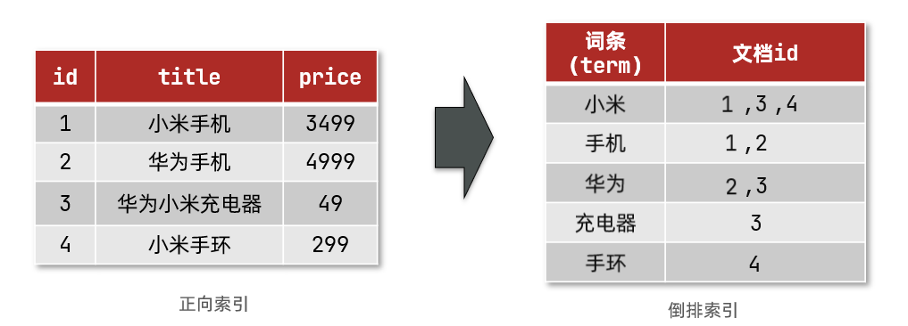
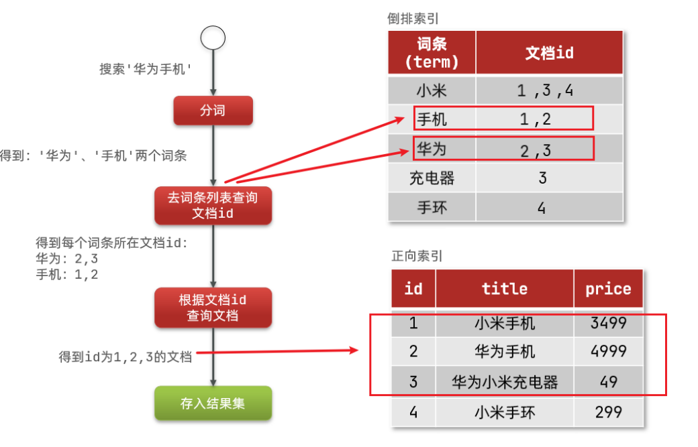

# elasticsearch

elasticsearch是一款非常强大的开源搜索引擎，主要负责存储、搜索、分析数据（日志统计、分析）、系统监控等。

## 一、倒排索引

倒排索引的概念是基于MySQL这样的正向索引而言的。

#### 1.1 正向索引

mysql正向索引就是当基于某个条件进行查询时，会逐行扫描，符合条件就放入结果集，不符合则丢弃。

逐行扫描，也就是全表扫描，随着数据量增加，其查询效率也会越来越低。当数据量达到数百万时，就是一场灾难。

#### 1.2 倒排索引

倒排索引中有两个非常重要的概念：

- 文档（`Document`）：用来搜索的数据，其中的每一条数据就是一个文档（mysql中的一条数据）。例如一个网页、一个商品信息
- 词条（`Term`）：对文档数据或用户搜索数据，利用某种算法分词，得到的具备含义的词语就是词条。例如：我是中国人，就可以分为：我、是、中国人、中国、国人这样的几个词条。

**创建倒排索引**是对正向索引的一种特殊处理，流程如下：

- 将每一个文档的数据利用算法分词，得到一个个词条
- 创建表，每行数据包括词条、词条所在文档id、位置等信息
- 因为词条唯一性，可以给词条创建索引，例如hash表结构索引

如图：



倒排索引的**搜索流程**如下（以搜索"华为手机"为例）：

1）用户输入条件`"华为手机"`进行搜索。

2）对用户输入内容**分词**，得到词条：`华为`、`手机`。

3）拿着词条在倒排索引中查找，可以得到包含词条的文档id：1、2、3。

4）拿着文档id到正向索引中查找具体文档。

如图：



虽然要先查询倒排索引，再查询倒排索引，但是无论是词条、还是文档id都建立了索引，查询速度非常快！无需全表扫描。

#### 1.3 正向和倒排

- **正向索引**是最传统的，根据id索引的方式。但根据词条查询时，必须先逐条获取每个文档，然后判断文档中是否包含所需要的词条，是**根据文档找词条的过程**。

- 而**倒排索引**则相反，是先找到用户要搜索的词条，根据词条得到保护词条的文档的id，然后根据id获取文档。是**根据词条找文档的过程**。

是不是恰好反过来了？

**正向索引**：

- 优点：
  - 可以给多个字段创建索引
  - 根据索引字段搜索、排序速度非常快
- 缺点：
  - 根据非索引字段，或者索引字段中的部分词条查找时，只能全表扫描。

**倒排索引**：

- 优点：
  - 根据词条搜索、模糊搜索时，速度非常快
- 缺点：
  - 只能给词条创建索引，而不是字段
  - 无法根据字段做排序


## 二、与mysql对比

elasticsearch是面向**文档（Document）**存储的，可以是数据库中的一条商品数据，一个订单信息。文档数据会被序列化为json格式后存储在elasticsearch中：


| **MySQL** | **Elasticsearch** | **说明**                                                     |
| --------- | ----------------- | ------------------------------------------------------------ |
| Table     | Index             | 索引(index)，就是文档的集合，类似数据库的表(table)           |
| Row       | Document          | 文档（Document），就是一条条的数据，类似数据库中的行（Row），文档都是JSON格式 |
| Column    | Field             | 字段（Field），就是JSON文档中的字段，类似数据库中的列（Column） |
| Schema    | Mapping           | Mapping（映射）是索引中文档的约束，例如字段类型约束。类似数据库的表结构（Schema） |
| SQL       | DSL               | DSL是elasticsearch提供的JSON风格的请求语句，用来操作elasticsearch，实现CRUD |

mysql和es各自擅长领域：

- Mysql：擅长事务类型操作，可以确保数据的安全和一致性

- Elasticsearch：擅长海量数据的搜索、分析、计算

因此在企业中，往往是两者结合使用：

- 对安全性要求较高的写操作，使用mysql实现
- 对查询性能要求较高的搜索需求，使用elasticsearch实现
- 两者再基于某种方式，实现数据的同步，保证一致性


## 三、安装es，head，kibana，ik

### 3.1 安装es

因为我们还需要部署kibana容器，因此需要让es和kibana容器互联。这里先创建一个网络：

3.1.1 创建网络

```bash
docker network create es-net	# 网络名称为es-net（自定义）
```

3.1.2 安装es镜像容器

```bash
docker run -d \
    --name elasticsearch7.14.1 \
    -e "ES_JAVA_OPTS=-Xms512m -Xmx512m" \
    -e "discovery.type=single-node" \
    -v es-data:/usr/share/elasticsearch/data \
    -v es-plugins:/usr/share/elasticsearch/plugins \
    --privileged \
    --net es-net \
    -p 9200:9200 \
    -p 9300:9300 \
    elasticsearch:7.14.1
    
curl localhost:9200		#测试
```

命令解释：

- `-e "cluster.name=es-docker-cluster"`：设置集群名称
- `-e "http.host=0.0.0.0"`：监听的地址，可以外网访问
- `-e "ES_JAVA_OPTS=-Xms512m -Xmx512m"`：内存大小
- `-e "discovery.type=single-node"`：非集群模式
- `-v es-data:/usr/share/elasticsearch/data`：挂载逻辑卷，绑定es的数据目录
- `-v es-logs:/usr/share/elasticsearch/logs`：挂载逻辑卷，绑定es的日志目录
- `-v es-plugins:/usr/share/elasticsearch/plugins`：挂载逻辑卷，绑定es的插件目录
- `--privileged`：授予逻辑卷访问权
- `--network es-net` ：加入一个名为es-net的网络中
- `-p 9200:9200`：端口映射配置

在浏览器中输入：http://主机地址:9200 即可看到elasticsearch的响应结果。


### 3.2  安装Kibana

kibana可以给我们提供一个elasticsearch的可视化界面，便于我们学习。

安装镜像容器命令：

```shell
172.18.0.2
docker inspect es容器ID |grep IPAddress	# 得到es容器的ip（填写在下面）

docker run -d \
    --name kibana \
    -e ELASTICSEARCH_HOSTS=http://172.18.0.2:9200 \
    --net=es-net \
    -p 5601:5601  \
    kibana:7.14.1
    

# 汉化（可选）
在配置文件kibana.yml中添加：
i18n.locale: "zh-CN"
```

- `--network es-net` ：加入一个名为es-net的网络中，与elasticsearch在同一个网络中
- `-e ELASTICSEARCH_HOSTS=http://es:9200"`：设置elasticsearch的地址，因为kibana已经与elasticsearch在一个网络，因此可以用容器名直接访问elasticsearch
- `-p 5601:5601`：端口映射配置

在浏览器输入地址访问：http://主机地址:5601，即可看到结果


### 3.3 安装elasticsearch-head插件

```shell
docker pull mobz/elasticsearch-head:5
docker run -d -p 9100:9100 docker.io/mobz/elasticsearch-head:5
```

在浏览器访问http://47.100.81.153:9100/，然后在连接框输入es地址：http://47.100.81.153:9200/

此时应该连不上，然后配置下跨域访问即可

步骤：

```shell
docker ps -a	# 查看es的容器id
docker exec -it es容器id /bin/bash	# 进入es容器
cd ./config
vi elasticsearch.yml	# 打开es配置文件

在配置文件下添加下面两行：
http.cors.enabled: true
http.cors.allow-origin: "*"

退出容器重启es即可
```

此时在图形化界面访问索引数据还是会显示不出来，此时再做如下配置：

```bash
docker exec -it head插件容器id /bin/bash	# 进入head插件的安装目录
cd _site
vim vendor.js
打开后使用全局搜索找到两处application/x-www-form-urlencoded 改为 application/json;charset=UTF-8
重启head容器，此时在数据浏览界面就能看到数据了。
```


```shell
容器内安装 vim 步骤：
apt-get update
apt-get install vim
```


### 3.4  安装ik分词器

在线安装

```shell
# 进入容器内部
docker exec -it es容器id /bin/bash

# 在线下载并安装
./bin/elasticsearch-plugin  install https://github.com/medcl/elasticsearch-analysis-ik/releases/download/v7.14.1/elasticsearch-analysis-ik-7.14.1.zip

#退出
exit
#重启容器
docker restart elasticsearch
# 查看es日志
docker logs -f elasticsearch


#测试
GET /_analyze
{
  "analyzer": "ik_max_word",
  "text": "宇宙超人啦啦啦"
}
```

IK分词器包含两种模式：

* `ik_smart`：最少切分

* `ik_max_word`：最细切分

#### 3.4.1  扩展词词典

随着互联网的发展，“造词运动”也越发的频繁。出现了很多新的词语，在原有的词汇列表中并不存在。比如：“奥力给”，“传智播客” 等。

所以我们的词汇也需要不断的更新，IK分词器提供了扩展词汇的功能。

1）打开IK分词器config目录：


2）在IKAnalyzer.cfg.xml配置文件内容添加：

```xml
<?xml version="1.0" encoding="UTF-8"?>
<!DOCTYPE properties SYSTEM "http://java.sun.com/dtd/properties.dtd">
<properties>
        <comment>IK Analyzer 扩展配置</comment>
        <!--用户可以在这里配置自己的扩展字典 *** 添加扩展词典-->
        <entry key="ext_dict">ext.dic</entry>
</properties>
```

3）新建一个 ext.dic，可以参考config目录下复制一个配置文件进行修改

```properties
传智播客
奥力给
```

4）重启elasticsearch 

```sh
docker restart es

# 查看 日志
docker logs -f elasticsearch
```


日志中已经成功加载ext.dic配置文件

5）测试效果：

```json
GET /_analyze
{
  "analyzer": "ik_max_word",
  "text": "传智播客Java就业超过90%,奥力给！"
}
```

> 注意当前文件的编码必须是 UTF-8 格式，严禁使用Windows记事本编辑

#### 3.4.2 停用词词典

在互联网项目中，在网络间传输的速度很快，所以很多语言是不允许在网络上传递的，如：关于宗教、政治等敏感词语，那么我们在搜索时也应该忽略当前词汇。

IK分词器也提供了强大的停用词功能，让我们在索引时就直接忽略当前的停用词汇表中的内容。

1）IKAnalyzer.cfg.xml配置文件内容添加：

```xml
<?xml version="1.0" encoding="UTF-8"?>
<!DOCTYPE properties SYSTEM "http://java.sun.com/dtd/properties.dtd">
<properties>
        <comment>IK Analyzer 扩展配置</comment>
        <!--用户可以在这里配置自己的扩展字典-->
        <entry key="ext_dict">ext.dic</entry>
         <!--用户可以在这里配置自己的扩展停止词字典  *** 添加停用词词典-->
        <entry key="ext_stopwords">stopword.dic</entry>
</properties>
```

3）在 stopword.dic 添加停用词

```properties
习大大
```

4）重启elasticsearch 

```sh
# 重启服务
docker restart elasticsearch
docker restart kibana

# 查看 日志
docker logs -f elasticsearch
```

日志中已经成功加载stopword.dic配置文件

5）测试效果：

```json
GET /_analyze
{
  "analyzer": "ik_max_word",
  "text": "传智播客Java就业率超过95%,习大大都点赞,奥力给！"
}
```

> 注意当前文件的编码必须是 UTF-8 格式，严禁使用Windows记事本编辑

### 3.5 部署es集群


## 四、索引操作

索引库就类似数据库表，mapping映射就类似表的结构。我们要向es中存储数据，必须先创建“库”和“表”。

### 4.1 mapping映射属性

mapping是对索引库中文档的约束，常见的mapping属性包括：

- type：字段数据类型，常见的简单类型有：
  - 字符串：text（可分词的文本）、keyword（精确值，例如：品牌、国家、ip地址）
  - 数值：long、integer、short、byte、double、float、
  - 布尔：boolean
  - 日期：date
  - 对象：object
- index：是否创建索引，默认为true
- analyzer：使用哪种分词器
- properties：该字段的子字段

**示例**

如下面的json文档：

```json
{
    "age": 21,
    "weight": 52.1,
    "isMarried": false,
    "info": "黑马程序员Java讲师",
    "email": "zy@itcast.cn",
    "score": [99.1, 99.5, 98.9],
    "name": {
        "firstName": "云",
        "lastName": "赵"
    }
}
```

对应的每个字段映射（mapping）：

- age：类型为 integer；参与搜索，因此需要index为true；无需分词器
- weight：类型为float；参与搜索，因此需要index为true；无需分词器
- isMarried：类型为boolean；参与搜索，因此需要index为true；无需分词器
- info：类型为字符串，需要分词，因此是text；参与搜索，因此需要index为true；分词器可以用ik_smart
- email：类型为字符串，但是不需要分词，因此是keyword；不参与搜索，因此需要index为false；无需分词器
- score：虽然是数组，但是我们只看元素的类型，类型为float；参与搜索，因此需要index为true；无需分词器
- name：类型为object，需要定义多个子属性
  - name.firstName；类型为字符串，但是不需要分词，因此是keyword；参与搜索，因此需要index为true；无需分词器
  - name.lastName；类型为字符串，但是不需要分词，因此是keyword；参与搜索，因此需要index为true；无需分词器

### 4.2 创建索引库

 **基本语法：**

- 请求方式：PUT
- 请求路径：/索引库名，可以自定义
- 请求参数：mapping映射（结构），setting（设置分片等信息）

格式：

```json
PUT /索引库名称
{
    "settings":{
    "index":{					//TODO 这里好像加不加index都一样
        "number_of_shards":2,		//分片数量（默认 1）
        "number_of_replicas":0		//副本数量（默认 1）
        }
    },
   "mappings": {
     "properties": {
       "字段名":{
         "type": "text",			    //字段值类型
         "analyzer": "ik_smart"		//使用哪种分词器（默认为stand）
       },
       "字段名2":{
         "type": "keyword",		//字段值类型
         "index": "false"		//是否参与搜索（默认为）
       },
       "字段名3":{
         "properties": {		//子属性
           "子字段": {
             "type": "keyword"
           }
         }
       },
      // ...略
    }
  }
}
```

#### 示例：

```json
PUT /stu
{
  "mappings": {
    "properties": {
      "remark":{
        "type": "text",
        "analyzer": "ik_smart"
      },
      "email":{
        "type": "keyword",
        "index": "falsae"
      },
      "name":{
        "properties": {
          "firstName": {
            "type": "keyword"
          }
        }
      },
      // ... 略
    }
  }
}

// 示例2
PUT /stu1
{
"settings":{
       "number_of_shards":2,
       "number_of_replicas":0
    },
    "mappings":{
        "properties":{
            "name": {
				"type": "text"
			},
			"age": {
				"type": "integer"
			},
			"email": {
				"type": "keyword"
			}
        }
    }
}
```


### 

### 4.3 删除索引库

**语法：**

- 请求方式：DELETE

- 请求路径：/索引库名

- 请求参数：无

**格式：**

```json
DELETE /索引库名
```


### 4.4 修改索引库（增加字段）

倒排索引结构虽然不复杂，但是一旦数据结构改变（比如改变了分词器），就需要重新创建倒排索引，这简直是灾难。因此索引库**一旦创建，无法修改mapping**。

虽然无法修改mapping中已有的字段，但是却允许添加新的字段到mapping中，因为不会对倒排索引产生影响。

**语法说明**：

```json
PUT /索引库名/_mapping
{
  "properties": {
    "新字段名":{
      "type": "integer"
    }
  }
}

// 示例
PUT /stu/_mapping
{
    "properties": {
        "age": {
            "type": "integer"
        }
    }
}
```


### 4.5 查询索引库

```json
// 查看所有索引库
GET _cat/indices?v

// 查看单个索引
GET /索引库名

// 查看单个索引映射信息
GET /索引库名/_mapping
```


### 4.6 总结

- 创建索引库：PUT /索引库名
- 查询索引库：GET /索引库名
- 删除索引库：DELETE /索引库名
- 添加字段：PUT /索引库名/_mapping


## 五、文档操作


### 5.1 新增文档

**语法：**

```json
POST /索引库名/_doc/文档id
{
    "字段1": "值1",
    "字段2": "值2",
    "字段3": {
        "子属性1": "值3",
        "子属性2": "值4"
    },
    "字段3": "值4"
    // ...
}
```


### 5.2 删除文档

```json
DELETE  /索引库名/_doc/文档id
```


### 5.3 修改文档

修改有两种方式：

- 全量修改：直接覆盖原来的文档
- 增量修改：修改文档中的部分字段

#### 5.3.1 全量修改

全量修改是覆盖原来的文档，其本质是：

1. 根据指定的id删除文档（若不存在，则直接第二步）
2. 新增一个相同id的文档

**语法**

```json
PUT /索引库名/_doc/文档id
{
    "字段1": "值1",
    "字段2": "值2",
    "字段3": {
        "子属性1": "值3",
        "子属性2": "值4"
    },
    "字段3": "值4"
    // ...
}
```

#### 5.3.2 增量修改

增量修改是只修改指定id匹配的文档中的部分字段。

**语法：**

```json
POST /索引库名/_update/文档id
{
    "doc": {
         "字段名": "新的值",
    }
}
```


### 5.4 查询文档

**语法：（ 查询中 GET 和 POST 都可 ）**

默认情况下，会返回符合条件搜索的前 10 个文档：

match 和 match_phrase区别：（就像or 和 and的区别）

- match： 当"match": { "hobby": "篮球 游戏" } }，匹配hobby字段值包含篮球 **或** 游戏的文档
- match_phrase： 当"match_phrase": { "hobby": "篮球 游戏" } }，匹配hobby字段值包含篮球 **和** 游戏的文档

```json
//查询索引库全部文档
GET /索引库名称/[_doc]/_search

//根据文档id查询
GET /索引库名称/_doc/文档id

//只显示原始字段
GET /索引库名/_doc/文档id/_source

//指定字段显示（查询结果只显示name和sex）
GET /索引库名/_search
{
  "_source": [
    "name","sex"
    ]
}


//条件查询
POST /索引库名/_doc/_search
{
	"query": {
		"match": {
			"age": 23	//年龄等于23的
		}
	}
}

POST /索引库名/_doc/_search
{
	"query": {
        "bool":{
            "filter":{
                "range":{
                    "age":{
                        "gt":20		//年龄大于20
                    }
                }
            },
            "must":{
                "match": {
			        "sex": "男"		//的男性
		        }
            }
        }
    }
}

POST /索引库名/_doc/_search
{
	"query": {
		"match": {
			"name": "张三 李四"		//名字为 张三 和 李四 的
		}
	}
}

POST /索引库名/_doc/_search
{
	"query": {
		"match": {
			"name": "张三"	//name值为张三的
		}
	},
	"highlight": {
		"fields": {
			"name": {}	//高亮显示name字段值
		}
	}
}

//多条件查询（搜索年龄是 40 的，但不居住在佛罗里达州 (FD) 的客户：）
GET /bank/_search
{
  "query": {
    "bool": {
      "must": [
        { "match": { "age": "40" } }
      ],
      "must_not": [
        { "match": { "state": "FD" } }
      ]
    }
  }
}
```

查询结果分析：

```json
{
  "took" : 0,	//查询花费时长（毫秒）
  "timed_out" : false,	//请求是否超时
  "_shards" : {		//搜索了多少分片，成功、失败或者跳过了多个分片（明细）
    "total" : 2,
    "successful" : 2,
    "skipped" : 0,
    "failed" : 0
  },
  "hits" : {
    "total" : {
      "value" : 2,	//找到的文档总数
      "relation" : "eq"
    },
    "max_score" : 1.0,	//最相关的文档分数
    "hits" : [			//hits.sort 文档排序方式 （如没有则按相关性分数排序）
      {
        "_index" : "stu",
        "_type" : "_doc",
        "_id" : "222",
        "_score" : 1.0,		//文档的相关性算分 (match_all 没有算分)
        "_source" : {
          "id" : "11",
          "name" : "111",
          "age" : "21",
          "sex" : "男",
          "remarks" : "备注来啦"
        }，
         ······
    ]
  }
}
```


### 5.5 聚合查询

```json
//分页查询
POST /stu/_search
{
  	"query": { "match_all": {} },
  	"sort": [
    	{ "age": "asc" }
  	],
  	"from": 1,	//显示第几页,从0开始
  	"size": 1	//每页显示几条
}

//按照性别分组
GET /stu/_search
{
  "size": 0,	//表示只返回聚合结果，无具体数据。
  "aggs": {
    "group_by_sex": {
      "terms": {
        "field": "sex.keyword"
      }
    }
  }
}
```


### 5.6  批量操作

以 **stu** 索引库为例

```json
//批量查询（通过id批量查询）
POST /stu/_doc/_mget
{
    "ids":["1","2"]
}

//批量添加（/stu/_doc/可加可不加）
POST /stu/_doc/_bulk
{"index":{"_index":"stu","_type":"_doc","_id":"222"}}
{"id":"11","name":"222","age":"21","sex":"男","remarks":"备注来啦"}
{"index":{"_index":"stu","_type":"_doc","_id":"111"}}
{"id":"22","name":"111","age":"21","sex":"男","remarks":"备注来啦"}

//批量删除（/stu/_doc/可加可不加）
POST /stu/_doc/_bulk
{"delete":{"_index":"stu","_type":"_doc","_id":"222"}}
{"delete":{"_index":"stu","_type":"_doc","_id":"111"}}

//批量更新（按理说是这样的）
POST /_bulk
{"update":{"_index":"stu","_type":"_doc","_id":"222"}}
{"id":"11","name":"111","age":"21","sex":"男","remarks":"备注来啦21"}
{"update":{"_index":"stu","_type":"_doc","_id":"111"}}
{"id":"22","name":"222","age":"21","sex":"男","remarks":"备注来啦21"}
```


### 5.7 总结

文档操作：

- 创建文档：POST /索引库名/_doc/文档id   { json文档 }
- 查询文档：GET /索引库名/_doc/文档id
- 删除文档：DELETE /索引库名/_doc/文档id
- 修改文档：
  - 全量修改：PUT /索引库名/_doc/文档id { json文档 }
  - 增量修改：POST /索引库名/_update/文档id { "doc": {字段: 新的值}}


## 六、RestClient操作索引库


springboot操作es

1.导入依赖：

```xml
<!--elasticsearch-->
<dependency>
    <groupId>org.elasticsearch.client</groupId>
    <artifactId>elasticsearch-rest-high-level-client</artifactId>
</dependency>
```

2.编写代码

```java
//1.获取连接的客户端
private RestHighLevelClient client = new RestHighLevelClient(RestClient.builder(
                HttpHost.create("http://47.100.81.153:9200")
//2.构建请求

//3.执行

//4.获取结果

//5.关闭连接
client.close();
```

