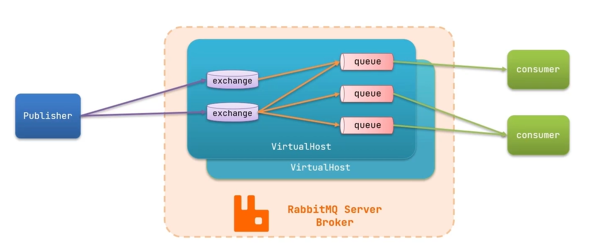

# RabbitMQ



## 一、安装RabbitMQ

```SHELL
docker pull rabbitmq:[版本]		# 在docker hub查看可用版本

# 创建并运行容器
docker run \
-e RABBITMQ_DEFAULT_USER=health \		# 设置环境变量
-e RABBITMQ_DEFAULT_PASS=123456 \		# 设置环境变量
--name mq-3.9 \		# 给该容器取名
--hostname mq1 \	# 配置主机名（未来将来配集群）
-p 15672:15672 \	# 端口映射（管理平台的端口，ui界面给我们用）
-p 5672:5672 \		# 端口映射（做消息通讯的端口）
-d \			   # 后台运行
rabbitmq:3.9-management		# 镜像名称
```

启动后在浏览器访问 主机:15672即可进入管理员ui界面

**相关概念：**

- channel ：操作mq的工具
- exchange：路由消息到队列
- queue：缓存消息
- virtual host：虚拟主机，是对queue、exchange等资源的逻辑分组。


## 二、发送接收案例（使用官方API）

消息被消费后将从队列中消失

发送流程：

1. 创建connection
2. 创建channel
3. 利用channel声明队列
4. 利用channel向队列发送消息

接收流程：

1. 建立connection
2. 创建channel
3. 利用channel声明队列
4. 定义consumer的消费行为handleDelivery()
5. 利用channel将消费者于队列绑定

### 2.1 搭建父项目

新建项目，编写其pom文件

```xml
<?xml version="1.0" encoding="UTF-8"?>
<project xmlns="http://maven.apache.org/POM/4.0.0"
         xmlns:xsi="http://www.w3.org/2001/XMLSchema-instance"
         xsi:schemaLocation="http://maven.apache.org/POM/4.0.0 http://maven.apache.org/xsd/maven-4.0.0.xsd">
    <modelVersion>4.0.0</modelVersion>

    <groupId>cn.health.demo</groupId>
    <artifactId>mq-demo</artifactId>
    <version>1.0-SNAPSHOT</version>
    
    <!--子模块-->
    <modules>
        <module>publisher</module>
        <module>consumer</module>
    </modules>
    <packaging>pom</packaging>

    <parent>
        <groupId>org.springframework.boot</groupId>
        <artifactId>spring-boot-starter-parent</artifactId>
        <version>2.3.9.RELEASE</version>
        <relativePath/>
    </parent>

    <properties>
        <maven.compiler.source>8</maven.compiler.source>
        <maven.compiler.target>8</maven.compiler.target>
    </properties>

    <dependencies>
        <dependency>
            <groupId>org.projectlombok</groupId>
            <artifactId>lombok</artifactId>
            <version>1.18.14</version>
        </dependency>
        <!--AMQP依赖，包含RabbitMQ-->
        <dependency>
            <groupId>org.springframework.boot</groupId>
            <artifactId>spring-boot-starter-amqp</artifactId>
        </dependency>
        <!--单元测试-->
        <dependency>
            <groupId>org.springframework.boot</groupId>
            <artifactId>spring-boot-starter-test</artifactId>
        </dependency>
    </dependencies>
</project>
```


### 2.2 生产者

在父项目中建立名为 publisher 的模块，pom文件什么都不需要改

编写测试文件：（可以在适当位置打断点，然后观察ui管理界面观察执行情况）

```java
package cn.itcast.mq.helloworld;

import com.rabbitmq.client.Channel;
import com.rabbitmq.client.Connection;
import com.rabbitmq.client.ConnectionFactory;
import org.junit.Test;

import java.io.IOException;
import java.util.concurrent.TimeoutException;

public class PublisherTest {
    @Test
    public void testSendMessage() throws IOException, TimeoutException {
        // 1.建立连接
        ConnectionFactory factory = new ConnectionFactory();
        // 1.1.设置连接参数，分别是：主机名、端口号、virtualhost、用户名、密码
        factory.setHost("47.100.81.153");
        factory.setPort(5672);
        factory.setVirtualHost("/");
        factory.setUsername("health");
        factory.setPassword("123456");
        // 1.2.建立连接
        Connection connection = factory.newConnection();

        // 2.创建通道Channel
        Channel channel = connection.createChannel();

        // 3.创建队列
        String queueName = "myQueue";
        channel.queueDeclare(queueName, false, false, false, null);

        // 4.发送消息
        String message = "hello, rabbitmq!";
        channel.basicPublish("", queueName, null, message.getBytes());  //mq底层消息是用字节传输的
        System.out.println("发送消息成功：【" + message + "】");

        // 5.关闭通道和连接
        channel.close();
        connection.close();
    }
}
```


### 2.3 消费者

在父项目中建立名为 consumer的模块，pom文件什么都不需要改

编写测试文件：

```java
package cn.itcast.mq.helloworld;

import com.rabbitmq.client.*;

import java.io.IOException;
import java.util.concurrent.TimeoutException;

public class ConsumerTest {

    public static void main(String[] args) throws IOException, TimeoutException {
        // 1.建立连接
        ConnectionFactory factory = new ConnectionFactory();
        // 1.1.设置连接参数，分别是：主机名、端口号、vhost、用户名、密码
        factory.setHost("47.100.81.153");
        factory.setPort(5672);
        factory.setVirtualHost("/");
        factory.setUsername("health");
        factory.setPassword("123456");
        // 1.2.建立连接
        Connection connection = factory.newConnection();

        // 2.创建通道Channel
        Channel channel = connection.createChannel();

        // 3.创建队列（已存在则不创建）
        String queueName = "myQueue";
        channel.queueDeclare(queueName, false, false, false, null);

        // 4.订阅消息，即消费消息（会拿到队列中所有消息）
        channel.basicConsume(queueName, true, new DefaultConsumer(channel){
            @Override
            public void handleDelivery(String consumerTag, Envelope envelope,
                                       AMQP.BasicProperties properties, byte[] body) throws IOException {
                // 5.处理消息
                String message = new String(body);  //字节转为字符串
                System.out.println("接收到消息：【" + message + "】");
            }
        });
        System.out.println("等待接收消息。。。。");
    }
}
```


## 三、