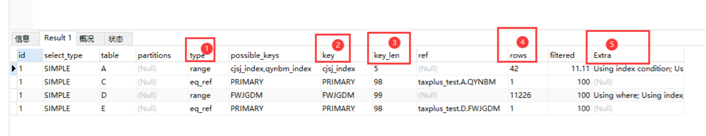

## Mysql性能优化

### 1、Explain

做MySQL优化，我们要善用EXPLAIN查看SQL执行计划。标注（1、2、3、4、5）我们要重点关注的数据：



- type列，连接类型。一个好的SQL语句至少要达到range级别。杜绝出现all级别。
- key列，使用到的索引名。如果没有使用到索引，值是NULL。
- key_len列，索引长度。不损失精确性的情况下，长度越短越好
- rows列，查询所扫描的行数。该值是个预估值。
- extra列，详细说明。注意，常见的不太友好的值，如下：Using filesort，Using temporary。

注：MySQL Explain详解可以参考 https://www.cnblogs.com/leeego-123/p/11846613.html


### 2、区分 in 和 existe

```sql
select * from 表A where id in (select id from 表B)
# 用下面的语句替换
select * from 表A where exists(select * from 表B where 表B.id=表A.id)
```

区分in和exists主要是造成了驱动顺序的改变（这是性能变化的关键）。

如果是exists，那么以外层表为驱动表，先被访问；

如果是IN，那么先执行子查询。

所以IN适合于外表大而内表小的情况；EXISTS适合于外表小而内表大的情况。


### 3、避免在where子句中对字段进行 null 值判断

对于 null 的判断会导致引擎放弃使用索引而进行全表扫描。

可以在字段上设置默认值，如：0，确保表中的列没有 null 值，然后这样查询：select id from 表名 where 字段名 = 0


### 4、in 和 not in也要慎用

<font color="red">否则会导致全表扫描</font>

```sql
如：
select id from t where num in(1,2,3)

对于连续的数值，能用 between 就不要用 in 了：

select id from t where num between 1 and 3
```


### 5、避免在 where 子句中对字段进行表达式操作

```sql
# 比如下面的SQL中对字段就行了算术运算，这会造成引擎放弃使用索引,而进行全表扫描
select user_id,user_project from user_base where age*2=36
建议改成
select user_id,user_project from user_base where age*2=36;

# 再比如：
select id from t where num/2=100
应改成
select id from t where num=100*2

```


### 6、应尽量避免在 where 子句中使用 != 或 <> 操作符

否则将引擎放弃使用索引而进行全表扫描


### 7、应尽量避免在where子句中对字段进行函数操作

否则会导致引擎放弃使用索引而进行全表扫描

```sql
select id from t where substring(name,1,3)='abc'	# name 以abc开头的id
应改为:
select id from t where name like 'abc%'
```


### 8、避免隐式类型转换

隐式转换导致索引失效.这一点应当引起重视.也是开发中经常会犯的错误.

由于表的字段 phone 定义为 varchar2(20)，但在查询时把该字段作为 number 类型以where 条件传给Mysql，这样会导致<font color="red">索引失效</font>

错误的例子：

```sql
select * from test where phone =13333333333;
```

正确的例子：

```sql
select * from test where phone ='13333333333';
```


### 9、对于联合索引来说，要遵守最左前缀法则

可以参考这两篇博客：

- https://w.cnblogs.com/rocker-pg/p/11635414.html（如果组合索引是(A,B)，则对于条件A=a，是可以用上这个组合索引的，因为组合索引是先按照第一列进行排序的，所以没必要对A单独建立一个索引，但是对于B=b就用不上了，因为只有在第一列相同的情况下，才比较第二列，因而第二列相同的，可以分布在不同的节点上，没办法快速定位）
- https://www.cnblogs.com/hongmoshui/p/10429842.html（组合索引的生效原则是：从前往后依次使用生效，如果中间某个索引没有使用，即在这里断点了，那么断点前面的索引起作用，断点后面的索引没有起作用）


### 10、尽量不要使用 select * 

用具体的字段列表代替 * ，不要返回用不到的任何字段，  

SELECT * 会增加很多不必要的消耗（CPU、IO、内存、网络带宽）

增加了使用覆盖索引的可能性；

当表结构发生改变时，前端也需要更新。

所以要求直接在select后面接上字段名。


### 11、如果排序字段没有用到索引，就尽量少排序


### 12、如果限制条件中其他字段没有索引，尽量少用or

or两边的字段中，如果有一个不是索引字段，而其他条件也不是索引字段，会造成该查询<font color="red">不走索引</font>的情况。

很多时候使用 union all 或者是union（必要的时候）的方式来代替 **or** 会得到更好的效果。

```sql
select id from t where num=10 or num=20
```

可以这样查询：

```sql
select id from t where num=10 union all select id from t where num=20
```


### 13、尽量用union all代替union

- union：对两个结果集进行并集操作，去重，同时进行默认规则的排序；
- union All：对两个结果集进行并集操作，不去重，不进行排序；

union 和union all 的差异主要是前者需要将结果集合并后再进行唯一性过滤操作，这就会涉及到排序，增加大量的CPU运算，加大资源消耗及延迟。

当然，union all的前提条件是两个结果集没有重复数据。


### 14、不建议使用 % 前缀模糊查询

例如 LIKE “%name” 或者 LIKE “%name%”，这种查询会导致<font color="red">索引失效而进行全表扫描</font>。但是可以使用LIKE “name%”。

假如有这样一列code的值为 'AAA','AAB','BAA','BAB' ,如果where code like '%AB'条件

由于前面是模糊的，所以不能利用索引的顺序，必须一个个去找，看是否满足条件。

如果是这样的条件where code like 'A % '，就可以查找CODE中A开头的CODE的位置，

当碰到B开头的数据时，就可以停止查找了，因为后面的数据一定不满足要求。这样就可以利用索引了。


### 15、索引数量不要过多

索引并不是越多越好，索引固然可以提高相应的 select 的效率，但同时也降低了 insert 及 update 的效率，

因为 insert 或 update 时有可能会重建索引，所以怎样建索引需要慎重考虑，视具体情况而定。

一个表的索引数最好不要超过6个，若太多则应考虑一些不常使用到的列上建的索引是否有必要。


## Explain详解

expain出来的信息有10列，分别是id、select_type、table、type、possible_keys、key、key_len、ref、rows、Extra,下面对这些字段出现的可能进行解释：

### 1、id

SQL执行的顺序的标识，SQL从大到小的执行

1. id相同时，执行顺序由上至下
2. 如果是子查询，id的序号会递增，id值越大优先级越高，越先被执行
3. id如果相同，可以认为是一组，从上往下顺序执行；在所有组中，id值越大，优先级越高，越先执行


### 2、select_type

 查询中每个select子句的类型

- SIMPLE：简单SELECT，不使用UNION或子查询等
- PRIMARY：查询中若包含任何复杂的子部分，最外层的select被标记为PRIMARY
- UNION：UNION中的第二个或后面的SELECT语句
- DEPENDENT UNION：UNION中的第二个或后面的SELECT语句，取决于外面的查询
- UNION RESULT：UNION的结果
- SUBQUERY：子查询中的第一个SELECT
- DEPENDENT SUBQUERY：子查询中的第一个SELECT，取决于外面的查询
- DERIVED：派生表的SELECT, FROM子句的子查询
- UNCACHEABLE SUBQUERY：一个子查询的结果不能被缓存，必须重新评估外链接的第一行


### 3、table

显示这一行的数据是关于哪张表的，有时不是真实的表名字，看到的是derivedx（x是个数字，可能是第几步执行的结果）

```
mysql> explain select * from (select * from ( select * from t1 where id=2602) a) b;
+----+-------------+------------+--------+-------------------+---------+---------+------+------+-------+
| id | select_type | table      | type   | possible_keys     | key     | key_len | ref  | rows | Extra |
+----+-------------+------------+--------+-------------------+---------+---------+------+------+-------+
|  1 | PRIMARY     | <derived2> | system | NULL              | NULL    | NULL    | NULL |    1 |       |
|  2 | DERIVED     | <derived3> | system | NULL              | NULL    | NULL    | NULL |    1 |       |
|  3 | DERIVED     | t1         | const  | PRIMARY,idx_t1_id | PRIMARY | 4       |      |    1 |       |
+----+-------------+------------+--------+-------------------+---------+---------+------+------+-------+
```


### 4、type

表示MySQL在表中找到所需行的方式，又称“访问类型”。

常用的类型有： **ALL，index，range，ref，eq_ref，const，system，NULL（从左到右，性能从差到好）**

**Select_type 说明查询中使用到的索引类型，如果没有用有用到索引则为all**

- ALL：Full Table Scan， MySQL将遍历全表以找到匹配的行
- index：Full Index Scan，index与ALL区别为index类型只遍历索引树
- range：只检索给定范围的行，使用一个索引来选择行
- ref：表示上述表的连接匹配条件，即哪些列或常量被用于查找索引列上的值
- eq_ref：类似ref，区别就在使用的索引是唯一索引，对于每个索引键值，表中只有一条记录匹配，简单来说，就是多表连接中使用primary key或者 unique key作为关联条件
- const、system：当MySQL对查询某部分进行优化，并转换为一个常量时，使用这些类型访问。如将主键置于where列表中，MySQL就能将该查询转换为一个常量,system是const类型的特例，当查询的表只有一行的情况下，使用system
- NULL：MySQL在优化过程中分解语句，执行时甚至不用访问表或索引，例如从一个索引列里选取最小值可以通过单独索引查找完成。

 

### 5、possible_keys

显示可能应用在这张表中的索引。如果为空，没有可用的索引。

该列完全独立于EXPLAIN输出所示的表的次序。这意味着在possible_keys中的某些键实际上不能按生成的表次序使用。
如果该列是NULL，则没有相关的索引。在这种情况下，可以通过检查WHERE子句看是否它引用某些列或适合索引的列来提高你的查询性能。如果是这样，创造一个适当的索引并且再次用EXPLAIN检查查询

 

### 6、Key

实际使用的索引。如果为null，则没有使用索引。很少的情况下，mysql会选择优化不足的索引。这种情况下，可以在select语句中使用use index（indexname）来强制使用一个索引或者用ignore index（indexname）来强制mysql忽略索引


### 7、key_len

使用的索引的长度。在不损失精确性的情况下，长度越短越好 


### 8、ref

显示索引的哪一列被使用了，如果可能的话，是一个常数

 

### 9、rows

mysql认为必须检查的用来返回请求数据的行数

 

### 10、Extra

**该列包含MySQL解决查询的详细信息,有以下几种情况：**

Using where:列数据是从仅仅使用了索引中的信息而没有读取实际的行动的表返回的，这发生在对表的全部的请求列都是同一个索引的部分的时候，表示mysql服务器将在存储引擎检索行后再进行过滤

Using temporary：表示MySQL需要使用临时表来存储结果集，常见于排序和分组查询

Using filesort：MySQL中无法利用索引完成的排序操作称为“文件排序”

(如果出现以上的两种的红色的Using temporary和Using filesort说明效率低)

Using join buffer：改值强调了在获取连接条件时没有使用索引，并且需要连接缓冲区来存储中间结果。如果出现了这个值，那应该注意，根据查询的具体情况可能需要添加索引来改进能。

Impossible where：这个值强调了where语句会导致没有符合条件的行。

Select tables optimized away：这个值意味着仅通过使用索引，优化器可能仅从聚合函数结果中返回一行

 (复合索引再使用时，尽量的考虑查询时，常用的排序方向和字段组合顺序)

 

### 总结：

- EXPLAIN不会告诉你关于触发器、存储过程的信息或用户自定义函数对查询的影响情况
- EXPLAIN不考虑各种Cache
- EXPLAIN不能显示MySQL在执行查询时所作的优化工作
- 部分统计信息是估算的，并非精确值
- EXPALIN只能解释SELECT操作，其他操作要重写为SELECT后查看执行计划。**

 


