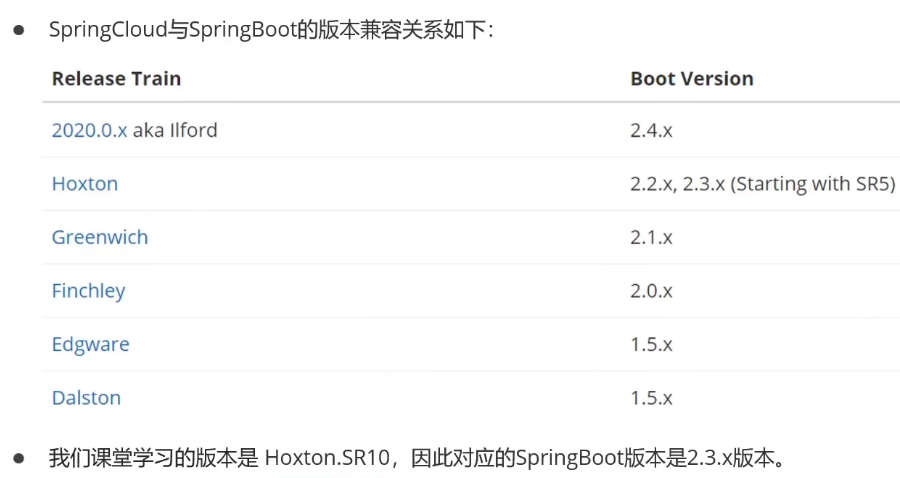
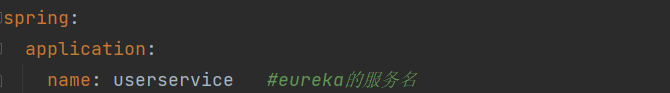
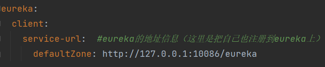
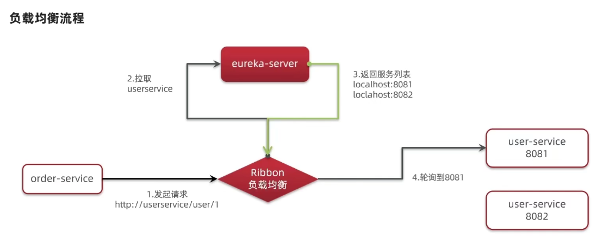

查看springboot与springcloud版本对应关系：https://start.spring.io/actuator/info



# Eureka注册中心

## 搭建EurekaServer

springboot用的是：2.3.9.RELEASE

搭建EurekaServer服务步骤如下：

1.创建项目，引入 spring-cloud-starter-netflix-eureka-server 的依赖（测试用的是2.2.7.RELEASE）

2.编写启动类，添加 @EnableEurekaServer 注解

3.添加application.yml文件，编写如下配置

```
server:
  port: 10086

# 下述两步都是为了注册服务
spring:
  application:
    name: enrekaserver   #eure的服务名
eureka:
  client:
    service-url:  #eureka的地址信息（这里是把自己也注册到eureka上）
      defaultZone: http://127.0.0.1:10086/eureka
```

## 注册user-service

将user-service服务注册到EurekaServer步骤如下：

1.在user-service项目中引入spring-cloud-starter-netflix-eureka-client 依赖（测试用的是2.2.7.RELEASE）

2.在application.yml 编写如下配置：





## 服务实例复制

右键服务-->copy configuration··· --> 取名+设置端口号


## 服务发现

在order-service完成服务拉取，服务拉取是基于服务名称获取服务列表，然后对服务列表做负载均衡

1.修改OrderService代码，修改访问url路径，用服务名代替ip:端口

2.在order-service项目启动类中的RestTemplate添加负载均衡注解（@LoadBalanced）


1.引入eureka-client依赖

2.在application.yml中配置eureka地址和自己的服务名

3.1 给restTemplate添加@LoadBalanced注解，实现负载均衡

3.2 用服务提供者的服务名远程调用

问题：若启动报错，可在配置文件yml上面加 fetch-registry: false

# Ribbon负载均衡




负载均衡策略

通过定义IRule实现可修改负载均衡策略，有两种方式：

1.代码方式：在order-service中的启动类，定义一个新的IRule（全局）

```java
/**
 * 设置负载均衡规则：只需要在这声明bean即可（这里是全局的）
 * 设置负载均衡规则为随机
 */
@Bean
public IRule randomRule(){
    return new RandomRule();
}
```

2.配置文件方式：在order-service的yml文件中添加新的配置（针对某个服务进行配置）

userservice.ribbon.NFloadBalanceRuleClassName: com.netflix.loadbalancer.RandomRule #负载均衡规则（随机）

```yaml
userservice:
  ribbon:
    NFloadBalanceRuleClassName: com.netflix.loadbalancer.RandomRule #负载均衡规则（随机）
```


### 饥饿加载

Ribbon默认采用懒加载，即第一次访问时才回去创建LoadBalanceClient，请求时间较长

饥饿加载会在项目启动时创建，降低第一次访问的耗时，通过下述配置开启饥饿加载：

ribbon.eager-load.enable: true   开启加载

ribbon.eager-load.clients: userservice  # 指定对userservice这个服务进行饥饿加载

```yaml
ribbon:
  eager-load:
    enabled: true # 开启加载
    clients: userservice  # 指定对userservice这个服务进行饥饿加载
```


# Nacos注册中心


## 服务注册到nacos

1.在cloud-demo父工程添加spring-cloud-alibaba的管理依赖：

```xml
<!--nacos-->
<dependency>
    <groupId>com.alibaba.cloud</groupId>
    <artifactId>spring-cloud-alibaba-dependencies</artifactId>
    <version>2.2.5.RELEASE</version>
    <type>pom</type>
    <scope>import</scope>
</dependency>
```

2.注掉order-service和user-service中原有的eureka依赖

3.添加nacos的客户端依赖

```xml
<dependency>
    <groupId>com.alibaba.cloud</groupId>
    <artifactId>spring-cloud-starter-alibaba-nacos-discovery</artifactId>
</dependency>
```

4.启动user-service和order-service。启动nacos，访问黑窗口给与的地址，在服务列表可以看到注册的各个服务

## 服务集群配置

1.修改yml配置即可，如下最后两行：（spring.cloud.nacos.discovery.cluster-name属性）

```yaml
cloud:
  nacos:
    server-addr: localhost:8848 #nacos服务地址
    discovery:
      cluster-name: BJ  #集群名称，这里BJ代指北京
```

2.这里设置集群名为BJ，启动两个user-service，修改集群名称为SH，再启动一个user-service

3.在nacos控制台可以看到集群变化，有两个集群了，一个BJ，一个SH


## Nacos负载均衡

### 访问顺序

在order-service的yml中配置：

```yaml
#nacos负载均衡
userservice:
  ribbon:
    NFLoadBalancerRuleClassName: com.alibaba.cloud.nacos.ribbon.NacosRule #优先选择本地集群，然后再随机访问服务
```

此时再去访问user-service时就会优先访问与自己相同集群的了。找不到再去其他集群，并且会报警告

### Nacos权重设置

在nacos控制台可以设置实例的权重值，步骤如下：

1. 点开服务详情，选择想设置的实例，点击编辑，直接修改即可
2. 


## 环境隔离

设置命名空间（不同命名空间下的服务互相不可见）

1.在控制台新建dev命名空间，复制其ID

2.在想添加到dev命名空间的服务的yml中添加 namespace: 命名空间ID 配置，重启服务

```
spring:
  cloud:
    nacos:
      server-addr: localhost:8848 #nacos服务地址
      discovery:
        cluster-name: BJ  #集群名称，这里BJ代指北京
        namespace: c38dfdb7-7558-48ac-826c-aa8aa6e0a186 #dev环境
```


# Nacos配置管理

首先在控制台添加配置

1.引入Nacos配置管理客户端依赖

```xml
<!--nacos配置管理依赖-->
<dependency>
    <groupId>com.alibaba.cloud</groupId>
    <artifactId>spring-cloud-starter-alibaba-nacos-config</artifactId>
</dependency>
```

2.在userservice中的添加bootstrap.yml文件（bootstrap.yml优先级最高）

```yaml
spring:
  application:
    name: userservice
  profiles:
    active: dev #环境
  cloud:
    nacos:
      server-addr: localhost:8848
      config:
        file-extension: yaml  #文件名后缀
```

3.读取配置（在controller中操作）

```java
@Value("${pattern.dateformat}")
private String dateFormat;

@GetMapping("/now")
public String now(){
    return LocalDateTime.now().format(DateTimeFormatter.ofPattern(dateFormat));
}
```

### 配置修改后自动刷新

#### 方式一

只需在@Value注入的变量所在类上添加@RefreshScope注解

```java
@RestController
@RequestMapping("/user")
@RefreshScope	//完成自动更新配置信息的注解
public class UserController {

    @Autowired
    private UserService userService;

    @Value("${pattern.dateformat}")
    private String dateFormat;
```

#### 方式二

 使用ConfigurationProperties注解

新写一个配置类

```java
@Data
@Component
@ConfigurationProperties("pattern")	//实时同步配置信息，前缀名和变量名跟配置文件一致，即可完成属性的自动注入
public class PatternProperties {
    private String dateformat;
}
```

controller获取值

```java
@Autowired
private PatternProperties properties;

@GetMapping("/now")
public String now(){
    return LocalDateTime.now().format(DateTimeFormatter.ofPattern(properties.getDateformat()));
}
```


