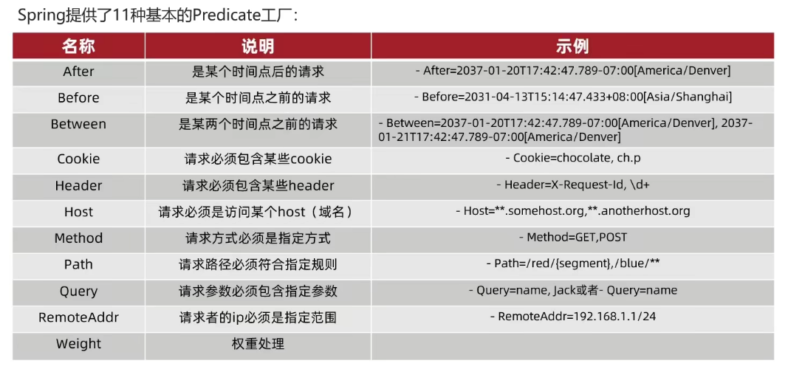
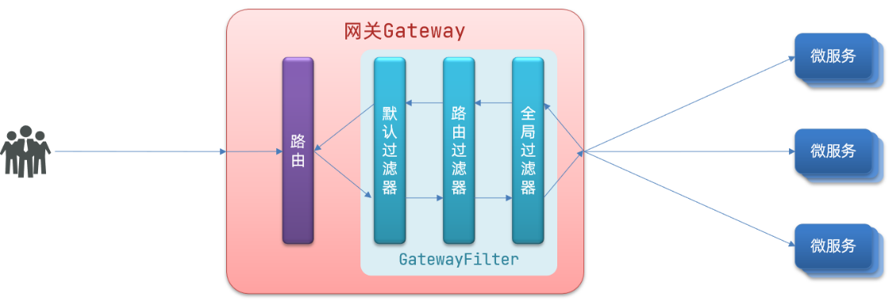

# spring cloud

spring cloud官方文档：https://spring.io/projects/spring-cloud

### 版本关系：

```shell
# springboot与springcloud版本对应关系
https://start.spring.io/actuator/info

# spring cloud alibaba 与 别的的版本对应关系
https://github.com/alibaba/spring-cloud-alibaba/wiki/%E7%89%88%E6%9C%AC%E8%AF%B4%E6%98%8E
```


# 一、Eureka注册中心

服务注册与消费过程：服务启动时会自动向eureka注册自己的信息，eureka保存这些信息，消费者根据服务名称向eureka拉去提供者信息

**EurekaServer（注册中心）：**

- 记录服务信息：服务启动时会自动向eureka注册自己的信息，eureka保存这些信息
- 心跳监控：服务提供者每隔30s会向eureka发送心跳请求，报告自己的健康状态，如果心跳不正常该服务会被eureka剔除掉。

**EurekaClient（客户端）：**

- 服务提供者：注册自己到EurekaServer，没隔30s发送自己的心跳。
- 服务消费者：从EurekaServer拉取服务，基于服务列表做负载均衡，挑选一个服务发起远程调用。

## 

## 1. 练习：

**搭建注册中心 -- 服务注册 -- 服务发现**

### 1.1 搭建EurekaServer

springboot用的是：2.3.9.RELEASE

搭建EurekaServer服务步骤如下：

1.创建 EurekaServer 模块，引入 spring-cloud-starter-netflix-eureka-server 的依赖（测试用的是2.2.7.RELEASE）

2.编写启动类，添加 @EnableEurekaServer 注解开启eureka服务

3.添加application.yml文件，编写如下配置

```yml
server:
  port: 10086

# 下述两步都是为了注册服务（将自己注册到注册中心，为了以后做集群时互相调用）
spring:
  application:
    name: eurekaserver   #eureka的服务名（EurekaServer自己也是个微服务，也需要有名字才能被注册到注册中心）
eureka:
  client:
    service-url:  #eureka的地址信息（这里是把自己也注册到eureka上）
      defaultZone: http://127.0.0.1:10086/eureka	# 注意这里的端口号要与服务的端口号一致
```

启动服务：访问localhost:10086 即可进入浏览器页面

### 1.2 注册user-service

将user-service服务注册到EurekaServer步骤如下：

1.在user-service项目中引入spring-cloud-starter-netflix-eureka-client 依赖（测试用的是2.2.7.RELEASE）

2.在application.yml 编写如下配置：

```shell
spring:
  application:
    name: eurekaserver   #eureka的服务名
eureka:
  client:
    service-url:  #eureka的地址信息（这里是把自己注册到eureka上）
      defaultZone: http://127.0.0.1:10086/eureka
```


### 1.3 服务实例复制

右键服务-->copy configuration··· --> 取名+设置端口号


### 1.4 服务发现（已弃用）

1.引入spring-cloud-starter-netflix-eureka-client 依赖

2.在application.yml中配置eureka地址和自己的服务名

3.在启动类中编写RestTemplate，并注入spring容器

```shell
@Bean
@LoadBalanced	//实现负载均衡
public RestTemplate restTemplate(){
	return new RestTemplate();
}
```

4.用服务提供者的服务名远程调用

```shell
@Override
public Student queryStudentById(Long id) {
    // 1.查询学生信息
    Student stu = studentMapper.findById(id);
    //2. http://服务名/路径/id
    String url = "http://bag-service/bag/"+stu.getBagId();
    //3 利用resttemplate发送http请求，实现远程调用
    Bag bag = restTemplate.getForObject(url, Bag.class);
    stu.setBag(bag);
    // 4.返回
    return stu;
}
```

<font color="red">注意：若启动报错，可在配置文件yml上面加 fetch-registry: false 和 register-with-eureka: false</font>

# 二、Ribbon负载均衡

Ribbon负载均衡规则接口为：IRule

### 1. 修改负载均衡策略

ribbon默认采用轮询方式进行负载均衡，通过定义IRule实现可修改负载均衡策略，有两种方式：

（1）代码方式：在**服务调用方**的启动类(配置类)，定义一个新的IRule（全局）

```java
/**
 * 设置负载均衡规则：只需要在这声明bean即可（这里是全局的）
 * 设置负载均衡规则为随机
 */
@Bean
public IRule randomRule(){
    return new RandomRule();
}
```

（2）配置文件方式：在**服务调用方**的yml文件中添加新的配置（针对某个服务进行配置），如下：针对访问userservice服务时使用随机访问

```yaml
userservice:
  ribbon:
    NFloadBalanceRuleClassName: com.netflix.loadbalancer.RandomRule #负载均衡规则（随机）
```


### 2. 饥饿加载

Ribbon默认采用**懒加载**，即第一次访问时才会去创建LoadBalanceClient，请求时间较长

**饥饿加载** 则会在项目启动时创建，降低第一次访问的耗时，可通过下述配置开启饥饿加载：

ribbon.eager-load.enable: true   开启加载

ribbon.eager-load.clients: userservice  # 指定对userservice这个服务进行饥饿加载

```yaml
ribbon:
  eager-load:
    enabled: true # 开启加载
    clients: userservice  # 指定对userservice这个服务进行饥饿加载（先开启再指定服务，这两步都需要）
```

# 三、Nacos

nacos安装：参考Linux目录下的**安装软件.md**

在bin目录执行：./startup.sh -m standalone    单机启动nacos

访问：ip:8848/nacos/index.html

## 3.1 服务注册到nacos

**注册中心细节分析：**

服务启动时会将自己的信息注册到注册中心，消费者需要调用的时候就会去注册中心拉取服务，并将拉取的服务缓存起来（存储到一个缓存列表里面），这个列表每隔30s重新去注册中心拉取一次进行更新。消费者拿到服务列表之后再去进行负载均衡、远程调用。如果拉取间隔中服务有变更nacos会主动推送变更信息到调用者。

**临时实例和非临时实例**

注册到nacos的服务默认为临时实例，可通过 **spring.cloud.nacos.discovery.ephemeral: false** 设置其为非临时实例

- 临时实例：采用心跳检测，服务会每隔一段时间发送一个请求到nacos中，如果哪天不发送请求了，说明服务挂掉了，此时nacos就会将其从服务列表在剔除。
- 非临时实例：采用主动检测，nacos主动发请求检测该服务是否处于健康状态，如果服务不健康，则会被nacos标记为不健康状态，并等待其恢复。

1.在父工程中添加spring-cloud-alibaba的管理依赖(包含各种spring-cloud-alibaba的组件)：

```xml
<!--nacos-->
<dependency>
    <groupId>com.alibaba.cloud</groupId>
    <artifactId>spring-cloud-alibaba-dependencies</artifactId>
    <version>2.2.5.RELEASE</version>
    <type>pom</type>
    <scope>import</scope>
</dependency>
```

2.在子工程中添加nacos的客户端依赖

```xml
<dependency>
    <groupId>com.alibaba.cloud</groupId>
    <artifactId>spring-cloud-starter-alibaba-nacos-discovery</artifactId>
</dependency>
```

3.在子工程的yml文件中添加 nacos 地址进行服务注册

```shell
spring
  cloud:
    nacos:
      server-addr: 47.100.81.153:8848 #nacos服务地址
      discovery:
        namespace: env-dev  # 注册到nacos里面的哪个环境（填写命名空间的ID，默认会注册到public下)
```

4.启动工程，启动nacos，访问黑窗口给与的地址，在服务列表可以看到注册的各个服务

## 3.2 服务集群配置

把一个服务的多个实例部署在多个集群（分配在多个不同的地区/机房）中，避免因为某个机房出了问题导致服务不能调用（即：容灾）

1.修改yml配置即可，增加cluster-name属性：（spring.cloud.nacos.discovery.cluster-name属性）

```yaml
cloud:
  nacos:
    server-addr: localhost:8848 #nacos服务地址
    discovery:
      cluster-name: BJ  #集群名称，这里BJ代指北京
```

2.这里设置集群名为BJ，启动两个user-service，修改集群名称为SH，再启动一个user-service

3.在nacos控制台可以看到集群变化，有两个集群了，一个BJ，一个SH

 

## 3.3 Nacos负载均衡

服务在选择实例时默认为轮询，配置其他负载均衡策略(两种)

### 3.31 优先访问同集群实例

在服务消费者（调用方）的yml中配置：

```yaml
#nacos负载均衡
被调用的服务名:
  ribbon:
    NFLoadBalancerRuleClassName: com.alibaba.cloud.nacos.ribbon.NacosRule 	#优先选择本地集群，然后再随机访问服务
```

此时再去调用实例时就会优先访问与自己相同集群的了（相同集群中多个相同实例的话采用是随机访问）。找不到再去其他集群，并且会报警告

### 3.32 Nacos权重设置

在nacos控制台可以设置实例的权重值（权重越大，访问频率越高），步骤如下：

1. 点开服务详情，选择想设置的实例，点击编辑，直接修改即可
2. 


## 3.4 环境隔离

设置命名空间（不同命名空间下的服务互相不可见）

1.在图像界面新建 env-test 命名空间，复制其ID

2.在想添加到 env-test 命名空间的服务的yml中添加 discovery.namespace: 命名空间ID 配置，重启服务

```
spring:
  cloud:
    nacos:
      server-addr: localhost:8848 #nacos服务地址
      discovery:
        cluster-name: BJ  #集群名称，这里BJ代指北京
        namespace: c38dfdb7-7558-48ac-826c-aa8aa6e0a186 #dev环境
```


## 3.5 Nacos配置管理

### 3.51 添加读取配置

nacos配置管理：如果修改了配置，配置管理服务会主动通知 微服务 配置更改了，微服务得到信息就回去配置管理服务中重新读取配置（后期还可以为服务设置热更新）

首先在图形界面添加配置

```shell
# 步骤：配置管理 --> 配置列表 --> + 
DataID：服务名称-运行环境.为配置内容的数据格式（例如：pdfsite-dev.properties）
Group：分组
配置格式：目前只支持yaml和properties（不能带空格）
```

项目启动 --> 读取bootstrap.yml --> 读取nacos -->  读取application.yml（因此nacos配置 需要加在bootstrap中）

1.引入Nacos配置管理客户端依赖

```xml
<!--nacos配置管理依赖-->
<dependency>
    <groupId>com.alibaba.cloud</groupId>
    <artifactId>spring-cloud-starter-alibaba-nacos-config</artifactId>
</dependency>
```

2.在 服务中的添加bootstrap.yml文件（**bootstrap.yml优先级最高**）

```yml
spring:
  profiles:
    active: dev   # 激活dev配置(开发环境)
  application:
    name: pdfsite # 服务名称
  cloud:
    nacos:
      config:
        file-extension: properties  # 配置文件后缀名
        namespace: env-dev    # nacos命名空间
        group: pdfsite    # 组名
      server-addr: 47.100.81.153:8848 #nacos地址
# 服务名称-开发环境.配置文件后缀名 = dataID
```

3.读取配置（在controller中操作）

```java
@Value("${pattern.dateformat}")
private String dateFormat;

@GetMapping("/now")
public String now(){
    return LocalDateTime.now().format(DateTimeFormatter.ofPattern(dateFormat));
}
```

### 3.52 配置修改后自动刷新（热更新）

nacos配置更新之后，微服务无需重启就可以感知

#### 方式一

只需在使用@Value注入的变量**所在类上**添加@RefreshScope注解

```java
@RestController
@RequestMapping("/user")
@RefreshScope	//完成自动更新配置信息的注解
public class UserController {

    @Autowired
    private UserService userService;

    @Value("${pattern.dateformat}")
    private String dateFormat;
```

#### 方式二

 使用ConfigurationProperties注解

新写一个配置类

```java
@Data
@Component
@ConfigurationProperties(prefix= "pattern")	//实时同步配置信息，前缀名加变量名跟配置文件一致，即可完成属性的自动注入
public class PatternProperties {
    private String dateformat;
}
```

controller获取值

```java
@Autowired
private PatternProperties properties;

@GetMapping("/now")
public String now(){
    return LocalDateTime.now().format(DateTimeFormatter.ofPattern(properties.getDateformat()));
}
```

### 3.53 多环境共享

微服务启动时会从nacos中读取多个配置文件：

- 服务名-环境.配置文件后缀名：只有对应环境下才会读取此配置文件
- 服务名.配置文件后缀名：无论什么环境都会读取此配置文件

补充：当有相同的配置时优先级情况为 服务名-环境.后缀名 > 服务名.后缀名 > 本地配置文件(application.yml)


## 3.6 nacos集群搭建

待续......

# 四、Feign

## 4.1 定义和使用Feign

1.引入依赖

在student-service（调用者）服务的pom文件中引入feign的依赖

```xml
<!--Feign-->
<dependency>
    <groupId>org.springframework.cloud</groupId>
    <artifactId>spring-cloud-starter-openfeign</artifactId>
</dependency>
```

2.开启Feign功能

在student-service（调用者）的启动类添加注解开启Feign功能

```java
@EnableFeignClients	//开启Feign注解
@MapperScan("com.health.student.mapper")
@SpringBootApplication
public class StudentApplication {
    ······
```

3.编写Feign客户端接口

在student-service（调用者）中新建一个被调用者（bagService）接口，内容如下：

```java
@FeignClient("bag-service")		//被调用的服务名称
public interface BagClient {
    @GetMapping("/bag/{id}")
    Bag findById(@PathVariable("id") Long id);
}
```

这个客户端主要是基于SpringMVC的注解来声明远程调用的信息，比如：

- 服务名称：bag-service
- 请求方式：GET
- 请求路径：/bag/{id}
- 请求参数：Long id
- 返回值类型：Bag

这样，Feign就可以帮助我们发送http请求，无需自己使用RestTemplate来发送了。

4.测试

修改order-service中的OrderService类中的queryOrderById方法，使用Feign客户端代替RestTemplate：

```java
@Autowired
private BagClient bagClient;

public Student queryStudentById(Long id) {
    // 1.查询学生信息
    Student stu = studentMapper.findById(id);
    
    /**
    restTemplate方式发送http请求，实现远程调用
        String url = "http://bag-service/bag/"+stu.getBagId();
        Bag bag = restTemplate.getForObject(url, Bag.class);
        stu.setBag(bag);
    */
    
    //2.Feign 方式远程调用
    Bag bag = bagClient.findById(id);
    stu.setBag(bag);
    return stu;
}
```


## 4.2.自定义配置

Feign可以支持很多的自定义配置，如下表所示：

| 类型                   | 作用             | 说明                                                   |
| ---------------------- | ---------------- | ------------------------------------------------------ |
| **feign.Logger.Level** | 修改日志级别     | 包含四种不同的级别：NONE、BASIC、HEADERS、FULL         |
| feign.codec.Decoder    | 响应结果的解析器 | http远程调用的结果做解析，例如解析json字符串为java对象 |
| feign.codec.Encoder    | 请求参数编码     | 将请求参数编码，便于通过http请求发送                   |
| feign. Contract        | 支持的注解格式   | 默认是SpringMVC的注解                                  |
| feign. Retryer         | 失败重试机制     | 请求失败的重试机制，默认是没有，不过会使用Ribbon的重试 |

一般情况下，默认值就能满足我们使用，如果要自定义时，只需要创建自定义的@Bean覆盖默认Bean即可。


下面以日志为例来演示如何自定义配置。

### 2.2.1.配置文件方式

基于配置文件修改feign的日志级别可以针对单个服务：

```yaml
feign:  
  client:
    config: 
      userservice: # 针对某个微服务的配置
        loggerLevel: FULL #  日志级别 
```

也可以针对所有服务：

```yaml
feign:  
  client:
    config: 
      default: # 这里用default就是全局配置，如果是写服务名称，则是针对某个微服务的配置
        loggerLevel: FULL #  日志级别 
```


而日志的级别分为四种：

- NONE：不记录任何日志信息，这是默认值。
- BASIC：仅记录请求的方法，URL以及响应状态码和执行时间
- HEADERS：在BASIC的基础上，额外记录了请求和响应的头信息
- FULL：记录所有请求和响应的明细，包括头信息、请求体、元数据。


### 2.2.2.Java代码方式

也可以基于Java代码来修改日志级别，先声明一个类，然后声明一个Logger.Level的对象：

```java
public class DefaultFeignConfiguration  {
    @Bean
    public Logger.Level feignLogLevel(){
        return Logger.Level.BASIC; // 日志级别为BASIC
    }
}
```


如果要**全局生效**，将其放到启动类的@EnableFeignClients这个注解中：

```java
@EnableFeignClients(defaultConfiguration = DefaultFeignConfiguration .class) 
```


如果是**局部生效**，则把它放到对应的@FeignClient这个注解中：

```java
@FeignClient(value = "userservice", configuration = DefaultFeignConfiguration .class) 
```


## 4.3.Feign使用优化

1. 日志级别尽量用basic

2. 使用HttpClient或OKHttp代替URLConnection
   - 引入feign-httpClient依赖
   - 配置文件开启httpClient功能，设置连接池参数


Feign底层发起http请求，依赖于其它的框架。其底层客户端实现包括：

•URLConnection：默认实现，不支持连接池

•Apache HttpClient ：支持连接池

•OKHttp：支持连接池

因此提高Feign的性能主要手段就是使用**连接池**代替默认的URLConnection。


这里我们用Apache的HttpClient来演示。

1）引入依赖

在order-service的pom文件中引入Apache的HttpClient依赖：（该依赖已经被spring管理了，不需要写版本）

```xml
<!--httpClient的依赖 -->
<dependency>
    <groupId>io.github.openfeign</groupId>
    <artifactId>feign-httpclient</artifactId>
</dependency>
```

2）配置连接池

在order-service的application.yml中添加配置：

```yaml
feign:
  client:
    config:
      default: # default全局的配置
        loggerLevel: BASIC # 日志级别，BASIC就是基本的请求和响应信息
  httpclient:
    enabled: true # 开启feign对HttpClient的支持
    max-connections: 200 # 最大的连接数
    max-connections-per-route: 50 # 每个路径的最大连接数
```


  

# 五、Gateway

官方文档：https://docs.spring.io/spring-cloud-gateway/docs/current/reference/html/

 网关的功能：

- 身份认证和权限校验：校验用户是是否有请求资格，如果没有则进行拦截。
- 服务路由、负载均衡：一切请求都必须先经过gateway，但网关不处理业务，而是根据某种规则，把请求转发到某个微服务，这个过程叫做路由。路由的目标服务有多个时，还需要做负载均衡。
- 请求限流：当请求流量过高时，在网关中按照下流的微服务能够接受的速度来放行请求，避免服务压力过大。

## 5.1 练习

#### 5.11 新建 gateway 模块 (项目)，引入依赖

```xml
<!--nacos服务注册依赖-->
<dependency>
    <groupId>com.alibaba.cloud</groupId>
    <artifactId>spring-cloud-starter-alibaba-nacos-discovery</artifactId>
</dependency>
<!--网关gateway依赖-->
<dependency>
    <groupId>org.springframework.cloud</groupId>
    <artifactId>spring-cloud-starter-gateway</artifactId>
</dependency>
```

#### 5.12编写配置文件

```yml
server:
  port: 9000   # 网关端口
spring:
  application:
    name: gateway   # 服务名称
  cloud:
    nacos:
      server-addr: 47.100.81.153:8848   # nacos地址，将网关注册到注册中心
      discovery:
        namespace: env-dev  # 注册到nacos里面的哪个环境(默认注册到public)
        group: demo02
    gateway:
      routes: # 网关路由配置
        - id: student-service  # 路由id，自定义，只要唯一即可
          # uri: http://127.0.0.1:8081 # 路由的目标地址 http就是固定地址
          uri: lb://student-service    # 路由的目标地址 lb就是负载均衡，后面跟服务名称
          predicates:   # 路由断言，也就是判断请求是否符合路由规则的条件
            - Path=/student/**   # 按照路径匹配，只要以/student/开头就符合要求

        - id: bag-service	# 可以配置多个服务
          uri: lb://bag-service
          predicates:
            - Path=/bag/**
```

此时启动gateway服务，再启动bag和student服务，访问 localhost:9000/bag/1 相当于之前访问 localhost:8081/bag/1 ，因为网关会基于配置的路由规则把请求路由到对应的服务上。

路由配置包括：

1. 路由id：路由的唯一标识
2. 路由目标（uri）：路由的目标地址，http代表固定地址，lb代表根据服务名负载均衡
3. 路由断言（predicates）：判断路由的规则是否符合，符合则转发到路由目的地。
4. 路由过滤器（filters）：对请求或响应做处理


## 5.2 断言工厂

Predicate Factory 会读取我们编写的yml中的断言规则，并解析处理，转变为路由判断条件对请求进行判断。

例如Path=/user/**是按照路径匹配，这个规则是由

`org.springframework.cloud.gateway.handler.predicate.PathRoutePredicateFactory`类来处理的，像这样的断言工厂在SpringCloudGateway还有十几个:



只需要掌握Path这种路由规则即可。


## 5.3.过滤器工厂（通过配置）

GatewayFilter是网关中提供的一种过滤器，可以对进入网关的 **请求** 和微服务返回的 **响应** 做处理：



### 5.3.1. 路由过滤器的种类

Spring提供了31种不同的路由过滤器工厂（使用方法可参照本节标题上给的官网）。例如：

| **名称**             | **说明**                     |
| -------------------- | ---------------------------- |
| AddRequestHeader     | 给当前请求添加一个请求头     |
| RemoveRequestHeader  | 移除请求中的一个请求头       |
| AddResponseHeader    | 给响应结果中添加一个响应头   |
| RemoveResponseHeader | 从响应结果中移除有一个响应头 |
| RequestRateLimiter   | 限制请求的流量               |


### 5.3.2. AddRequestHeader 示例

在网关的配置文件加上 AddRequestHeader 的路由过滤配置（在最后几行），即完成对该路由添加请求头了，AddRequestHeader =请求头名,内容

```yml
spring:
  application:
    name: gateway   # 服务名称
  cloud:
    nacos:
      server-addr: 47.100.81.153:8848   # nacos地址，将网关注册到注册中心
      discovery:
        namespace: env-dev  # 注册到nacos里面的哪个环境(默认注册到public)
        group: demo02
    gateway:
      routes: # 网关路由配置
        - id: student-service  # 路由id，自定义，只要唯一即可
          # uri: http://127.0.0.1:8081 # 路由的目标地址 http就是固定地址
          uri: lb://student-service    # 路由的目标地址 lb就是负载均衡，后面跟服务名称
          predicates:   # 路由断言，也就是判断请求是否符合路由规则的条件
            - Path=/student/**   # 按照路径匹配，只要以/student/开头就符合要求

        - id: bag-service
          uri: lb://bag-service
          predicates:
            - Path=/bag/**
          filters:  # 过滤器（只针对该路由生效）
            - AddRequestHeader=Truth,I was no object! # 添加请求头(请求头名,内容)
            
      default-filters: # 默认过滤器，会对所有路由请求都生效
        - AddRequestHeader=haha,I was no object！
```


此时我们可以在controller中通过参数获取请求头内容：RequestHeader注解获取，并打印出来

```java
@GetMapping("{bagId}")
public Bag queryAll(@PathVariable("bagId") Long id,
                    @RequestHeader(value = "haha", required = false) String truth) {
    System.out.println("truth: "+truth);
    return bagService.queryBagById(id);
}
```


## 5.4 全局过滤器（通过代码）

处理一切进入网关的请求和微服务响应，于GatewayFilter的作用一样，但GatewayFilter是通过配置定义，GlobalFilter的逻辑需要自己写代码实现。

定义全局过滤器的方式：实现GlobalFilter接口

 ```java
 //spring中的接口
 public interface GlobalFilter {
 
 	/**
 	 * 处理web请求 and (可选) 通过给定的GatewayFilterChain委托给下一个WebFilter
 	 * @param exchange 请求上下文，里面可以获取Request、Response等信息
 	 * @param chain 用来把请求委托给下一个过滤器
 	 * @return {@code Mono<Void>} 返回标识当前过滤器业务结束
 	 */
 	Mono<Void> filter(ServerWebExchange exchange, GatewayFilterChain chain);
 }
 ```


### 5.4.1 小案例

**需 求**：定义全局过滤器，拦截请求，判断请求的参数是否满足下面条件：

- 参数中是否有authorization，

- authorization参数值是否为admin

如果同时满足则放行，否则拦截


**实现步骤**：在gateway中定义一个过滤器：

1. 实现GlobalFilter接口
2. 添加@Order注解或实现Ordered接口，设置过滤处理优先级
3. 编写处理逻辑

```java
package com.health.gateway.filters;

import org.springframework.cloud.gateway.filter.GatewayFilterChain;
import org.springframework.cloud.gateway.filter.GlobalFilter;
import org.springframework.core.annotation.Order;
import org.springframework.http.HttpStatus;
import org.springframework.stereotype.Component;
import org.springframework.util.MultiValueMap;
import org.springframework.web.server.ServerWebExchange;
import reactor.core.publisher.Mono;

/**
 * @author health
 * @desc 全局过滤器,拦截所有请求，并做自定义处理
 * @since 2021/11/16
 */
@Order(-1)  //设置该过滤器优先级，数字越小优先级越高
@Component  //添加到spring容器中
public class AuthorizeFilter implements GlobalFilter {

    @Override
    public Mono<Void> filter(ServerWebExchange exchange, GatewayFilterChain chain) {
        // 1.获取请求参数
        MultiValueMap<String, String> params = exchange.getRequest().getQueryParams();
        // 2.获取authorization参数
        String auth = params.getFirst("authorization");
        // 3.校验
        if ("admin".equals(auth)) {
            // 放行
            return chain.filter(exchange);
        }
        // 4.拦截
        // 4.1.禁止访问，设置状态码
        exchange.getResponse().setStatusCode(HttpStatus.UNAUTHORIZED);
        // 4.2.结束处理
        return exchange.getResponse().setComplete();
    }
}
```


### 5.4.2.过滤器执行顺序

请求进入网关会碰到三类过滤器：当前路由的过滤器、DefaultFilter、GlobalFilter

请求路由后，会将当前路由过滤器和DefaultFilter、GlobalFilter，合并到一个过滤器链（集合）中，排序后依次执行每个过滤器：


排序的规则：

- 每一个过滤器都必须指定一个int类型的order值，**order值越小，优先级越高，执行顺序越靠前**。
- GlobalFilter通过实现Ordered接口，或者添加@Order注解来指定order值，由我们自己指定
- 路由过滤器(单个服务的那种)和defaultFilter的order由Spring指定，默认是按照声明顺序从1递增。
- 当过滤器的order值一样时，会按照 defaultFilter > 路由过滤器 > GlobalFilter的顺序执行。


详细内容，可以查看源码：

`org.springframework.cloud.gateway.route.RouteDefinitionRouteLocator#getFilters()`方法是先加载defaultFilters，然后再加载某个route的filters，然后合并。

`org.springframework.cloud.gateway.handler.FilteringWebHandler#handle()`方法会加载全局过滤器，与前面的过滤器合并后根据order排序，组织过滤器链


## 5.5 跨域问题

### 5.5.1 跨域简介

跨域：域名不一致就是跨域，主要包括：

- 域名不同： www.taobao.com 和 www.taobao.org 和 www.jd.com 和 miaosha.jd.com

- 域名相同，端口不同：localhost:8080和localhost8081

### 5.5.2 跨域问题

浏览器禁止 请求的发起者与服务端发生跨域 ajax请求，请求被浏览器拦截的问题

### 5.5.3 解决方法：

CORS（详情：https://www.ruanyifeng.com/blog/2016/04/cors.html），在Gateway项目中配置：

```yml
spring:
  cloud:
    gateway:
      globalcors: # 全局的跨域处理
        add-to-simple-url-handler-mapping: true # 解决options请求被拦截问题,即不拦截
        corsConfigurations:
          '[/**]':		# 拦截哪些请求
            allowedOrigins: 	# 允许哪些网站的跨域请求
              - "http://localhost:8090"
              - "https://www.baidu.com"
            allowedMethods: 	# 允许的跨域ajax的请求方式
              - "GET"
              - "POST"
              - "DELETE"
              - "PUT"
              - "OPTIONS"
            allowedHeaders: "*" 	# 允许在请求中携带的头信息
            allowCredentials: true 	# 是否允许携带cookie
            maxAge: 360000 	  # 这次跨域检测的有效期
```


