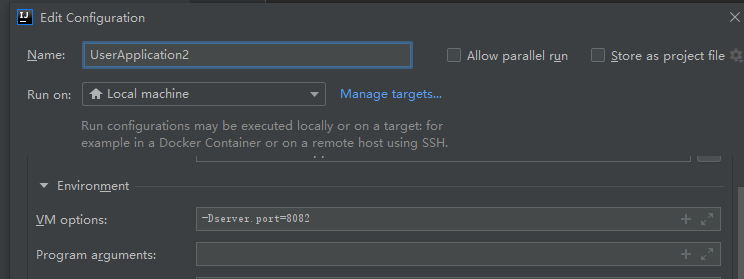
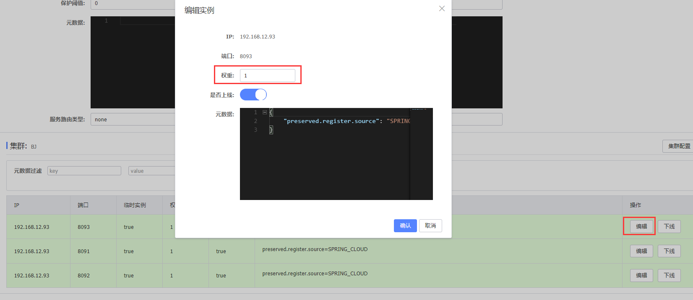

# spring cloud

spring cloud官方文档：https://spring.io/projects/spring-cloud

### 版本关系：

```shell
# springboot与springcloud版本对应关系
https://start.spring.io/actuator/info

# spring cloud alibaba 与 别的的版本对应关系
https://github.com/alibaba/spring-cloud-alibaba/wiki/%E7%89%88%E6%9C%AC%E8%AF%B4%E6%98%8E
```


# 一、Eureka注册中心

服务注册与消费过程：服务启动时会自动向eureka注册自己的信息，eureka保存这些信息，消费者根据服务名称向eureka拉去提供者信息

**EurekaServer（注册中心）：**

- 记录服务信息：服务启动时会自动向eureka注册自己的信息，eureka保存这些信息
- 心跳监控：服务提供者每隔30s会向eureka发送心跳请求，报告自己的健康状态，如果心跳不正常该服务会被eureka剔除掉。

**EurekaClient（客户端）：**

- 服务提供者：注册自己到EurekaServer，没隔30s发送自己的心跳。
- 服务消费者：从EurekaServer拉取服务，基于服务列表做负载均衡，挑选一个服务发起远程调用。

## 

## 1. 练习：

**搭建注册中心 -- 服务注册 -- 服务发现**

### 1.1 搭建EurekaServer

springboot用的是：2.3.9.RELEASE

搭建EurekaServer服务步骤如下：

1.创建 EurekaServer 模块，引入 spring-cloud-starter-netflix-eureka-server 的依赖（测试用的是2.2.7.RELEASE）

2.编写启动类，添加 @EnableEurekaServer 注解开启eureka服务

3.添加application.yml文件，编写如下配置

```yml
server:
  port: 10086

# 下述两步都是为了注册服务（将自己注册到注册中心，为了以后做集群时互相调用）
spring:
  application:
    name: eurekaserver   #eureka的服务名（EurekaServer自己也是个微服务，也需要有名字才能被注册到注册中心）
eureka:
  client:
    service-url:  #eureka的地址信息（这里是把自己也注册到eureka上）
      defaultZone: http://127.0.0.1:10086/eureka	# 注意这里的端口号要与服务的端口号一致
```

启动服务：访问localhost:10086 即可进入浏览器页面

### 1.2 注册user-service

将user-service服务注册到EurekaServer步骤如下：

1.在user-service项目中引入spring-cloud-starter-netflix-eureka-client 依赖（测试用的是2.2.7.RELEASE）

2.在application.yml 编写如下配置：

```shell
spring:
  application:
    name: eurekaserver   #eureka的服务名
eureka:
  client:
    service-url:  #eureka的地址信息（这里是把自己注册到eureka上）
      defaultZone: http://127.0.0.1:10086/eureka
```


### 1.3 服务实例复制

右键服务-->copy configuration··· --> 取名+设置端口号



### 1.4 服务发现（已弃用）

1.引入spring-cloud-starter-netflix-eureka-client 依赖

2.在application.yml中配置eureka地址和自己的服务名

3.在启动类中编写RestTemplate，并注入spring容器

```shell
@Bean
@LoadBalanced	//实现负载均衡
public RestTemplate restTemplate(){
	return new RestTemplate();
}
```

4.用服务提供者的服务名远程调用

```shell
@Override
public Student queryStudentById(Long id) {
    // 1.查询学生信息
    Student stu = studentMapper.findById(id);
    //2. http://服务名/路径/id
    String url = "http://bag-service/bag/"+stu.getBagId();
    //3 利用resttemplate发送http请求，实现远程调用
    Bag bag = restTemplate.getForObject(url, Bag.class);
    stu.setBag(bag);
    // 4.返回
    return stu;
}
```

<font color="red">注意：若启动报错，可在配置文件yml上面加 fetch-registry: false 和 register-with-eureka: false</font>

# 二、Ribbon负载均衡

Ribbon负载均衡规则接口为：IRule

### 1. 修改负载均衡策略

ribbon默认采用轮询方式进行负载均衡，通过定义IRule实现可修改负载均衡策略，有两种方式：

（1）代码方式：在**服务调用方**的启动类(配置类)，定义一个新的IRule（全局）

```java
/**
 * 设置负载均衡规则：只需要在这声明bean即可（这里是全局的）
 * 设置负载均衡规则为随机
 */
@Bean
public IRule randomRule(){
    return new RandomRule();
}
```

（2）配置文件方式：在**服务调用方**的yml文件中添加新的配置（针对某个服务进行配置），如下：针对访问userservice服务时使用随机访问

```yaml
userservice:
  ribbon:
    NFloadBalanceRuleClassName: com.netflix.loadbalancer.RandomRule #负载均衡规则（随机）
```


### 2. 饥饿加载

Ribbon默认采用**懒加载**，即第一次访问时才会去创建LoadBalanceClient，请求时间较长

**饥饿加载** 则会在项目启动时创建，降低第一次访问的耗时，可通过下述配置开启饥饿加载：

ribbon.eager-load.enable: true   开启加载

ribbon.eager-load.clients: userservice  # 指定对userservice这个服务进行饥饿加载

```yaml
ribbon:
  eager-load:
    enabled: true # 开启加载
    clients: userservice  # 指定对userservice这个服务进行饥饿加载（先开启再指定服务，这两步都需要）
```

# 三、Nacos注册中心

nacos安装：参考Linux目录下的**安装软件.md**

在bin目录执行：./startup.sh -m standalone    单机启动nacos

访问：ip:8848/nacos/index.html

## 3.1 服务注册到nacos

1.在父工程中添加spring-cloud-alibaba的管理依赖(包含各种spring-cloud-alibaba的组件)：

```xml
<!--nacos-->
<dependency>
    <groupId>com.alibaba.cloud</groupId>
    <artifactId>spring-cloud-alibaba-dependencies</artifactId>
    <version>2.2.5.RELEASE</version>
    <type>pom</type>
    <scope>import</scope>
</dependency>
```

2.在子工程中添加nacos的客户端依赖

```xml
<dependency>
    <groupId>com.alibaba.cloud</groupId>
    <artifactId>spring-cloud-starter-alibaba-nacos-discovery</artifactId>
</dependency>
```

3.在子工程的yml文件中添加 nacos 地址进行服务注册

```shell
spring
  cloud:
    nacos:
      server-addr: 47.100.81.153:8848 #nacos服务地址
```

4.启动工程，启动nacos，访问黑窗口给与的地址，在服务列表可以看到注册的各个服务

## 3.2 服务集群配置

1.修改yml配置即可，如下最后两行：（spring.cloud.nacos.discovery.cluster-name属性）

```yaml
cloud:
  nacos:
    server-addr: localhost:8848 #nacos服务地址
    discovery:
      cluster-name: BJ  #集群名称，这里BJ代指北京
```

2.这里设置集群名为BJ，启动两个user-service，修改集群名称为SH，再启动一个user-service

3.在nacos控制台可以看到集群变化，有两个集群了，一个BJ，一个SH


## 3.3 Nacos负载均衡

### 访问顺序

在order-service的yml中配置：

```yaml
#nacos负载均衡
userservice:
  ribbon:
    NFLoadBalancerRuleClassName: com.alibaba.cloud.nacos.ribbon.NacosRule #优先选择本地集群，然后再随机访问服务
```

此时再去访问user-service时就会优先访问与自己相同集群的了。找不到再去其他集群，并且会报警告

### Nacos权重设置

在nacos控制台可以设置实例的权重值，步骤如下：

1. 点开服务详情，选择想设置的实例，点击编辑，直接修改即可
2. 


## 3.4 环境隔离

设置命名空间（不同命名空间下的服务互相不可见）

1.在控制台新建dev命名空间，复制其ID

2.在想添加到dev命名空间的服务的yml中添加 namespace: 命名空间ID 配置，重启服务

```
spring:
  cloud:
    nacos:
      server-addr: localhost:8848 #nacos服务地址
      discovery:
        cluster-name: BJ  #集群名称，这里BJ代指北京
        namespace: c38dfdb7-7558-48ac-826c-aa8aa6e0a186 #dev环境
```


# 四、Nacos配置管理

首先在图形界面添加配置

```shell
# 步骤：配置管理 --> 配置列表 --> + 
DataID：服务名称-运行环境.为配置内容的数据格式（例如：pdfsite-dev.properties）
Group：分组
配置格式：目前只支持yaml和properties
```

项目启动 --> 去取bootstrap.yml --> 读取nacos -->  读取application.yml（因此nacos配置 需要加在bootstrap中）

1.引入Nacos配置管理客户端依赖

```xml
<!--nacos配置管理依赖-->
<dependency>
    <groupId>com.alibaba.cloud</groupId>
    <artifactId>spring-cloud-starter-alibaba-nacos-config</artifactId>
</dependency>
```

2.在userservice中的添加bootstrap.yml文件（**bootstrap.yml优先级最高**）

```yaml
spring:
  profiles:
    active: dev   # 激活dev配置(开发环境)
  application:
    name: pdfsite # 服务名称
  cloud:
    nacos:
      config:
        file-extension: properties  # 配置文件后缀名
        namespace: env-dev    # nacos命名空间
        group: pdfsite    # 组名
      server-addr: 47.100.81.153:8848 #nacos地址
# 服务名称-开发环境.配置文件后缀名 = dataID
```

3.读取配置（在controller中操作）

```java
@Value("${pattern.dateformat}")
private String dateFormat;

@GetMapping("/now")
public String now(){
    return LocalDateTime.now().format(DateTimeFormatter.ofPattern(dateFormat));
}
```

### 配置修改后自动刷新

#### 方式一

只需在@Value注入的变量所在类上添加@RefreshScope注解

```java
@RestController
@RequestMapping("/user")
@RefreshScope	//完成自动更新配置信息的注解
public class UserController {

    @Autowired
    private UserService userService;

    @Value("${pattern.dateformat}")
    private String dateFormat;
```

#### 方式二

 使用ConfigurationProperties注解

新写一个配置类

```java
@Data
@Component
@ConfigurationProperties("pattern")	//实时同步配置信息，前缀名和变量名跟配置文件一致，即可完成属性的自动注入
public class PatternProperties {
    private String dateformat;
}
```

controller获取值

```java
@Autowired
private PatternProperties properties;

@GetMapping("/now")
public String now(){
    return LocalDateTime.now().format(DateTimeFormatter.ofPattern(properties.getDateformat()));
}
```

# 五、Feign

## 5.1 定义和使用Feign

1.引入依赖

在order-service服务的pom文件中引入feign的依赖

```xml
<!--Feign-->
<dependency>
    <groupId>org.springframework.cloud</groupId>
    <artifactId>spring-cloud-starter-openfeign</artifactId>
</dependency>
```

2.开启Feign功能

在order-service的启动类添加注解开启Feign功能

```java
@EnableFeignClients	//开启Feign注解
@MapperScan("cn.itcast.order.mapper")
@SpringBootApplication
public class OrderApplication {
    ······
```

3.编写Feign客户端

在order-service中新建一个接口，内容如下：

```java
@FeignClient("userservice")
public interface UserClient {
    @GetMapping("/user/{id}")
    User findById(@PathVariable("id") Long id);
}
```

这个客户端主要是基于SpringMVC的注解来声明远程调用的信息，比如：

- 服务名称：userservice
- 请求方式：GET
- 请求路径：/user/{id}
- 请求参数：Long id
- 返回值类型：User

这样，Feign就可以帮助我们发送http请求，无需自己使用RestTemplate来发送了。

4.测试

修改order-service中的OrderService类中的queryOrderById方法，使用Feign客户端代替RestTemplate：

```java
@Autowired
private UserClient userClient;

public Order queryOrderById(Long orderId) {
    // 1.查询订单
    Order order = orderMapper.findById(orderId);

    //3 使用Feign发送http请求，实现远程调用
    User user = userClient.findById(orderId);
    order.setUser(user);
    return order;
}
```


## 5.2.自定义配置

Feign可以支持很多的自定义配置，如下表所示：

| 类型                   | 作用             | 说明                                                   |
| ---------------------- | ---------------- | ------------------------------------------------------ |
| **feign.Logger.Level** | 修改日志级别     | 包含四种不同的级别：NONE、BASIC、HEADERS、FULL         |
| feign.codec.Decoder    | 响应结果的解析器 | http远程调用的结果做解析，例如解析json字符串为java对象 |
| feign.codec.Encoder    | 请求参数编码     | 将请求参数编码，便于通过http请求发送                   |
| feign. Contract        | 支持的注解格式   | 默认是SpringMVC的注解                                  |
| feign. Retryer         | 失败重试机制     | 请求失败的重试机制，默认是没有，不过会使用Ribbon的重试 |

一般情况下，默认值就能满足我们使用，如果要自定义时，只需要创建自定义的@Bean覆盖默认Bean即可。


下面以日志为例来演示如何自定义配置。

### 2.2.1.配置文件方式

基于配置文件修改feign的日志级别可以针对单个服务：

```yaml
feign:  
  client:
    config: 
      userservice: # 针对某个微服务的配置
        loggerLevel: FULL #  日志级别 
```

也可以针对所有服务：

```yaml
feign:  
  client:
    config: 
      default: # 这里用default就是全局配置，如果是写服务名称，则是针对某个微服务的配置
        loggerLevel: FULL #  日志级别 
```


而日志的级别分为四种：

- NONE：不记录任何日志信息，这是默认值。
- BASIC：仅记录请求的方法，URL以及响应状态码和执行时间
- HEADERS：在BASIC的基础上，额外记录了请求和响应的头信息
- FULL：记录所有请求和响应的明细，包括头信息、请求体、元数据。


### 2.2.2.Java代码方式

也可以基于Java代码来修改日志级别，先声明一个类，然后声明一个Logger.Level的对象：

```java
public class DefaultFeignConfiguration  {
    @Bean
    public Logger.Level feignLogLevel(){
        return Logger.Level.BASIC; // 日志级别为BASIC
    }
}
```


如果要**全局生效**，将其放到启动类的@EnableFeignClients这个注解中：

```java
@EnableFeignClients(defaultConfiguration = DefaultFeignConfiguration .class) 
```


如果是**局部生效**，则把它放到对应的@FeignClient这个注解中：

```java
@FeignClient(value = "userservice", configuration = DefaultFeignConfiguration .class) 
```


## 5.3.Feign使用优化

1. 日志级别尽量用basic

2. 使用HttpClient或OKHttp代替URLConnection
   - 引入feign-httpClient依赖
   - 配置文件开启httpClient功能，设置连接池参数


Feign底层发起http请求，依赖于其它的框架。其底层客户端实现包括：

•URLConnection：默认实现，不支持连接池

•Apache HttpClient ：支持连接池

•OKHttp：支持连接池

因此提高Feign的性能主要手段就是使用**连接池**代替默认的URLConnection。


这里我们用Apache的HttpClient来演示。

1）引入依赖

在order-service的pom文件中引入Apache的HttpClient依赖：（该依赖已经被spring管理了，不需要写版本）

```xml
<!--httpClient的依赖 -->
<dependency>
    <groupId>io.github.openfeign</groupId>
    <artifactId>feign-httpclient</artifactId>
</dependency>
```

2）配置连接池

在order-service的application.yml中添加配置：

```yaml
feign:
  client:
    config:
      default: # default全局的配置
        loggerLevel: BASIC # 日志级别，BASIC就是基本的请求和响应信息
  httpclient:
    enabled: true # 开启feign对HttpClient的支持
    max-connections: 200 # 最大的连接数
    max-connections-per-route: 50 # 每个路径的最大连接数
```

