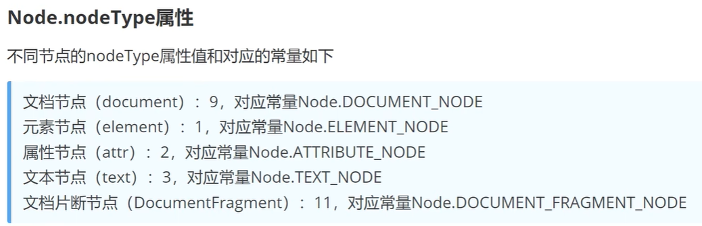

html+css学习教程：https://www.bilibili.com/video/BV1gY4y1U78C/

# 一、html

常见块级元素（段落级元素）：div、form、h1~h6、hr、p、table、ul等，（独占一行可以设置宽高属性）

常见内联元素（行内元素）：a、b、em、i、span、strong等（不独占一行，宽高熟悉无效）

行内快级元素（不换行、可设置宽高）：button、input、img等

```html
<!DOCTYPE HTML> ：document type类型的html语言，即文档类型的超文本标记语言
```

## 1. 常用标签总结

- h1~h6：标题标签，<h1>标题<h1>
- p：段落，<p>一段文字</p>
- br：换行，加在哪在哪换行<br>
- hr：水平线<hr color="颜色" width="宽度" size="高度" align="对齐方式，默认居中，可取left|right">
- img：图片标签
- a：超文本链接，<a href="跳转路径">
- 文本标签：em(着重)、b(粗体)、i(斜体)、strong(加重语气)、del(删除线)、span(无定义)
- ol>li：有序列表
- ul>li：无序列表
- table>tr>td：表格，快速生成表格table>tr*2>td *3{内容}，<table border="表格边距" width="宽度" height="高度">
  - 水平合并：colspan，colspan="2"表示此单元格会水平占用两个格子
  - 垂直合并：rowspan，rowspan="2"表示此单元格会垂直占用两个格子
- form：表单，<form action="服务器地址" method="get|post" name="表单名"> 一些input标签 </form>

## 2. HTML5新增标签

h5之前一般使用div+css来布局 使用id="header|artical|footer"等来进行标识，缺点是文档结构不清晰。为此h5增加了一些语义化的标签，如下所示：

```html
<header></header>	 	 <!-- 头部 -->
<nav></nav>				<!-- 导航 -->
<artical> 				<!-- 独立的文章 -->
    <section></section>	 <!-- 文档中的章节 -->
</artical>
<aside></aside> 		<!-- 侧边栏 -->
<footer></footer> 		<!-- 脚部 -->
```

# 二、CSS

CSS(cascading style sheets)层叠样式表，又叫级联样式表

语法构成：选择器+多条声明，如：h1 {color:red;font-size:12px;}

## 1. 三种使用方式

**1.1 内联样式（行内样式）**

- 标签内使用style标签，如：<p style="background:red;font-size:24px;">CSS</p>
- 缺点：缺乏整体性和规划性，不利于维护，维护成本高

**1.2 内部样式**：

- 如：

  ````html
  <head>
  	<style>
      	h1 {
  			background:red;
      	}
  	</style>    
  </head>
  ````

- 单个页面内的css代码具有统一性和规划性，便于维护，但在多个页面的时候容易混乱。

**1.3 外部样式**

- 使用link标签链接到样式表，link标签在文档头部，如：

  ```html
  <link rel="stylesheet" type="text/css" href="xxx.css">
  ```

- 推荐使用


## 2. 选择器

**2.1 全局选择器**

" * "通配符表示匹配所有

```css
* {
	margin : 0;
	padding : 0;
}
```

**2.2 标签选择器**

所有的标签都可以作为选择器，使用一个标签，所有同名标签都会被作用上。

```css
p{
    font-size:30px;
}
```

**2.3 类选择器**

规定用圆点 . 来定义，比较灵活，特点：

- 同一个类选择器可以被多个标签使用
- 同一个标签可以使用多个选择器。用空格隔开。

```css
<h2 class="oneclass">你好</h2>
<h2 class="oneclass testclass">你好</h2>

/*定义类选择器*/
.oneclass{
    width:800px;
}
```

**2.4 ID选择器**

规定用 # 来定义。针对某一个标签进行使用，同一个ID选择器只能被使用一次。

```css
<h2 id="mytitle">你好</h2>

/*定义类选择器*/
#mytitle{
    color:red;
}
```

**2.5 合并选择器**

- 语法：选择器1，选择器2...{ }
- 作用：提取共同的样式，减少重复代码

```css
.header, .footer{
    height:300px;
}
p,h1{
    color:red;
}
```


**2.6 选择器的优先级**

CSS中，权重用数字衡量，数字越大，优先级越高

- 标签选择器权重为：1
- 类选择器权重为：10
- ID选择器权重为：100
- 内联样式权重为：1000

选择器优先级从高到低：行内样式 > ID选择器 > 类选择器 > 标签选择器

## 3. 字体属性

css字体属性包括：颜色、大小、加粗、文字样式

- color：字体颜色

  ```css
  div{ color:red; }
  div{ color:#ff0000; }
  div{ color:rgb(255,0,0); }
  div{ color:rgba(255,0,0,.5); }
  ```

- font-size：文字大小（注：谷歌浏览器接受的最小字体为12px）

  ```css
  h1{ font-size:40px; }
  ```

- font-weight：设置文字粗细

  ```css
  /*font-weight的值有四种
  bold：定义粗体文字
  bolder：定义更粗体文字
  lighter：定义更细体文字
  100~900：定义由细到粗 400等同默认，700等同于bold
  */
  p{ font-weight:bold; }
  ```

- font-style：指定字体样式

  1. normal：默认字体
  2. italic：斜体字

  

- font-family：指定元素的字体

  ```css
  p{ font-family:"Microsoft YaHei|微软雅黑"; }
  ```


## 4. 背景属性

css背景属性包括背景颜色、图片、图片显示位置、图片填充属性、图片大小

- background-color：背景颜色

  ```css
  .box1{ background-color:red; }
  ```

- background-image：设置背景图片

  ```css
  .box2{ background-img:url("images/img1.jpg"); }
  ```

- background-repeat：设置如何平铺背景图片（用在图片小，背景大的情况）

  ```css
  repeat：默认值
  repeat-x：只水平方向平铺
  repeat-y：只垂直方向平铺
  no-repeat：不平铺
  ```

- background-size：设置背景图片大小

  ```css
  length：设置背景图片的宽度和高度，第一个值宽度，第二个值高度，如果只是设置一个，第二个值auto
  percentage：计算相对位置区域的百分比，第一个值宽度，第二个值高度，如果只是设置一个，第二个值auto
  cover：保持图片纵横比并将图片缩放成完全覆盖背景区域的最小大小（会切割一些多余的图片）
  contain：保持图片纵横比并将图像缩放成适合背景定位区域的最大大小（不切割图片）
  
  如：
  .box{
      background-size：100% 100%;
  }
  ```

- background-postion：设置背景图片的起始位置，默认值是0% 0%

  ```css
  left top		左上角
  left center		左中
  left bottom		左下
  right top		右上角
  right center		右中
  right bottom		右下
  center top			中上
  center center		中中
  center bottom		中下
  x% y%			第一个值是水平位置，第二个值是垂直位置，左上角是0% 0%，右下角是100% 100%。如果只指定了一个值，其他值默认是50%。默认是0% 0%
  xpos ypos			单位是像素
  ```


## 5. 文本属性

控制文本显示效果

- text-aligin：控制文本对齐方式（left、right、center）
- text-decoration：添加文本上的修饰（underline下划线、line-through删除线、overline上划线）
- text-transform：控制文本大小写（captialize每个单词开头字母大写、uppercase全部字母大写、lowercase全部字母小写）
- text-indent：文本块中首行文本缩进（text-indent：50px，缩进50px的距离。负数的话会往左缩进）


## 6. 表格属性

- 表格边框

  ```css
  table,td{
      border: 1px solid red;	/*边框大小、实线、线的颜色*/
  }
  ```

- 折叠边框：将默认的双层边框折叠为一个单层的边框

  ```css
  table{
      border-collapse:collapse;
  }
  ```

- 表格宽高

  ```css
  table{
      width:300px;
      height:200px;
  }
  ```

- 表格文字对齐：给td加text-align属性即可，如td:{ text-align：center; }

- 表格填充：td{ padding：20px; }表示每个格子上下左右间隔20px

- 表格颜色：background-color:red;表示背景颜色为红色，color:bule,表示字体颜色为蓝色

## 7. 关系选择器

1. 后代选择器
2. 子代选择器
3. 相邻兄弟选择器
4. 通用兄弟选择器

**7.1 后代选择器**

- 定义：选择所有被E包含的F元素，中间用空格隔开。（无论是子代、孙代都会生效）

- 示例：

  ```css
  <ul>
      <li>苹果</li>
      <li>香蕉</li>
      <li>菠萝</li>
      <div>
          <li>披萨</li>
          <li>煎饼</li>
          <li>烙饼</li>
      </div>
  </ul>
  
  /*上述ul下的六个li都会生效*/
  ul li{
      color: red;
  }
  ```

**7.2 子代选择器**

- 定义：选择所有作为E元素的**直接子元素**F，对更深一层的元素不起作用。用 > 表示

- 示例

  ```css
  <div>
      <a href="#">子元素1</a>
      <p><a href="#">孙元素2</a></p>
      <a href="#">子元素2</a>
  </div>
  
  /*只对子元素生效*/
  div>a{
  	color: red;
  }
  ```

**7.3 相邻兄弟选择器**

- 定义：选择紧跟E元素后面的F元素，选择相邻的第一个兄弟元素。用 + 表示

- 示例

  ```css
  <h1>h1元素</h1>
  <p>第一个元素</p>
  <p>第二个元素</p>
  
  /*第一个元素会生效，因为*/
  h1+p{
      color: red;
  }
  ```

**7.4 通用兄弟选择器**

- 定义：选择E元素后的所有兄弟元素F，作用于多个标签元素，只能向下选择。用 ~ 隔开

- 示例：

  ```css
  <h1>h1元素</h1>
  <p>第一个元素</p>
  <p>第二个元素</p>
  <span>第三个元素</span>
  <p>第四个元素</p>
  
  /*p标签都会生效，颜色变为红色，span标签不生效*/
  h1~p{
      color: red;
  }
  ```


## 8. 属性选择器（待完善）

## 9. 盒子模型

**9.1 盒子模型**

包含外边距（margin），边框（border），内边距（padding），内容（content）


**9.2 弹性盒子模型（flex box）**

CSS3的新特性，由弹性容器和弹性子元素组成，弹性盒子只定义了弹性子元素如何在弹性容器内布局

通过设置父容器的display属性值为flex将其定义为弹性容器

display:flex;	//开启弹性盒子（开启后下面的属性才能正常使用），容器内元素横向摆放

作用在父容器上的属性

```css
flex-direction：row|row-reverse|colum|colum-reverse  指定子容器在父容器中的对齐方式
    row:横向从左到右排列(左对齐)，默认的排列方式
    row-reverse:反转横向排列 (右对齐，从后往前排，最后一项排在最前面
    column:纵向排列
    columnreverse:反转纵向排列，从后往前排，最后一项排在最上面

justify-content：flex-start|flex-end|center  在垂直（横轴）方向上子容器的对其方式（居中、靠上、靠下）
    flex-start：默认值，紧挨着第一行摆放
    flex-end：紧挨着最后一行摆放
    center：居中摆放
align-items：flex-start|flex-end|center  在竖直（纵轴）方向上子容器的对其方式（居中、靠左、靠右）
    flex-start：默认值，靠左摆放
    flex-end：靠右摆放
    center：居中摆放
```

作用在子元素上的属性

```css
flex:根据权重分配父容器的空间，默认值为0
	flex:1
    flex:2
    flex:1
	如果三个子元素按照上面的flex进行设置，那么父容器将被分为四份，1占1份
```


## 10. 浮动

float属性定义元素在哪个方向浮动，任何元素都可以浮动

- 浮动以后使元素脱离了文档流（相当于在页面上新增了一个浮层来放置内容）
- 浮动只有左右浮动，没有上下浮动

```css
float：left|right
```

## 11. 定位

## 12. CSS3新特性

**12.1 border-radius：设置圆角**

border-radius：px/%

- 四个值: 第一个值为左上角，第二个值为右上角，第三个值为右下角，第四个值为左下角
- 三个值: 第一个值为左上角,第二个值为右上角和左下角，第三个值为右下角
- 两个值:第一个值为左上角与右下角，第二个值为右上角与左下角
- 一个值: 四个圆角值相同

示例：border-radius:25%;


**12.2 box-shadow：添加阴影**

box-shadow：h-shadow v-shadow blur color 

- h-shadow：必选，水平阴影的位置
- v-shadow：必选，垂直阴影的位置
- blur：可选，模糊距离
- color：可选，阴影的颜色

示例：box-shadow:10px,10px,20px,red


**12.3 动画**

动画是使元素从一种样式逐渐变化为另一种样式的效果，可以改变任意多的样式，任意多的次数。用百分比来规定变化发生的时间，或用关键词“from”和“to"，等同于 0% 和 100%，0% 是动画的开始，100% 是动画的完成，中间可以有很多个（如0%、20%、40%···100%）

**12.31 @keyframes 创建动画**

使用规则：

- name：动画名称，开发人员自己定义
- percent：百分比值，可以添加多个百分比

```css
@keyframes name {
    from|0%{
        css样式
    }
    percent{
        css样式
    }
    to|100%{
        css样式
    }
}
```

**12.32 animation执行动画**

```css
animation: name duration timing-function delay iteration-count direction fill-mode;
/*各个值的解释*/
name：动画名称
duration：动画持续执行时间，单位s
timing-function：设置动画效果的速率(如下)
delay：设置动画的开始时间 (延时执行)，单位s
iteration-count：设置动画循环的次数，infinite为无限次数的循环
direction：设置动画播放的方向 (可选，如下)
animation-play-state：控制动画的播放状态:running代表播放，而paused代表停止播放
```


示例：

```css
.box {
    width: 100px;
    height: 100px;
    background-color: red;
    animation: myAnimation 4s linear 0s infinite;
    animation-play-state:running;	/*不加也行，默认播放动画*/
}

@keyframes myAnimation {
    0% {
        height: 100px;
        background-color: red;
    }
    50% {
        height: 200px;
        background-color: blue;
    }
    100% {
        height: 100px;
        background-color: greenyellow;
    }
}


<div class="box"></div>
```


# 三、JS

## 1. 引入方式

- 嵌入到html文件中

  ```html
  <body>
  	<script>
      	var age = 19
      </script>
  </body>
  ```

- 引入本地js文件

  ```html
  <body>
  	<script type="text/javascript" src="./xxx.js"></script>
  </body>
  ```

- 引入网络来源文件

  ```html
  <body>
  	<script src="http://xxxxxx.js"></script>
  </body>
  ```

  

## 2. JS中的数据类型

- [`Number`](https://developer.mozilla.org/zh-CN/docs/Web/JavaScript/Reference/Global_Objects/Number)（数字）
- [`String`](https://developer.mozilla.org/zh-CN/docs/Web/JavaScript/Reference/Global_Objects/String)（字符串）
- [`Boolean`](https://developer.mozilla.org/zh-CN/docs/Web/JavaScript/Reference/Global_Objects/Boolean)（布尔）
- [`Symbol`](https://developer.mozilla.org/zh-CN/docs/Web/JavaScript/Reference/Global_Objects/Symbol)（符号）（ES6 新增）
- `Object`
- [`Function`](https://developer.mozilla.org/zh-CN/docs/Web/JavaScript/Reference/Global_Objects/Function)（函数）
  - [`Array`](https://developer.mozilla.org/zh-CN/docs/Web/JavaScript/Reference/Global_Objects/Array)（数组）
- [`Date`](https://developer.mozilla.org/zh-CN/docs/Web/JavaScript/Reference/Global_Objects/Date)（日期）
  - [`RegExp`](https://developer.mozilla.org/zh-CN/docs/Web/JavaScript/Reference/Global_Objects/RegExp)（正则表达式）
- [`null`](https://developer.mozilla.org/zh-CN/docs/Web/JavaScript/Reference/Operators/null)（空）
- [`undefined`](https://developer.mozilla.org/zh-CN/docs/Web/JavaScript/Reference/Global_Objects/undefined)（未定义）


## 3. DOM

DOM 是JavaScript 操作网页的接口，全称为"文档对象模型”(Document Obiect Model)。它的作用是将网页转为一个JavaScript 对象，从而可以用脚本进行各种操作(比如对元素增删内容)

节点（node）：DOM的最小组成单位

节点的类型有七种：

- Document：整个文档的顶层节点
- DocumentType：doctype标签
- Element：网页的各种html标签
- Attribute：网页标签的属性（比如class="box1"）
- Text：标签内或之间包含的文本
- Comment：注释
- DocumentFragment：文档的片段

除了根节点，其他节点都有三种层级关系：父节点（parentNode）、子节点（childNode）、兄弟[同父]节点（sibling）




**3.1 获取页面元素**

- document.getElementsByTagName("标签")：返回值为数组对象，若没有则返回空

  ```javascript
  var parse = document.getElementsByTagName("div")[0]		//如果传 * 就返回文档中所有的HTML元素
  
  parse.innerHTML = "Hello02";	//通过此方式改变原值
  ```

- document.getElementsByClassName("Class名")：返回值为数组对象，Class名可以写多个

- document.getElementsByTaName("名字")：返回值为数组对象

- document.getElementsById("属性ID")

- document.querySelector(".box1")：接受选择器，如.box1、#box2等等，只返回第一个

- document.querySelectorAll(".box1")[0]


**3.2 创建元素**

- document.createElement("p")：创建标签，并返回该标签
- document.createTextNode("我是文本")：创建文本
- 元素.appendChild(内容)：将文本或子元素放到容器中
- document.createAttribute("")：创建属性
- 属性.setAttributeNode();

```javascript
var text = document.createElement("p");
var content = document.createTextNode("我是文本")
var id = document.createAttribute("id")
id.value ="root"
// appendChild:将内容或者子元素放到容器中
text.appendChild(content);
text.setAttributeNode(id);
var container = document.getElementById("container");
```


# NULL、简单vue入门

## 1. 小示例

参考：https://cn.vuejs.org/v2/guide/

```html
1.引入vue包
<!-- 开发环境版本，包含了有帮助的命令行警告 -->
<script src="https://cdn.jsdelivr.net/npm/vue@2/dist/vue.js"></script>

2.编写html体
<div id="app">
  {{ message }}
</div>

3.编写js
var app = new Vue({
  el: '#app',
  data: {
    message: 'Hello Vue!'
  }
})

```

## 2. el挂载点

- el：用来设置vue实例挂载(管理)的元素
- Vue实例的作用范围：el选项命中的元素及内部的后代元素
- 可以使用其它选择器，但建议使用id选择器
- 不能挂载 html 和 body 标签

## 3. 指令

```js
v-text=""		//设置标签的内容，会替换标签的全部内容
{{}}		//插值设置内容，可替换指定内容
v-html=""		//设置标签的内容，会解析html格式并替换标签的全部内容
v-on:click="方法"  @click="方法名"		//为元素绑定事件（单击事件，双击事件等等）。
v-show="表达式"						//根据表达式真假，判断元素显示和隐藏(style设置为none)
v-if="表达式"						//根据表达式真假，判断元素显示和隐藏(从dom树中移除)
v-bind:属性名="xx"  :属性名="xxx"			//为元素绑定属性 如:src="xxx"
v-for="(item,index) in arr"
v-model							//双向数据绑定（表单元素）
```


# 二、基础

Vue (读音 /vjuː/，类似于 **view**) 是一套用于构建用户界面的**渐进式框架**。

## 2.1 安装

2.1.1 使用script引入

2.1.2 使用cdn引入


## 2.2 Vue模板语法：

#### 插值语法：

- 功能：用于解析标签体内容

- 举例：{{xxx}}，xxx是js表达式，且可以直接读取到data中的所有属性。

#### 指令语法：

- 功能：用于解析标签（包括：标签属性、标签体内容、绑定事件......）

- 举例：**v-bind**:href="xxx" 或简写为 :href="xxx"，xxx同样要写js表达式，且可以是data中所有属性。

Tips:

```shell
use v-bind:href="url" to instead of href="url"	# v-bind:	可以动态绑定各种属性


```


## 2.3 数据绑定

v-model只能应用在表单类/输入类元素上，如input，radio，checkbox等，都有value的元素


## 2.4 ref属性

- 被用来给元素或子组件注册引用信息（id的替代者）
- 应用在html标签上获取的是真实的dom元素，应用在组件标签上是组件的实例对象

#### 子传父（方式三）

```vue
父组件
<template>
  <div>
      //绑定自定义事件receiveThing
      <Student ref="health"></Student>
  </div>
</template>
<script>
//引入组件
import Student from './components/Student.vue'
    export default {
        name:'App',
        components:{Student},
        methods:{
            //编写自定义事件内容
            receiveStudent(name){
                console.log(name);
            }
        },
        //挂载完毕函数
        mounted(){
            //student的组件实例对象('当health被触发时'，执行的回调函数)
            this.$refs.student.$on('health',this.receiveStudent)
        }
    }
</script>

子组件
<template>
  <div>
    <h2>学生姓名：{{ name }}</h2>
    <button @click="sendStudent">发送学生信息给父组件</button>
  </div>
</template>

<script>
export default {
  name: "Student",
  data() {return{name: "张三"}},
  methods:{
    sendStudent(){
      //触发Student组件实例上的receiveThing组件事件
      this.$emit('receiveThing',this.name)
    }
  }
};
</script>
```


## 2.5 props属性

#### **父传子（常用）**

```vue
<!--父组件-->
<MyItem v-for="todo in todos" :key="todo.id" :todo="todo"/>


<!--子组件-->
<template>
  <div>
    <input type="checkbox" :checked="todo.done"/>
    <span>{{todo.title}}</span>
  </div>
</template>
<script>
  export default {
    name: "MyItem",
    props:['todo'],
  };
</script>
```

#### **子传父（方式一）**

```vue
<!--父组件-->
<MyHeader :addTodoObj="addTodoObj"></MyHeader>	//传给子组件一个函数
<script>
export default {
  name: "App",
  methods:{
    //该函数接收一个参数
    addTodoObj(todoObj){
      console.log(todoObj)
    },
  },
};
</script>


<!--子组件-->
<script>
export default {
  name: "MyHeader",
  props:["addTodoObj"],	//接收父组件传的函数
  methods:{
    addTodo(){
      const todoObj = 111;
      //调用父组件传的函数，把值传递给父组件
      this.addTodoObj(todoObj)
    }
  }
};
</script>


```


## 2.6 $emit

#### 子传父（方式二）

```vue
父组件
<template>
  <div>
      //绑定自定义事件receiveThing
      <Student v-on:receiveThing="receiveStudent"></Student>
  </div>
</template>
<script>
//引入组件
import Student from './components/Student.vue'
    export default {
        name:'App',
        components:{Student},
        methods:{
            //编写自定义事件内容
            receiveStudent(name){
                console.log(name);
            }
        }
    }
</script>

子组件
<template>
  <div>
    <h2>学生姓名：{{ name }}</h2>
    <button @click="sendStudent">发送学生信息给父组件</button>
  </div>
</template>

<script>
export default {
  name: "Student",
  data() {return{name: "张三"}},
  methods:{
    sendStudent(){
      //触发Student组件实例上的receiveThing组件事件
      this.$emit('receiveThing',this.name)
    }
  }
};
</script>
```


## 2.7 插槽

#### 2.7.1 默认插槽

```vue
父组件
<子组件名><h1>1111111</h1></子组件名>

子组件
<div>
    <slot></slot>	//此位置会显示 <h1>1111111</h1>的内容
</div>
```


#### 2.7.2 具名插槽

```vue
父组件
<子组件名>
    <h1 slot="s1">1111111</h1>
    <h1 slot="s2">2222222</h1>
    <h1 slot="s2">3333333</h1>
    如果用的是 template 包裹的内容 可以用<template v-slot:s1></template>形式
</子组件名>

子组件
<div>
    <slot name="s1"></slot>	//此位置会显示 <h1>1111111</h1>的内容
    <slot name="s2"></slot>	//此位置会显示 <h1>2222222</h1> 和 <h1 slot="s2">3333333</h1>的内容
</div>
```


# 三、脚手架创建项目

官方文档：https://cli.vuejs.org/zh/guide/

## 3.1 使用步骤

默认vscode、nodejs已经安装好了

```shell
# 1.全局安装@vue/cli 可以帮助我们快速构建Vue项目
npm install -g @vue/cli

# 2.切换到要创建项目的目录，使用命令创建项目
vue create 项目名	//选择vue3

# 3.启动项目（切记要切换到项目目录下再执行命令）
npm run serve
```

注意：

1. 如果出现下载缓慢请配置 npm 淘宝镜像：npm config set registry https://registry.npm.taobao.org
2. Vue 脚手架隐藏了所有webpack相关的配置，若想看具体的webpack配置，请执行：vue inspect > output.js


## 3.2 项目结构

### 配置文件

| 文件名            | 功能作用                                     |
| ----------------- | -------------------------------------------- |
| .gitignore        | git的忽略文件，设置不被git管理的文件和文件夹 |
| babel.config.js   | babel的控制文件                              |
| package-lock.json | 包的说明书                                   |
| package.json      | ...（scripts下的 lint 作用语法检查）         |


 


# 小工具

npm i nanoid	uuid简化版


## axios使用步骤

### 一、普通html项目

引入axios库

```html
<!-- axios库 -->
<script src="https://unpkg.com/axios/dist/axios.min.js"></script>
```

发送请求

```js
//post请求（带参数）
axios.post("http://47.100.81.153:10001/user/add", {
    username: that.registerForm.username,
    password: that.registerForm.password,
    sex: that.registerForm.sex,
    birth: that.registerForm.birth,
    phone: that.registerForm.phone,
}).then(function (response) {
    console.log(response);
}, function (err) {
    that.$message.error('操作失败！');
})

//get请求（不带参数）
axios.get("http://47.100.81.153:10001/user/add")
    .then(function (response) {
    	//请求成功
    	console.log(response);
	}, function (err) {
    	that.$message.error('操作失败！');
})
```


### 二、脚手架项目

```vue
<script>
    import axios from 'axios'	//引入axios
    export default {
        name:'App',
        methods: {
            getStudent(){
                //执行axios请求
                axios.get('url').then(function (response) {
    				//请求成功
    				console.log(response.data);
				}, function (err) {
    				that.$message.error('操作失败！');
            	}
        }
    }
    
</script>
```


### 三、解决跨域

1. cros （后端做）
2. jsonp（前后端一起，只能解决get请求）
3. 代理服务器（ nginx 或 vue-cli ）

**代理服务器跨域（vue-cli）**

​	在根目录创建 vue.config.js 文件

```js

module.exports = {
    
    //方式一：开启代理服务器（只能配置一个代理，不能灵活控制到底走不走代理）
    //需要把原来的请求路径从http://localhost:10001改为http://localhost:8080
	devServer: {
        //把前端传来的8080请求转发给10001
    	proxy: 'http://localhost:4000'
  	}
    
    
    //方式二：开启代理服务器
    //需要把原来的请求路径从http://localhost:10001改为http://localhost:8080/health
	devServer: {
    	proxy: {
    	//请求前缀(发请求时端口号后面有它才会来找代理服务器转发请求)
    	'/health': {
    		//请求地址
    		target: 'http://localhost:10001',
    		//匹配所有以/health开头的路径，并把它改为/health改为''
    		pathRewrite:{'^/health':''}
    		//用于支持websocket
    		ws: true,
             //用于控制请求头中的host值，默认为true。请求回复后端时false：我来自8080，true：我来自跟你一样10001
    		changeOrigin: true
		},
         //配置多个代理
    	'/health2': {
            target: 'http://localhost:10002'
      }
    }
  }
}
```


# 工程化

```shell
npm init -y		# 生成package.json
npm install jquery -S	# 引入jquery依赖	-S：--save表示将依赖放进dependencies中，全局可用

npm install webpack@5.42.1 webpack-cli@4.7.2 -D	# 安装webpack	-D：--save-dev表示将依赖放在开发环境下devDependencies
```

### 1.  webpack在项目中的安装配置

```shell
# 1.安装webpack	-D：--save-dev表示将依赖放在开发环境下devDependencies
npm install webpack@5.42.1 webpack-cli@4.7.2 -D

# 2.在项目根目录，创建webpack.config.js的文件，并初始化如下配置
module.exports = {
    //webpack运行的模式（开发环境development和 生产环境production）
    mode: 'development'
}

# 3.在package.json的scripts节点下，新增dev脚本，内容如下：
"scripts": {
    "dev": "webpack"	//script节点下的脚本，可以通过 npm run 执行，例如：npm run dev（前面dev可自定义命名)
}
```


# ES6模块化

ES6 模块化规范是浏览器端与服务器端通用的模块化开发规范。它的出现极大的降低了前端开发者的模块化学 习成本，开发者不需再额外学习 AMD、CMD 或 CommonJS 等模块化规范。

ES6 模块化规范中定义： 

- 每个 js 文件都是一个独立的模块
- 导入其它模块成员使用 import 关键字
- 向外共享模块成员使用 export 关键字

### ES6 的模块化主要包含 3 种用法： 

**1.默认导出(每个模块只允许一次)与默认导入**

- 共享/导出自己的变量和方法：export  default  { 变量，方法......}
- 导入01.js中向外共享的成员：import 别名 from ./01.js

**2.按需导出与按需导入**

- 按需导出的语法： export 按需导出的成员（按需导入可以和默认导入一起使用）
- 按需导入的语法： import { s1,s2 as ss2,say } from './xxx.js'（导入时可以用as重命名）

**3.直接导入并执行模块中的代码**

- 直接：import './xxx.js'，就会执行后xxx.js中的方法

### 宏任务微任务

执行顺序：同步任务-->微任务-->宏任务


